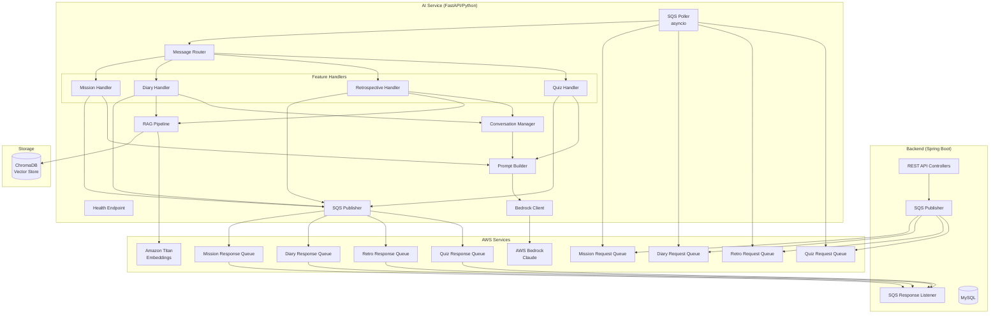
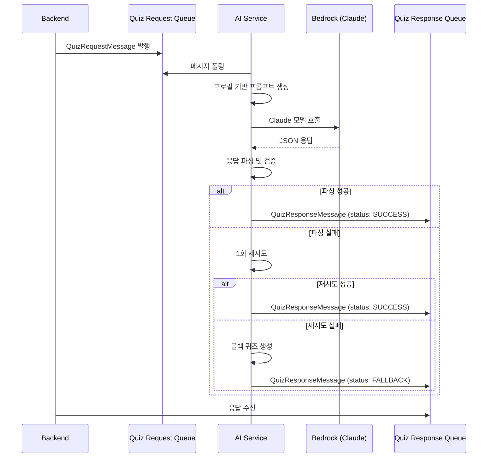
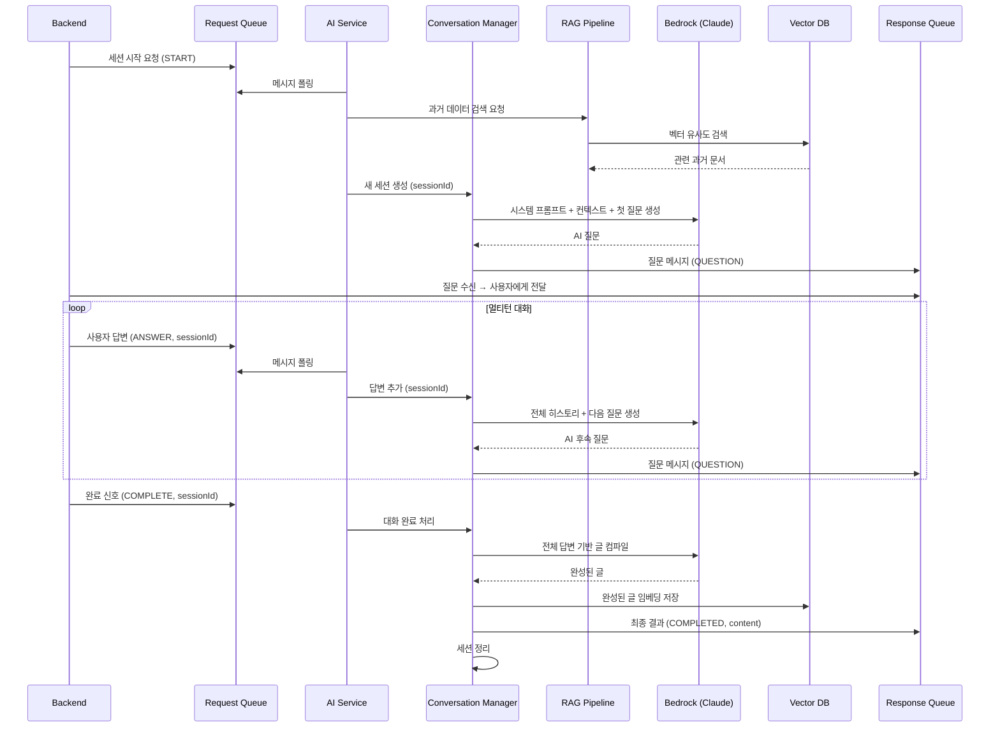
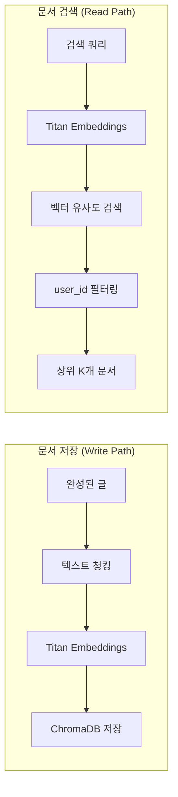
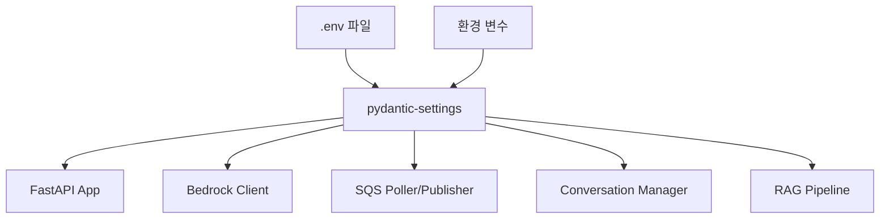
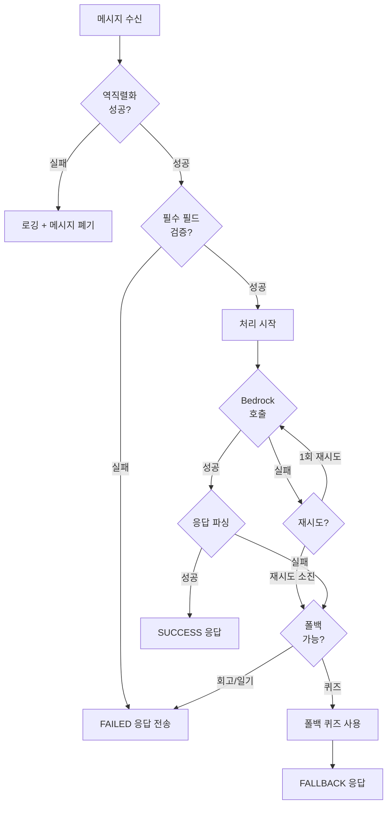

# 설계 문서: AI 서비스 분리

## 개요

기존 Spring Boot 백엔드(`backend/`)에 포함된 AI 관련 코드를 독립적인 Python/FastAPI 서비스(`ai/`)로 분리한다. AI 서비스는 AWS Bedrock(Claude)과의 모든 상호작용을 전담하며, 백엔드와는 AWS SQS를 통한 비동기 메시징으로 통신한다.

### 핵심 설계 원칙

1. **서비스 독립성**: AI 서비스는 백엔드와 코드/라이브러리 의존성 없이 독립 배포 가능
2. **비동기 메시징**: SQS 기반 느슨한 결합으로 서비스 간 독립적 확장
3. **기능별 큐 분리**: 퀴즈, 회고, 일기, 미션 각각 전용 요청/응답 큐 사용
4. **하위 호환성**: 기존 퀴즈 SQS 메시지 계약 유지
5. **RAG 파이프라인**: 벡터 DB를 활용한 과거 데이터 검색으로 개인화된 대화 지원

### 기술 스택

| 구성 요소 | 기술 |
|-----------|------|
| 웹 프레임워크 | FastAPI (Python 3.11+) |
| ASGI 서버 | Uvicorn |
| AWS SDK | boto3 (Bedrock, SQS) |
| 데이터 검증 | Pydantic v2 |
| 설정 관리 | pydantic-settings |
| 벡터 DB | ChromaDB (임베딩 저장/검색) |
| 임베딩 모델 | Amazon Titan Embeddings (Bedrock) |
| 비동기 처리 | asyncio + aioboto3 |
| 패키지 관리 | Poetry |
| 테스트 | pytest + hypothesis (PBT) |

## 아키텍처

### 고수준 시스템 아키텍처



### 퀴즈 생성 데이터 흐름



### 멀티턴 대화 흐름 (회고/일기)



## 컴포넌트 및 인터페이스

### 프로젝트 구조

```
ai/
├── pyproject.toml
├── .env.example
├── .env
├── README.md
├── app/
│   ├── __init__.py
│   ├── main.py                    # FastAPI 앱 진입점
│   ├── config.py                  # pydantic-settings 설정
│   ├── health.py                  # 헬스체크 엔드포인트
│   ├── sqs/
│   │   ├── __init__.py
│   │   ├── poller.py              # asyncio SQS 폴러
│   │   ├── publisher.py           # SQS 메시지 발행
│   │   └── router.py             # action 기반 메시지 라우팅
│   ├── bedrock/
│   │   ├── __init__.py
│   │   └── client.py             # Bedrock Runtime 클라이언트
│   ├── conversation/
│   │   ├── __init__.py
│   │   ├── manager.py            # 세션 관리 및 히스토리
│   │   └── models.py             # 대화 관련 모델
│   ├── rag/
│   │   ├── __init__.py
│   │   ├── pipeline.py           # RAG 검색 파이프라인
│   │   ├── embeddings.py         # 임베딩 생성 (Titan)
│   │   └── vector_store.py       # ChromaDB 연동
│   ├── features/
│   │   ├── __init__.py
│   │   ├── quiz/
│   │   │   ├── __init__.py
│   │   │   ├── handler.py        # 퀴즈 생성 핸들러
│   │   │   ├── prompt.py         # 퀴즈 프롬프트 빌더
│   │   │   ├── parser.py         # 퀴즈 응답 파서
│   │   │   └── models.py         # 퀴즈 메시지 모델
│   │   ├── retrospective/
│   │   │   ├── __init__.py
│   │   │   ├── handler.py        # 회고 핸들러
│   │   │   ├── prompt.py         # 회고 프롬프트 빌더
│   │   │   └── models.py         # 회고 메시지 모델
│   │   └── diary/
│   │       ├── __init__.py
│   │       ├── handler.py        # 일기 핸들러
│   │       ├── prompt.py         # 일기 프롬프트 빌더
│   │       └── models.py         # 일기 메시지 모델
│   └── common/
│       ├── __init__.py
│       ├── exceptions.py         # 공통 예외 정의
│       └── logging.py            # 구조화된 로깅
└── tests/
    ├── __init__.py
    ├── conftest.py
    ├── test_quiz_handler.py
    ├── test_conversation_manager.py
    ├── test_rag_pipeline.py
    ├── test_sqs_router.py
    └── properties/
        ├── __init__.py
        ├── test_quiz_serialization.py
        ├── test_conversation_properties.py
        └── test_message_routing.py
```

### 핵심 컴포넌트 설계

#### 1. SQS Poller (`app/sqs/poller.py`)

asyncio 기반 비동기 SQS 폴링 컴포넌트. 각 기능별 큐를 동시에 폴링한다.

```python
class SQSPoller:
    """asyncio 기반 SQS 메시지 폴러"""
    
    async def start(self) -> None:
        """모든 큐에 대한 폴링 태스크 시작"""
        
    async def poll_queue(self, queue_url: str, handler: Callable) -> None:
        """단일 큐 폴링 루프"""
        
    async def stop(self) -> None:
        """폴링 중지 및 리소스 정리"""
```

#### 2. Message Router (`app/sqs/router.py`)

수신된 메시지의 `action` 필드를 기반으로 적절한 핸들러로 라우팅한다.

```python
class MessageRouter:
    """메시지 action 필드 기반 라우팅"""
    
    def register_handler(self, action: str, handler: Callable) -> None:
        """action별 핸들러 등록"""
        
    async def route(self, queue_name: str, message: dict) -> None:
        """메시지를 적절한 핸들러로 라우팅"""
```

#### 3. Bedrock Client (`app/bedrock/client.py`)

AWS Bedrock Runtime API를 호출하여 Claude 모델과 통신한다.

```python
class BedrockClient:
    """AWS Bedrock Claude 모델 클라이언트"""
    
    async def invoke(self, prompt: str, max_tokens: int = 4096) -> str:
        """단일 프롬프트로 모델 호출 (단일턴)"""
        
    async def invoke_with_messages(
        self, 
        system_prompt: str, 
        messages: list[dict]
    ) -> str:
        """메시지 히스토리로 모델 호출 (멀티턴)"""
        
    async def invoke_with_retry(self, prompt: str, max_retries: int = 1) -> str:
        """재시도 로직 포함 모델 호출"""
```

#### 4. Conversation Manager (`app/conversation/manager.py`)

멀티턴 대화의 세션 상태를 관리한다. 인메모리 저장소를 사용하며, 세션 타임아웃과 최대 턴 수를 적용한다.

```python
class ConversationManager:
    """멀티턴 대화 세션 관리"""
    
    async def create_session(
        self, 
        session_id: str, 
        system_prompt: str,
        context: dict
    ) -> Session:
        """새 대화 세션 생성"""
        
    async def add_message(
        self, 
        session_id: str, 
        role: str, 
        content: str
    ) -> None:
        """세션에 메시지 추가"""
        
    async def get_history(self, session_id: str) -> list[dict]:
        """세션의 전체 메시지 히스토리 반환"""
        
    async def complete_session(self, session_id: str) -> str:
        """세션 완료 처리 및 컴파일된 결과 반환"""
        
    async def cleanup_expired(self) -> None:
        """만료된 세션 정리 (주기적 실행)"""
```

#### 5. RAG Pipeline (`app/rag/pipeline.py`)

벡터 DB를 활용하여 과거 회고/일기 데이터를 검색하고, 새로운 문서를 임베딩하여 저장한다.

```python
class RAGPipeline:
    """RAG 기반 컨텍스트 검색 파이프라인"""
    
    async def search(
        self, 
        user_id: str, 
        query: str, 
        collection: str,
        top_k: int = 3
    ) -> list[Document]:
        """유저별 과거 문서 벡터 유사도 검색"""
        
    async def store(
        self, 
        user_id: str, 
        content: str, 
        collection: str,
        metadata: dict
    ) -> None:
        """완성된 문서를 벡터 DB에 임베딩 저장"""
```

#### 6. SQS Publisher (`app/sqs/publisher.py`)

응답 메시지를 지정된 SQS 큐로 발행한다.

```python
class SQSPublisher:
    """SQS 응답 메시지 발행"""
    
    async def publish(
        self, 
        queue_url: str, 
        message: BaseModel
    ) -> None:
        """메시지를 JSON 직렬화하여 큐로 전송"""
        
    async def publish_with_retry(
        self, 
        queue_url: str, 
        message: BaseModel, 
        max_retries: int = 3
    ) -> None:
        """재시도 로직 포함 메시지 발행"""
```


## 데이터 모델

### SQS 메시지 스키마

#### 퀴즈 요청 메시지 (기존 계약 유지)

```json
{
  "action": "GENERATE_QUIZ",
  "matchId": "uuid-string",
  "requesterId": "uuid-string",
  "targetUserId": "uuid-string",
  "requestedAt": "2024-01-01T00:00:00Z",
  "targetProfile": {
    "name": "string",
    "nickname": "string",
    "university": "string",
    "major": "string",
    "hobbies": ["string"],
    "interests": ["string"],
    "personalityType": ["string"]
  }
}
```

#### 퀴즈 응답 메시지 (기존 계약 유지)

```json
{
  "action": "QUIZ_GENERATED",
  "status": "SUCCESS | FALLBACK | FAILED",
  "matchId": "uuid-string",
  "requesterId": "uuid-string",
  "targetUserId": "uuid-string",
  "quiz": {
    "matchId": "uuid-string",
    "targetUserId": "uuid-string",
    "questions": [
      {
        "questionText": "string",
        "choices": ["string", "string", "string", "string"],
        "correctIndex": 0,
        "explanation": "string"
      }
    ],
    "createdAt": "2024-01-01T00:00:00Z"
  },
  "questionCount": 5,
  "completedAt": "2024-01-01T00:00:00Z"
}
```

#### 회고 요청 메시지

```json
{
  "action": "START_SESSION | ANSWER | COMPLETE",
  "sessionId": "uuid-string",
  "userId": "uuid-string",
  "meetingContext": {
    "matchedUserId": "uuid-string",
    "matchedUserName": "string",
    "meetingDate": "2024-01-01",
    "meetingLocation": "string"
  },
  "userMessage": "string (ANSWER 시 사용자 답변)",
  "requestedAt": "2024-01-01T00:00:00Z"
}
```

#### 회고 응답 메시지

```json
{
  "action": "QUESTION | COMPLETED | FAILED",
  "sessionId": "uuid-string",
  "userId": "uuid-string",
  "status": "IN_PROGRESS | COMPLETED | TIMEOUT | FAILED",
  "question": "string (QUESTION 시 AI 질문)",
  "currentTurn": 1,
  "maxTurns": 5,
  "compiledContent": "string (COMPLETED 시 최종 회고글)",
  "completedAt": "2024-01-01T00:00:00Z",
  "errorMessage": "string (FAILED 시 에러 설명)"
}
```

#### 일기 요청 메시지

```json
{
  "action": "START_SESSION | ANSWER | COMPLETE",
  "sessionId": "uuid-string",
  "userId": "uuid-string",
  "plannerEntries": [
    {
      "dayOfWeek": 1,
      "startTime": "09:00",
      "endTime": "10:30",
      "location": "string",
      "name": "string",
      "type": "CLASS | FREE | ACTIVITY"
    }
  ],
  "userMessage": "string (ANSWER 시 사용자 답변)",
  "requestedAt": "2024-01-01T00:00:00Z"
}
```

#### 일기 응답 메시지

```json
{
  "action": "QUESTION | COMPLETED | FAILED",
  "sessionId": "uuid-string",
  "userId": "uuid-string",
  "status": "IN_PROGRESS | COMPLETED | TIMEOUT | FAILED",
  "question": "string (QUESTION 시 AI 질문)",
  "currentTurn": 1,
  "maxTurns": 5,
  "compiledContent": "string (COMPLETED 시 최종 일기)",
  "completedAt": "2024-01-01T00:00:00Z",
  "errorMessage": "string (FAILED 시 에러 설명)"
}
```

#### 미션 요청 메시지

```json
{
  "action": "GENERATE_MISSION",
  "matchId": "uuid-string",
  "userAId": "uuid-string",
  "userBId": "uuid-string",
  "timeSlot": "14:45-15:00",
  "userARoute": {
    "fromBuilding": { "id": "uuid-string", "name": "string" },
    "toBuilding": { "id": "uuid-string", "name": "string" },
    "subNodeIds": ["uuid-string"]
  },
  "userBRoute": {
    "fromBuilding": { "id": "uuid-string", "name": "string" },
    "toBuilding": { "id": "uuid-string", "name": "string" },
    "subNodeIds": ["uuid-string"]
  },
  "requestedAt": "2024-01-01T00:00:00Z"
}
```

#### 미션 응답 메시지

```json
{
  "action": "MISSION_GENERATED",
  "status": "SUCCESS | FAILED",
  "matchId": "uuid-string",
  "mission": {
    "location": "string",
    "activity": "string",
    "description": "string",
    "selectedNodeId": "uuid-string"
  },
  "completedAt": "2024-01-01T00:00:00Z",
  "errorMessage": "string (FAILED 시 에러 설명)"
}
```

### Pydantic 모델 정의

#### 설정 모델 (`app/config.py`)

```python
from pydantic_settings import BaseSettings

class Settings(BaseSettings):
    # AWS
    aws_region: str = "ap-northeast-2"
    aws_access_key_id: str | None = None
    aws_secret_access_key: str | None = None
    
    # Bedrock
    bedrock_model_id: str = "anthropic.claude-3-sonnet-20240229-v1:0"
    bedrock_max_tokens: int = 4096
    bedrock_timeout_seconds: int = 30
    bedrock_embedding_model_id: str = "amazon.titan-embed-text-v2:0"
    
    # SQS Queues
    sqs_quiz_request_queue: str = "quiz-generation-requests"
    sqs_quiz_response_queue: str = "quiz-generation-responses"
    sqs_retro_request_queue: str = "retro-session-requests"
    sqs_retro_response_queue: str = "retro-session-responses"
    sqs_diary_request_queue: str = "diary-session-requests"
    sqs_diary_response_queue: str = "diary-session-responses"
    sqs_mission_request_queue: str = "mission-generation-requests"
    sqs_mission_response_queue: str = "mission-generation-responses"
    sqs_max_concurrent_messages: int = 5
    sqs_poll_interval_seconds: float = 1.0
    sqs_publish_max_retries: int = 3
    
    # Conversation
    conversation_max_turns: int = 5
    conversation_session_timeout_minutes: int = 30
    
    # RAG
    chroma_persist_directory: str = "./data/chroma"
    rag_top_k: int = 3
    
    # Server
    server_port: int = 8081
    
    # Request timeout
    request_timeout_seconds: int = 60
    
    class Config:
        env_file = ".env"
        env_file_encoding = "utf-8"
```

#### 대화 세션 모델 (`app/conversation/models.py`)

```python
from pydantic import BaseModel
from datetime import datetime
from enum import Enum

class MessageRole(str, Enum):
    SYSTEM = "system"
    USER = "user"
    ASSISTANT = "assistant"

class ConversationMessage(BaseModel):
    role: MessageRole
    content: str
    timestamp: datetime

class SessionStatus(str, Enum):
    ACTIVE = "active"
    COMPLETED = "completed"
    TIMEOUT = "timeout"
    FORCE_COMPLETED = "force_completed"

class Session(BaseModel):
    session_id: str
    user_id: str
    feature: str  # "retrospective" | "diary"
    system_prompt: str
    messages: list[ConversationMessage] = []
    context: dict = {}
    status: SessionStatus = SessionStatus.ACTIVE
    current_turn: int = 0
    max_turns: int = 5
    created_at: datetime
    last_activity: datetime
```

### RAG 파이프라인 설계



#### 벡터 DB 컬렉션 구조

| 컬렉션 | 용도 | 메타데이터 |
|---------|------|-----------|
| `retrospectives` | 과거 회고글 저장 | user_id, created_at, matched_user_id |
| `diaries` | 과거 일기 저장 | user_id, created_at, day_of_week |
| `campus_nodes` | 캠퍼스 장소 정보 (venue + buildingPlace 통합) | node_id, source (VENUE/BUILDING_PLACE), typeActivity, operatingHours |

#### 임베딩 전략

- **모델**: Amazon Titan Text Embeddings V2 (Bedrock)
- **청킹**: 문서를 500자 단위로 분할 (100자 오버랩)
- **검색**: 코사인 유사도 기반, user_id 필터 적용, 상위 3개 반환
- **저장 시점**: 대화 완료 후 컴파일된 최종 글을 임베딩하여 저장

### 설정 관리 구조




## 정확성 속성 (Correctness Properties)

*속성(Property)은 시스템의 모든 유효한 실행에서 참이어야 하는 특성 또는 동작입니다. 속성은 사람이 읽을 수 있는 명세와 기계가 검증할 수 있는 정확성 보장 사이의 다리 역할을 합니다.*

### Property 1: 메시지 라우팅 정확성

*For any* 유효한 action 필드를 가진 SQS 메시지에 대해, MessageRouter는 해당 action에 등록된 핸들러를 정확히 호출해야 하며, 다른 핸들러는 호출되지 않아야 한다.

**Validates: Requirements 3.2**

### Property 2: 잘못된 메시지 복원력

*For any* 유효하지 않은 JSON 문자열 또는 필수 필드가 누락된 메시지에 대해, SQS_Listener는 예외를 전파하지 않고 정상적으로 메시지를 폐기해야 한다.

**Validates: Requirements 3.5**

### Property 3: 퀴즈 프롬프트 완전성

*For any* 유효한 TargetProfile(name이 비어있지 않은)에 대해, Prompt_Builder가 생성한 프롬프트 문자열은 프로필의 모든 비어있지 않은 필드(name, nickname, university, major, hobbies, interests, personalityType)를 포함해야 한다.

**Validates: Requirements 4.2**

### Property 4: 퀴즈 응답 파싱 정확성

*For any* 유효한 퀴즈 응답 JSON(questions 배열이 있고, 각 question이 4개의 choices와 0-3 범위의 correctIndex를 가진)에 대해, Response_Parser는 원본 JSON의 모든 필드를 보존하는 구조화된 객체를 반환해야 한다.

**Validates: Requirements 4.3**

### Property 5: 잘못된 응답 시 폴백 정확성

*For any* 유효하지 않은 JSON 문자열(파싱 불가능하거나 필수 필드 누락)에 대해, AI_Service는 정확히 5개의 문제를 가진 폴백 퀴즈를 반환해야 하며, 각 문제는 4개의 선택지와 유효한 correctIndex(0-3)를 가져야 한다.

**Validates: Requirements 4.4**

### Property 6: 퀴즈 메시지 직렬화 라운드트립

*For any* 유효한 QuizRequestMessage 및 QuizResponseMessage 객체에 대해, JSON으로 직렬화한 후 다시 역직렬화하면 원본과 동등한 객체가 생성되어야 한다.

**Validates: Requirements 4.5, 4.7**

### Property 7: 세션 히스토리 무결성

*For any* 고유한 sessionId 집합과 각 세션에 추가되는 임의의 메시지 시퀀스에 대해, 각 세션의 히스토리는 해당 세션에 추가된 메시지만을 추가된 순서대로 포함해야 하며, 다른 세션의 메시지가 혼입되지 않아야 한다.

**Validates: Requirements 5.1, 5.2**

### Property 8: 최대 턴 수 강제 적용

*For any* 설정된 max_turns 값(N)을 가진 세션에 대해, N번째 턴을 초과하는 메시지가 추가되면 세션은 강제 완료 상태로 전환되어야 하며, 그 시점까지의 모든 답변이 컴파일 결과에 포함되어야 한다.

**Validates: Requirements 5.5, 5.6**

### Property 9: 회고 프롬프트 컨텍스트 포함

*For any* 유효한 만남 맥락(meetingContext)과 RAG 검색 결과 문서 목록에 대해, Prompt_Builder가 생성한 프롬프트는 만남 맥락의 핵심 필드(matchedUserName, meetingDate, meetingLocation)와 RAG 검색 결과의 내용을 모두 포함해야 한다.

**Validates: Requirements 6.2, 6.4**

### Property 10: 일기 프롬프트 컨텍스트 포함

*For any* 유효한 플래너 엔트리 목록과 RAG 검색 결과 문서 목록에 대해, Prompt_Builder가 생성한 프롬프트는 플래너 엔트리의 핵심 정보(name, startTime, endTime, type)와 RAG 검색 결과의 내용을 모두 포함해야 한다.

**Validates: Requirements 7.2, 7.4**

### Property 11: 설정 기본값 완전성

*For any* Settings 클래스의 인스턴스를 환경 변수 없이 생성할 때, 모든 필드는 None이 아닌 합리적인 기본값을 가져야 한다 (AWS 자격증명 필드 제외).

**Validates: Requirements 10.3**

## 에러 처리

### 에러 처리 전략



### 에러 유형별 처리

| 에러 유형 | 처리 방식 | 응답 |
|-----------|-----------|------|
| 메시지 역직렬화 실패 | 로깅 + 메시지 폐기 | 없음 (DLQ로 이동) |
| 필수 필드 누락 | 검증 에러 로깅 | FAILED + 누락 필드 목록 |
| Bedrock API 타임아웃 | 1회 재시도 후 폴백/실패 | FALLBACK 또는 FAILED |
| Bedrock API 에러 | 1회 재시도 후 폴백/실패 | FALLBACK 또는 FAILED |
| 응답 파싱 실패 | 폴백 사용 (퀴즈) / 실패 (회고/일기) | FALLBACK 또는 FAILED |
| 세션 타임아웃 | 부분 컴파일 + 알림 | COMPLETED (status: TIMEOUT) |
| SQS 발행 실패 | 최대 3회 재시도 후 로깅 | 로깅만 (메시지 유실) |
| 예상치 못한 예외 | 스택 트레이스 로깅 | FAILED + 일반 에러 메시지 |

### 구조화된 로깅

```python
# 로그 포맷 예시
{
    "timestamp": "2024-01-01T00:00:00Z",
    "level": "ERROR",
    "message": "Bedrock API 호출 실패",
    "correlation_id": "match-uuid-or-session-uuid",
    "feature": "quiz",
    "error_type": "BedrockInvocationError",
    "error_detail": "Timeout after 30s",
    "attempt": 2
}
```

## 테스트 전략

### 이중 테스트 접근법

이 프로젝트는 **단위 테스트**와 **속성 기반 테스트(PBT)**를 병행하여 포괄적인 정확성을 보장한다.

### 속성 기반 테스트 (Property-Based Testing)

- **라이브러리**: [Hypothesis](https://hypothesis.readthedocs.io/) (Python PBT 표준)
- **최소 반복 횟수**: 각 속성 테스트당 100회 이상
- **태그 형식**: `Feature: ai-service-separation, Property {number}: {property_text}`

#### PBT 대상 속성

| Property | 테스트 파일 | 생성기 |
|----------|------------|--------|
| 1. 메시지 라우팅 | `test_message_routing.py` | 랜덤 action 문자열 + 메시지 본문 |
| 2. 잘못된 메시지 복원력 | `test_message_routing.py` | 랜덤 바이트/문자열 (유효하지 않은 JSON) |
| 3. 퀴즈 프롬프트 완전성 | `test_quiz_serialization.py` | 랜덤 TargetProfile |
| 4. 퀴즈 응답 파싱 | `test_quiz_serialization.py` | 랜덤 유효 퀴즈 JSON |
| 5. 폴백 정확성 | `test_quiz_serialization.py` | 랜덤 유효하지 않은 JSON |
| 6. 직렬화 라운드트립 | `test_quiz_serialization.py` | 랜덤 QuizRequest/ResponseMessage |
| 7. 세션 히스토리 무결성 | `test_conversation_properties.py` | 랜덤 sessionId + 메시지 시퀀스 |
| 8. 최대 턴 수 강제 | `test_conversation_properties.py` | 랜덤 max_turns + 메시지 시퀀스 |
| 9. 회고 프롬프트 컨텍스트 | `test_conversation_properties.py` | 랜덤 meetingContext + RAG 문서 |
| 10. 일기 프롬프트 컨텍스트 | `test_conversation_properties.py` | 랜덤 plannerEntries + RAG 문서 |
| 11. 설정 기본값 | `test_quiz_serialization.py` | Settings 인스턴스 필드 검사 |

### 단위 테스트

단위 테스트는 구체적인 예시, 에지 케이스, 에러 조건에 집중한다:

- Bedrock 클라이언트 재시도 로직 (mock 기반)
- 세션 타임아웃 처리
- 헬스체크 엔드포인트 응답
- SQS 발행 재시도 로직
- 에러 응답 메시지 구조

### 통합 테스트

- SQS 폴링 → 핸들러 → 응답 발행 전체 흐름 (LocalStack 사용)
- RAG 파이프라인: 임베딩 저장 → 검색 (ChromaDB 인메모리)
- 멀티턴 대화 전체 흐름 (Bedrock mock)

### 테스트 도구

| 도구 | 용도 |
|------|------|
| pytest | 테스트 프레임워크 |
| hypothesis | 속성 기반 테스트 |
| pytest-asyncio | 비동기 테스트 지원 |
| moto | AWS 서비스 모킹 (SQS, Bedrock) |
| httpx | FastAPI 테스트 클라이언트 |

