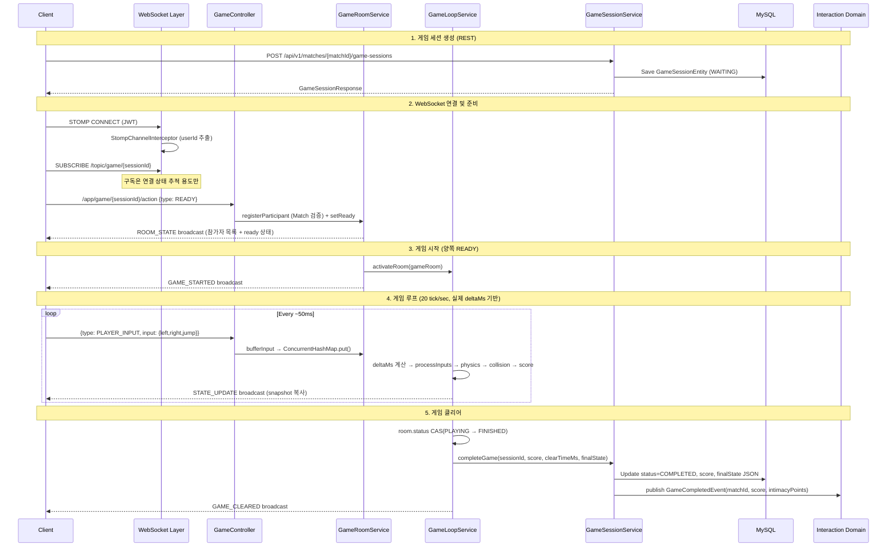
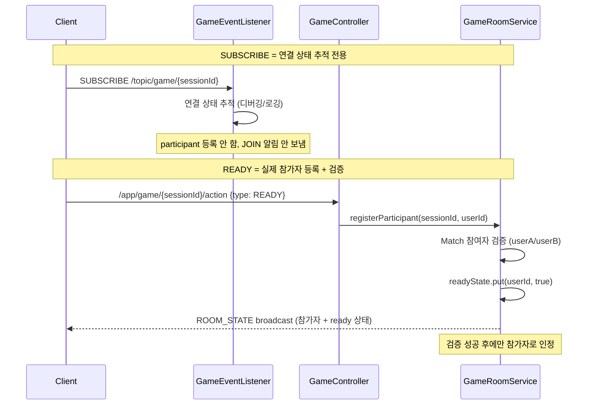
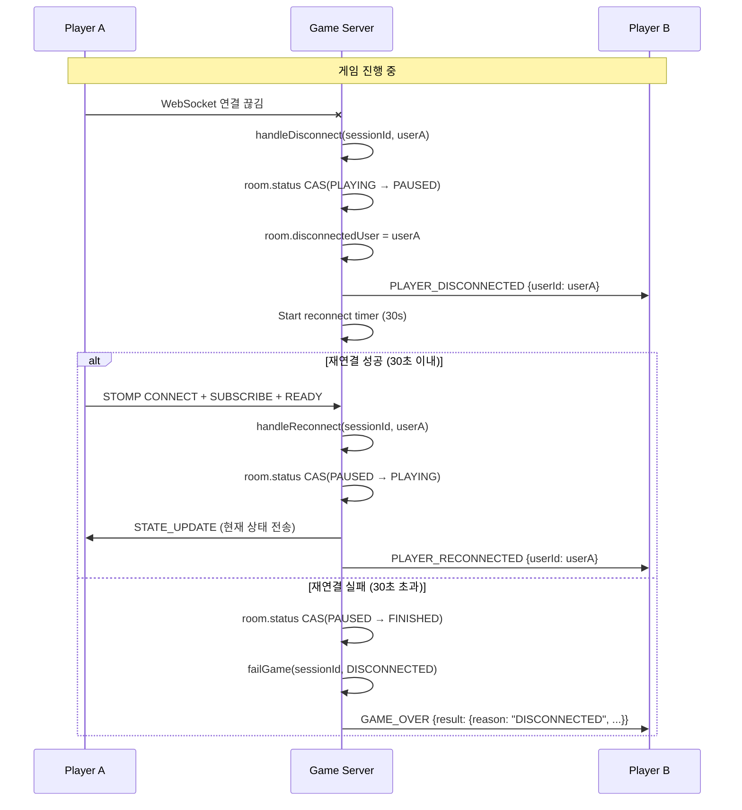
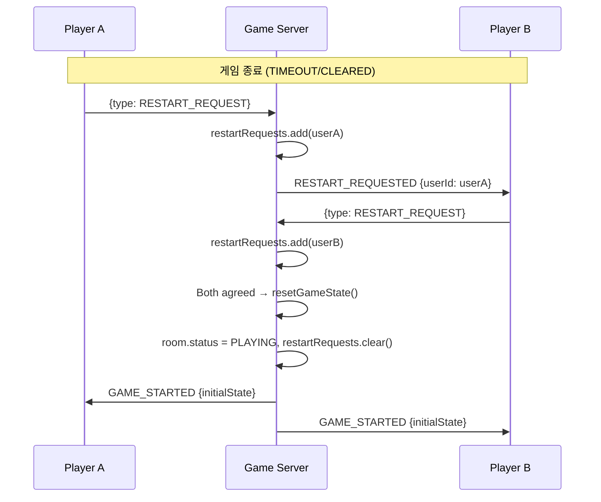

# Design Document: 실시간 협동 게임 도메인 (domain.game)

## Overview

실시간 2인 협동 퍼즐 플랫포머 게임("별빛 길 열기")의 서버 authoritative 아키텍처를 설계한다. 서버가 모든 게임 상태를 계산하고, 클라이언트는 입력만 전송하며 서버로부터 수신한 상태를 렌더링한다.

### 핵심 설계 원칙

- **Server Authoritative**: 클라이언트는 입력(boolean snapshot)만 전송, 서버가 물리/충돌/점수를 계산
- **단일 GameLoopService**: 하나의 스케줄러가 모든 활성 GameRoom을 순회하며 tick 처리
- **인메모리 런타임**: GameRoom/GameState는 메모리에서 관리, DB는 세션 생성/완료 시점에만 접근
- **기존 인프라 재사용**: WebSocketConfig, StompChannelInterceptor, /topic, /app, /queue/errors 공유
- **스레드 안전성**: GameState는 GameLoop thread만 변경, STOMP thread는 inputBuffer에만 쓴다
- **도메인 이벤트 기반 연동**: 게임 완료 시 Spring ApplicationEvent를 발행하여 Interaction 도메인과 느슨하게 결합

### 기술 스택

- **Backend**: Spring Boot 3.3.5, Java 17, Spring WebSocket (STOMP)
- **Database**: MySQL (GameSessionEntity), Redis (선택적 확장)
- **Game Loop**: `@Scheduled` 기반 fixed-rate 스케줄러 (50ms = 20 tick/sec), 실제 delta 시간 기반 계산
- **Test Client**: Phaser.js + Vite + TypeScript + @stomp/stompjs + SockJS
- **Testing**: JUnit 5 + jqwik (property-based testing)

## Concurrency Strategy

### 문제 정의

GameRoom은 다음 두 스레드에서 동시에 접근된다:
- **STOMP 핸들러 스레드**: inputBuffer 변경, readyState 변경, connectedUsers 변경, restartRequests 변경
- **GameLoop 스케줄러 스레드**: inputBuffer 읽기, gameState 갱신, room.status 체크/변경, 브로드캐스트

### MVP 동시성 전략

| 필드 | 타입 | 접근 패턴 | 동시성 제어 |
|------|------|-----------|-------------|
| `inputBuffer` | `ConcurrentHashMap<UUID, PlayerInputData>` | STOMP: put / GameLoop: read | ConcurrentHashMap (lock-free read) |
| `readyState` | `ConcurrentHashMap<UUID, Boolean>` | STOMP: put / GameLoop: read | ConcurrentHashMap |
| `connectedUsers` | `CopyOnWriteArraySet<UUID>` | STOMP: add/remove / GameLoop: iterate | CopyOnWriteArraySet |
| `restartRequests` | `CopyOnWriteArraySet<UUID>` | STOMP: add / GameLoop: read+clear | CopyOnWriteArraySet |
| `status` | `AtomicReference<GameRoomStatus>` | STOMP: CAS / GameLoop: CAS | AtomicReference + compareAndSet |
| `gameState` | `GameState` (mutable) | GameLoop만 write | GameLoop thread 독점 변경, broadcast 시 snapshot 복사 |
| `disconnectedUser` | `volatile UUID` | Event thread: write / GameLoop: read | volatile |
| `disconnectedAt` | `volatile Instant` | Event thread: write / GameLoop: read | volatile |

### 핵심 규칙

1. **GameState는 GameLoop thread만 변경한다.** STOMP thread는 절대 gameState를 직접 수정하지 않는다.
2. **STOMP thread는 inputBuffer에만 쓴다.** 입력은 ConcurrentHashMap.put()으로 최신 snapshot을 덮어쓴다.
3. **status 변경은 CAS(Compare-And-Set)로 보호한다.** 중복 완료 처리를 방지한다.
4. **broadcast 시 GameState의 snapshot을 복사하여 전송한다.** 전송 중 상태 변경으로 인한 불일치를 방지한다.

```java
// status 변경 예시 (중복 완료 방지)
if (!room.getStatus().compareAndSet(GameRoomStatus.PLAYING, GameRoomStatus.FINISHED)) {
    return; // 이미 다른 스레드가 변경함
}
// 안전하게 completeGame 호출
```


## Architecture

### High-Level Architecture Diagram

```mermaid
graph TB
    subgraph Client ["Game_Front_Test (Phaser.js)"]
        PH[Phaser Game Engine]
        SC[STOMP Client]
        IR[Input Reader]
        SR[State Renderer]
    end

    subgraph Server ["Backend (Spring Boot)"]
        subgraph WS ["WebSocket Layer"]
            WSC[WebSocketConfig<br/>/ws/game endpoint]
            SCI[StompChannelInterceptor<br/>JWT Auth]
            GC[GameController<br/>@MessageMapping]
            GEL[GameEventListener<br/>연결 상태 추적 전용]
        end

        subgraph Engine ["Game Engine"]
            GLS[GameLoopService<br/>@Scheduled 50ms<br/>실제 deltaMs 기반]
            PE[PhysicsEngine]
            CE[CollisionEngine]
            SCE[ScoreEngine]
        end

        subgraph Domain ["Domain Layer"]
            GSS[GameSessionService]
            GRS[GameRoomService]
            GCE[GameCompletedEvent<br/>Spring ApplicationEvent]
        end

        subgraph Persistence ["Persistence"]
            GSR[GameSessionRepository]
            DB[(MySQL)]
            RD[(Redis - optional)]
        end

        subgraph External ["External Domain"]
            INT[Interaction Domain<br/>@EventListener]
        end
    end

    IR --> SC
    SC -->|"/app/game/{id}/action"| WSC
    WSC --> SCI
    SCI --> GC
    GC --> GRS
    GRS --> GLS
    GLS --> PE
    GLS --> CE
    GLS --> SCE
    GLS -->|"State_Update"| SC
    SC --> SR
    SR --> PH

    GEL -->|"연결 추적/LEAVE"| SC
    GSS --> GSR
    GSR --> DB
    GRS -.->|"optional"| RD
    GSS -->|"publish"| GCE
    GCE -->|"subscribe"| INT
```

### Request/Response Flow




## Components and Interfaces

### Package Structure

```
com.ilgiyebo.domain.game/
├── config/
│   └── (WebSocketConfig에 /ws/game 추가 - 별도 파일 없음)
├── controller/
│   ├── GameController.java          // @MessageMapping STOMP 핸들러
│   └── GameSessionController.java   // @RestController REST API
├── dto/
│   ├── request/
│   │   ├── GameActionMessage.java   // 클라이언트→서버 STOMP 메시지
│   │   └── PlayerInputData.java     // {left, right, jump} boolean snapshot
│   ├── response/
│   │   ├── GameSessionResponse.java // REST 응답
│   │   ├── GameEvent.java           // 서버→클라이언트 이벤트 (sealed interface)
│   │   ├── RoomStateEvent.java
│   │   ├── GameStartedEvent.java
│   │   ├── StateUpdateEvent.java
│   │   ├── GameClearedEvent.java
│   │   ├── GameOverEvent.java
│   │   ├── PlayerDisconnectedEvent.java
│   │   ├── PlayerReconnectedEvent.java
│   │   ├── RestartRequestedEvent.java
│   │   └── GameErrorEvent.java
│   └── event/
│       └── GameCompletedEvent.java  // Spring ApplicationEvent (도메인 간 연동)
├── entity/
│   ├── GameSessionEntity.java       // DB 엔티티
│   ├── GameSessionStatus.java       // enum: WAITING, PLAYING, COMPLETED, FAILED, EXPIRED
│   └── GameFailReason.java          // enum: TIMEOUT, DISCONNECTED
├── engine/
│   ├── GameRoom.java                // 런타임 방 객체 (동시성 제어 포함)
│   ├── GameRoomStatus.java          // enum: WAITING, PLAYING, PAUSED, FINISHED
│   ├── GameState.java               // 게임 상태 (위치, 스위치, 문, 시간, 점수)
│   ├── PlayerState.java             // 플레이어 상태 (위치, 속도)
│   ├── PhysicsEngine.java           // 물리 계산 (이동, 중력, 충돌)
│   ├── CollisionEngine.java         // 충돌 판정 (스위치, 도착점)
│   ├── ScoreEngine.java             // 점수 계산 (매 tick)
│   └── MapData.java                 // 맵 데이터 (플랫폼, 스위치, 도착점 좌표)
├── exception/
│   └── GameException.java           // enum 기반 예외
├── repository/
│   └── GameSessionRepository.java   // JPA Repository
├── scheduler/
│   └── GameSessionScheduler.java    // 만료/정리 스케줄러
└── service/
    ├── GameSessionService.java      // 인터페이스
    ├── GameSessionServiceImpl.java  // 세션 CRUD + 상태 전이 + 이벤트 발행
    ├── GameRoomService.java         // 인터페이스
    ├── GameRoomServiceImpl.java     // 런타임 방 관리
    ├── GameLoopService.java         // 게임 루프 (단일 구현)
    └── GameRoomStore.java           // 인터페이스 (인메모리/Redis 추상화)
```

### Key Interfaces

```java
// GameRoomStore - 인메모리/Redis 추상화
public interface GameRoomStore {
    void put(UUID sessionId, GameRoom room);
    Optional<GameRoom> get(UUID sessionId);
    void remove(UUID sessionId);
    Collection<GameRoom> getActiveRooms();
}

// GameSessionService
public interface GameSessionService {
    GameSessionResponse createSession(UUID matchId, UUID requesterId);
    GameSessionResponse getSession(UUID gameSessionId, UUID requesterId);
    void startGame(UUID gameSessionId);
    void completeGame(UUID gameSessionId, int score, long clearTimeMs, String finalStateJson);
    void failGame(UUID gameSessionId, GameFailReason reason, int partialScore, String finalStateJson);
    void expireSession(UUID gameSessionId);
}

// GameRoomService
public interface GameRoomService {
    void registerParticipant(UUID sessionId, UUID userId);
    void setReady(UUID sessionId, UUID userId);
    void bufferInput(UUID sessionId, UUID userId, PlayerInputData input);
    void handleDisconnect(UUID sessionId, UUID userId);
    void handleReconnect(UUID sessionId, UUID userId);
    void requestRestart(UUID sessionId, UUID userId);
}
```


## Data Models

### Entity: GameSessionEntity

```java
@Entity
@Table(name = "game_session")
@Getter
@Setter
@SuperBuilder(toBuilder = true)
@NoArgsConstructor(access = AccessLevel.PROTECTED)
@AllArgsConstructor(access = AccessLevel.PROTECTED)
@EqualsAndHashCode(onlyExplicitlyIncluded = true, callSuper = true)
public class GameSessionEntity extends BaseSchema {

    @Column(name = "match_id", nullable = false)
    private UUID matchId;

    @ManyToOne(fetch = FetchType.LAZY)
    @JoinColumn(name = "match_id", insertable = false, updatable = false)
    private MatchEntity match;

    @Column(name = "game_type", nullable = false, length = 50)
    private String gameType;  // "COOP_SWITCH"

    @Builder.Default
    @Enumerated(EnumType.STRING)
    @Column(nullable = false, length = 20)
    private GameSessionStatus status = GameSessionStatus.WAITING;

    @Column(name = "fail_reason", length = 20)
    @Enumerated(EnumType.STRING)
    private GameFailReason failReason;

    @Column(name = "score")
    private Integer score;

    @Column(name = "clear_time_ms")
    private Long clearTimeMs;

    @Column(name = "intimacy_points")
    private Integer intimacyPoints;

    @Column(name = "final_state", columnDefinition = "JSON")
    private String finalState;  // 최종 GameState JSON 스냅샷 (디버깅/분석용)

    @Column(name = "started_at")
    private Instant startedAt;

    @Column(name = "completed_at")
    private Instant completedAt;
}
```

### Runtime Objects

```java
// GameRoom - 인메모리 런타임 방 객체 (동시성 제어 포함)
public class GameRoom {
    private final UUID sessionId;
    private final UUID matchId;
    private final UUID userAId;
    private final UUID userBId;

    // 참가자 상태 (STOMP thread: write, GameLoop thread: read)
    private final ConcurrentHashMap<UUID, Boolean> readyState = new ConcurrentHashMap<>();
    private final CopyOnWriteArraySet<UUID> connectedUsers = new CopyOnWriteArraySet<>();

    // 게임 상태 (GameLoop thread만 write)
    private GameState gameState;

    // room status (양쪽 스레드에서 CAS로 변경)
    private final AtomicReference<GameRoomStatus> status = new AtomicReference<>(GameRoomStatus.WAITING);

    // 입력 버퍼 (STOMP thread: put, GameLoop thread: read)
    private final ConcurrentHashMap<UUID, PlayerInputData> inputBuffer = new ConcurrentHashMap<>();

    // 타이밍 (GameLoop thread만 write)
    private volatile long lastTickTime;

    // 재시작 요청 (STOMP thread: add, GameLoop thread: read+clear)
    private final CopyOnWriteArraySet<UUID> restartRequests = new CopyOnWriteArraySet<>();

    // 연결 끊김 추적 (Event thread: write, GameLoop thread: read)
    private volatile UUID disconnectedUser;
    private volatile Instant disconnectedAt;

    // 맵 데이터 (불변, 초기화 시 설정)
    private final MapData mapData;
}

// GameState - 게임 진행 상태 (GameLoop thread만 변경)
public class GameState {
    private final Map<UUID, PlayerState> players;           // userId → PlayerState
    private final Map<String, Boolean> switches;            // "switch-a" → pressed 여부
    private boolean doorOpen;                               // 문 열림 여부
    private double remainingTimeMs;                         // 남은 시간 (ms)
    private long elapsedTimeMs;                             // 경과 시간 (ms)
    private int cooperationCount;                           // 협동 성공 횟수
    private int score;                                      // 현재 점수 (매 tick ScoreEngine이 갱신)

    // broadcast용 snapshot 생성 (불변 복사)
    public GameStateSnapshot toSnapshot() {
        return new GameStateSnapshot(
            players.entrySet().stream().collect(Collectors.toMap(
                e -> e.getKey().toString(),
                e -> e.getValue().toDto()
            )),
            Map.copyOf(switches),
            doorOpen,
            remainingTimeMs,
            elapsedTimeMs,
            cooperationCount,
            score
        );
    }
}

// PlayerState - 플레이어 물리 상태
public class PlayerState {
    private double x;
    private double y;
    private double velocityX;
    private double velocityY;
    private boolean onGround;
    private boolean atGoal;

    public PlayerStateDto toDto() {
        return new PlayerStateDto(x, y, velocityX, velocityY, onGround, atGoal);
    }
}

// PlayerInputData - 입력 DTO
public record PlayerInputData(
    boolean left,
    boolean right,
    boolean jump
) {}

// MapData - 맵 정의
public class MapData {
    private double width;
    private double height;
    private List<Platform> platforms;       // 바닥/플랫폼
    private List<SwitchArea> switches;     // 스위치 영역 (각각 String id 보유)
    private List<DoorArea> doors;          // 문 영역
    private GoalArea goal;                 // 도착 지점
    private Position spawnA;               // 플레이어A 시작 위치
    private Position spawnB;               // 플레이어B 시작 위치
    private double timeLimitMs;            // 제한 시간
}

// SwitchArea - 스위치 영역 (String id 기반)
public class SwitchArea {
    private String id;          // "switch-a", "switch-b"
    private double x;
    private double y;
    private double width;
    private double height;
    private UUID assignedTo;    // 어느 플레이어가 밟아야 하는지 (null이면 아무나)
}
```


### DTO: STOMP Messages

```java
// 클라이언트 → 서버
public record GameActionMessage(
    @NotNull String type,   // "READY", "PLAYER_INPUT", "RESTART_REQUEST"
    PlayerInputData input   // PLAYER_INPUT일 때만 사용
) {}

// 서버 → 클라이언트 (sealed interface)
public sealed interface GameEvent permits
    RoomStateEvent, GameStartedEvent, StateUpdateEvent,
    GameClearedEvent, GameOverEvent, PlayerDisconnectedEvent,
    PlayerReconnectedEvent, RestartRequestedEvent, GameErrorEvent {
    String type();
}

public record RoomStateEvent(
    String type,  // "ROOM_STATE"
    Map<String, Boolean> players  // userId → ready
) implements GameEvent {}

public record GameStartedEvent(
    String type,  // "GAME_STARTED"
    GameStateSnapshot initialState
) implements GameEvent {}

public record StateUpdateEvent(
    String type,  // "STATE_UPDATE"
    GameStateSnapshot state
) implements GameEvent {}

public record GameClearedEvent(
    String type,  // "GAME_CLEARED"
    GameResultDto result
) implements GameEvent {}

public record GameResultDto(
    boolean clear,
    int score,
    long clearTimeMs,
    int intimacyPoints
) {}

public record GameOverEvent(
    String type,  // "GAME_OVER"
    GameOverResultDto result
) implements GameEvent {}

public record GameOverResultDto(
    String reason,       // "TIMEOUT", "DISCONNECTED"
    int partialScore,
    long elapsedTimeMs
) {}

public record PlayerDisconnectedEvent(
    String type,  // "PLAYER_DISCONNECTED"
    String userId
) implements GameEvent {}

public record PlayerReconnectedEvent(
    String type,  // "PLAYER_RECONNECTED"
    String userId
) implements GameEvent {}

public record RestartRequestedEvent(
    String type,  // "RESTART_REQUESTED"
    String userId
) implements GameEvent {}

public record GameErrorEvent(
    String type,  // "GAME_ERROR"
    String code,
    String message
) implements GameEvent {}

// State snapshot for broadcast (score 포함)
public record GameStateSnapshot(
    Map<String, PlayerStateDto> players,
    Map<String, Boolean> switches,    // "switch-a" → true/false
    boolean doorOpen,
    double remainingTimeMs,
    long elapsedTimeMs,
    int cooperationCount,
    int score                         // 현재 점수 (매 tick 갱신)
) {}

public record PlayerStateDto(
    double x, double y,
    double velocityX, double velocityY,
    boolean onGround, boolean atGoal
) {}
```

### REST API

| Method | Path | Description | Request | Response |
|--------|------|-------------|---------|----------|
| POST | `/api/v1/matches/{matchId}/game-sessions` | 게임 세션 생성 | - | `GameSessionResponse` |
| GET | `/api/v1/game-sessions/{gameSessionId}` | 게임 세션 조회 | - | `GameSessionResponse` |

```java
public record GameSessionResponse(
    UUID id,
    UUID matchId,
    String gameType,
    GameSessionStatus status,
    GameFailReason failReason,
    Integer score,
    Long clearTimeMs,
    Integer intimacyPoints,
    Instant startedAt,
    Instant completedAt,
    Instant createdAt
) {}
```


## Domain Event Integration

### 설계 원칙

Game 도메인은 추후 별도 game-server로 분리될 가능성이 높으므로, InteractionService를 직접 호출하지 않고 **내부 도메인 이벤트 기반**으로 연동한다.

- MVP: Spring ApplicationEvent 사용
- 추후 game-server 분리 시: SQS / Kafka / EventBridge 메시지로 대체 가능한 구조

### Interaction 도메인 연동

```java
// 도메인 이벤트 정의 (game 도메인 내부)
public record GameCompletedEvent(
    UUID matchId,
    UUID gameSessionId,
    String gameType,       // "COOP_SWITCH"
    int score,
    int intimacyPoints,
    long clearTimeMs,
    boolean cleared        // true: 클리어, false: 실패/타임아웃
) {}

// GameSessionServiceImpl에서 발행
@Service
@RequiredArgsConstructor
public class GameSessionServiceImpl implements GameSessionService {

    private final ApplicationEventPublisher eventPublisher;
    private final GameSessionRepository gameSessionRepository;

    @Override
    @Transactional
    public void completeGame(UUID gameSessionId, int score, long clearTimeMs, String finalStateJson) {
        GameSessionEntity session = findById(gameSessionId);
        int intimacyPoints = calculateIntimacyPoints(score, clearTimeMs);

        session.setStatus(GameSessionStatus.COMPLETED);
        session.setScore(score);
        session.setClearTimeMs(clearTimeMs);
        session.setIntimacyPoints(intimacyPoints);
        session.setFinalState(finalStateJson);
        session.setCompletedAt(Instant.now());
        gameSessionRepository.save(session);

        // 도메인 이벤트 발행 (트랜잭션 commit 후 리스너가 처리)
        eventPublisher.publishEvent(new GameCompletedEvent(
            session.getMatchId(),
            gameSessionId,
            session.getGameType(),
            score,
            intimacyPoints,
            clearTimeMs,
            true
        ));
    }

    @Override
    @Transactional
    public void failGame(UUID gameSessionId, GameFailReason reason, int partialScore, String finalStateJson) {
        GameSessionEntity session = findById(gameSessionId);

        session.setStatus(GameSessionStatus.FAILED);
        session.setFailReason(reason);
        session.setScore(partialScore);
        session.setFinalState(finalStateJson);
        session.setCompletedAt(Instant.now());
        gameSessionRepository.save(session);

        // 실패 시에도 이벤트 발행 (Interaction이 실패 처리할 수 있도록)
        eventPublisher.publishEvent(new GameCompletedEvent(
            session.getMatchId(),
            gameSessionId,
            session.getGameType(),
            partialScore,
            0,  // 실패 시 intimacyPoints 없음
            0,
            false
        ));
    }
}
```

### Interaction 도메인 이벤트 핸들러

```java
// Interaction 도메인 내부 (com.ilgiyebo.domain.interaction.handler)
@Slf4j
@Component
@RequiredArgsConstructor
public class InteractionGameEventHandler {

    private final InteractionService interactionService;

    /**
     * GameSession 저장 트랜잭션이 성공적으로 commit된 이후에 실행된다.
     * 이렇게 하면 GameSession이 확실히 저장된 상태에서만 Interaction 상태를 변경한다.
     *
     * 추후 game-server 분리 시 이 리스너를 SQS/Kafka consumer로 대체한다.
     */
    @TransactionalEventListener(phase = TransactionPhase.AFTER_COMMIT)
    public void handleGameCompleted(GameCompletedEvent event) {
        try {
            if (event.cleared()) {
                interactionService.completeGame(event.matchId(), event.gameType());
                log.info("게임 완료 처리 성공: matchId={}, score={}, intimacyPoints={}",
                    event.matchId(), event.score(), event.intimacyPoints());
            } else {
                log.info("게임 실패 이벤트 수신: matchId={}, reason=failed", event.matchId());
                // MVP에서는 실패 시 별도 처리 없음. 추후 재도전 로직 추가 가능.
            }
        } catch (Exception e) {
            log.error("게임 완료 이벤트 처리 실패: matchId={}, error={}",
                event.matchId(), e.getMessage());
            // 이벤트 처리 실패 시 GameSession은 이미 저장됨.
            // 추후 재처리 메커니즘(DLQ 등) 추가 가능.
        }
    }
}
```

### InteractionService 확장

```java
// InteractionService 인터페이스에 추가
public interface InteractionService {
    // ... 기존 메서드들 ...
    void completeGame(UUID matchId, String gameType);
}

// InteractionServiceImpl에 구현 추가
@Override
@Transactional
public void completeGame(UUID matchId, String gameType) {
    InteractionEntity interaction = findInteraction(matchId);

    if (interaction.getCurrentStage() < 3) {
        log.warn("게임 완료 처리 스킵: matchId={}, currentStage={}", matchId, interaction.getCurrentStage());
        return;
    }

    // 3단계 완료 → 4단계로 진행
    interaction.setCurrentStage(4);
    interaction.setStageStatus(StageStatus.IN_PROGRESS);
    interactionRepository.save(interaction);

    log.info("3단계 게임 완료 → 4단계 진행: matchId={}", matchId);
}
```

### 이벤트 흐름

```
GameLoopService (클리어 판정)
  → room.status CAS(PLAYING → FINISHED)
  → GameSessionService.completeGame() (DB 저장 + 이벤트 발행)
    → @Transactional commit 성공
      → GameCompletedEvent (Spring ApplicationEvent)
        → InteractionGameEventHandler (@TransactionalEventListener AFTER_COMMIT)
          → InteractionService.completeGame(matchId, gameType)
            → InteractionEntity: currentStage=4, stageStatus=IN_PROGRESS
```

### 추후 game-server 분리 시 변경 포인트

| 현재 (모놀리스) | 분리 후 (game-server) |
|----------------|----------------------|
| `ApplicationEventPublisher.publishEvent()` | SQS/Kafka producer로 메시지 발행 |
| `@TransactionalEventListener` | SQS/Kafka consumer로 메시지 수신 |
| `GameCompletedEvent` record | JSON 메시지 payload (동일 필드) |
| 동일 JVM 내 동기 처리 | 비동기 메시지 처리 + 재시도/DLQ |


## Database Schema

현재 프로젝트는 `spring.jpa.hibernate.ddl-auto: update` 기반으로 개발 중이므로, Flyway 마이그레이션 대신 JPA 엔티티 정의로 테이블을 자동 생성한다.

### 테이블 구조 (GameSessionEntity에서 자동 생성)

| 컬럼 | 타입 | 제약 | 설명 |
|------|------|------|------|
| id | BINARY(16) | PK | UUID |
| match_id | BINARY(16) | NOT NULL, FK | 매칭 참조 |
| game_type | VARCHAR(50) | NOT NULL | "COOP_SWITCH" |
| status | VARCHAR(20) | NOT NULL | WAITING/PLAYING/COMPLETED/FAILED/EXPIRED |
| fail_reason | VARCHAR(20) | NULL | TIMEOUT/DISCONNECTED |
| score | INT | NULL | 최종 점수 |
| clear_time_ms | BIGINT | NULL | 클리어 시간 |
| intimacy_points | INT | NULL | 친밀도 점수 |
| final_state | JSON | NULL | 최종 GameState 스냅샷 (디버깅용, 매 tick 저장 금지) |
| started_at | TIMESTAMP(6) | NULL | 게임 시작 시각 |
| completed_at | TIMESTAMP(6) | NULL | 게임 완료 시각 |
| created_at | TIMESTAMP(6) | NOT NULL | 생성 시각 (BaseSchema) |
| updated_at | TIMESTAMP(6) | NULL | 수정 시각 (BaseSchema) |

인덱스는 `@Table(indexes = {...})` 어노테이션으로 정의한다:
- `idx_game_session_match_id` (match_id)
- `idx_game_session_status` (status)
- `idx_game_session_match_status` (match_id, status)

### final_state JSON 예시 (게임 완료 시 1회만 저장)

```json
{
  "players": {
    "user-a-uuid": {"x": 1100, "y": 200, "atGoal": true},
    "user-b-uuid": {"x": 1150, "y": 200, "atGoal": true}
  },
  "switches": {"switch-a": true, "switch-b": true},
  "doorOpen": true,
  "remainingTimeMs": 85000,
  "elapsedTimeMs": 95000,
  "cooperationCount": 4,
  "score": 820
}
```

**저장 시점**: 게임 완료(COMPLETED), 실패(FAILED), 만료(EXPIRED) 시에만 저장. 매 tick 저장 금지.


## GameLoopService Design

```java
@Slf4j
@Component
@RequiredArgsConstructor
public class GameLoopService {

    private final GameRoomStore roomStore;
    private final PhysicsEngine physicsEngine;
    private final CollisionEngine collisionEngine;
    private final ScoreEngine scoreEngine;
    private final SimpMessagingTemplate messagingTemplate;
    private final GameSessionService gameSessionService;

    private static final double MAX_DELTA_MS = 100.0;  // 튐 방지 clamp

    @Scheduled(fixedRate = 50)  // 50ms = 20Hz
    public void tick() {
        long now = System.currentTimeMillis();
        Collection<GameRoom> activeRooms = roomStore.getActiveRooms();

        for (GameRoom room : activeRooms) {
            if (room.getStatus().get() == GameRoomStatus.PLAYING) {
                try {
                    // 실제 경과 시간 기반 delta 계산
                    double deltaMs = now - room.getLastTickTime();
                    deltaMs = Math.min(deltaMs, MAX_DELTA_MS);  // 튐 방지
                    room.setLastTickTime(now);
                    processRoom(room, deltaMs);
                } catch (Exception e) {
                    log.error("Error processing room {}: {}", room.getSessionId(), e.getMessage());
                }
            }
        }
    }

    private void processRoom(GameRoom room, double deltaMs) {
        GameState state = room.getGameState();

        // 1. 입력 처리 → 속도 계산 (ConcurrentHashMap에서 안전하게 읽기)
        room.getInputBuffer().forEach((userId, input) -> {
            PlayerState player = state.getPlayers().get(userId);
            if (player != null) {
                physicsEngine.applyInput(player, input, deltaMs);
            }
        });

        // 2. 물리 계산 (중력 + 이동)
        for (PlayerState player : state.getPlayers().values()) {
            physicsEngine.applyGravity(player, deltaMs);
            physicsEngine.applyMovement(player, deltaMs);
        }

        // 3. 충돌 판정 (바닥, 스위치, 도착점)
        MapData map = room.getMapData();
        for (PlayerState player : state.getPlayers().values()) {
            collisionEngine.resolveFloorCollision(player, map.getPlatforms());
        }
        collisionEngine.checkSwitches(state, map.getSwitches());
        collisionEngine.checkDoor(state, map.getDoors());
        collisionEngine.checkGoal(state, map.getGoal());

        // 4. 시간 갱신
        state.setRemainingTimeMs(state.getRemainingTimeMs() - deltaMs);
        state.setElapsedTimeMs(state.getElapsedTimeMs() + (long) deltaMs);

        // 5. 점수 계산 (매 tick)
        scoreEngine.updateScore(state);

        // 6. 게임 종료 조건 체크 (CAS로 중복 완료 방지)
        if (isGameCleared(state)) {
            if (room.getStatus().compareAndSet(GameRoomStatus.PLAYING, GameRoomStatus.FINISHED)) {
                handleGameCleared(room);
            }
        } else if (state.getRemainingTimeMs() <= 0) {
            if (room.getStatus().compareAndSet(GameRoomStatus.PLAYING, GameRoomStatus.FINISHED)) {
                handleGameOver(room);
            }
        } else {
            // 7. 상태 브로드캐스트 (snapshot 복사)
            broadcastState(room);
        }
    }

    private void handleGameCleared(GameRoom room) {
        GameState state = room.getGameState();
        int finalScore = state.getScore();
        long clearTimeMs = state.getElapsedTimeMs();
        String finalStateJson = serializeState(state);

        // DB 저장 (별도 스레드에서 실행해도 됨, MVP에서는 직접 호출)
        try {
            gameSessionService.completeGame(room.getSessionId(), finalScore, clearTimeMs, finalStateJson);
        } catch (Exception e) {
            log.error("Failed to save game completion for session {}: {}", room.getSessionId(), e.getMessage());
            // 복구: room은 이미 FINISHED이므로 재처리 불가. 로그로 추적.
        }

        // 클라이언트에 결과 전송
        GameClearedEvent event = new GameClearedEvent(
            "GAME_CLEARED",
            new GameResultDto(true, finalScore, clearTimeMs, calculateIntimacyPoints(finalScore, clearTimeMs))
        );
        messagingTemplate.convertAndSend("/topic/game/" + room.getSessionId(), event);

        // GameRoom 정리
        roomStore.remove(room.getSessionId());
    }

    private void handleGameOver(GameRoom room) {
        GameState state = room.getGameState();
        int partialScore = state.getScore();
        String finalStateJson = serializeState(state);

        try {
            gameSessionService.failGame(room.getSessionId(), GameFailReason.TIMEOUT, partialScore, finalStateJson);
        } catch (Exception e) {
            log.error("Failed to save game failure for session {}: {}", room.getSessionId(), e.getMessage());
        }

        GameOverEvent event = new GameOverEvent(
            "GAME_OVER",
            new GameOverResultDto("TIMEOUT", partialScore, state.getElapsedTimeMs())
        );
        messagingTemplate.convertAndSend("/topic/game/" + room.getSessionId(), event);

        roomStore.remove(room.getSessionId());
    }

    private void broadcastState(GameRoom room) {
        // GameState의 불변 snapshot을 복사하여 전송 (스레드 안전)
        GameStateSnapshot snapshot = room.getGameState().toSnapshot();
        StateUpdateEvent event = new StateUpdateEvent("STATE_UPDATE", snapshot);
        messagingTemplate.convertAndSend("/topic/game/" + room.getSessionId(), event);
    }

    private boolean isGameCleared(GameState state) {
        return state.getPlayers().values().stream().allMatch(PlayerState::isAtGoal);
    }
}
```


## Sequence Diagrams

### SUBSCRIBE vs READY 역할 분리



### 연결 끊김 및 재연결



### 재시작 플로우




## WebSocket Configuration Change

기존 `WebSocketConfig`에 `/ws/game` 엔드포인트를 추가한다. 별도의 `WebSocketMessageBrokerConfigurer`를 생성하지 않는다.

```java
@Override
public void registerStompEndpoints(StompEndpointRegistry registry) {
    registry.addEndpoint("/ws/chat")
            .setAllowedOriginPatterns(allowedOrigins.split(","))
            .withSockJS();
    // 게임 엔드포인트 추가 (동일 MessageBroker, 동일 Interceptor 공유)
    registry.addEndpoint("/ws/game")
            .setAllowedOriginPatterns(allowedOrigins.split(","))
            .withSockJS();
}
```

- 기존 `StompChannelInterceptor`가 `/ws/game` 연결에도 동일하게 적용된다 (동일 `MessageBrokerConfigurer` 내이므로)
- `/topic`, `/app`, `/queue/errors` prefix도 그대로 공유
- 게임 전용 destination: `/app/game/{sessionId}/action`, `/topic/game/{sessionId}`

## Game_Front_Test Architecture

```
game-front-test/
├── index.html
├── package.json
├── tsconfig.json
├── vite.config.ts
└── src/
    ├── main.ts                    // 진입점
    ├── config.ts                  // 서버 URL, 게임 설정
    ├── network/
    │   ├── StompClient.ts         // @stomp/stompjs + SockJS 래퍼
    │   └── GameProtocol.ts        // 메시지 타입 정의
    ├── scenes/
    │   ├── BootScene.ts           // 에셋 로드
    │   ├── LobbyScene.ts          // 세션 생성 + READY 대기
    │   ├── GameScene.ts           // 메인 게임 (렌더링 + 입력)
    │   └── ResultScene.ts         // 결과 화면
    ├── input/
    │   ├── KeyboardInput.ts       // 방향키 + 스페이스바
    │   └── TouchInput.ts          // 모바일 터치 버튼
    └── ui/
        └── OrientationGuard.ts    // 세로 모드 감지 → 안내 화면
```

**Phaser 설정:**
```typescript
const config: Phaser.Types.Core.GameConfig = {
    type: Phaser.AUTO,
    scale: {
        mode: Phaser.Scale.FIT,
        autoCenter: Phaser.Scale.CENTER_BOTH,
        width: 1280,
        height: 720,
    },
    physics: { default: 'none' },  // 서버 authoritative이므로 클라이언트 물리 없음
    scene: [BootScene, LobbyScene, GameScene, ResultScene],
};
```

**STOMP 연결 (SockJS fallback):**
```typescript
import { Client } from '@stomp/stompjs';
import SockJS from 'sockjs-client';

const stompClient = new Client({
    webSocketFactory: () => new SockJS('http://localhost:8080/ws/game'),
    connectHeaders: { Authorization: `Bearer ${token}` },
    onConnect: () => {
        stompClient.subscribe(`/topic/game/${sessionId}`, (message) => {
            const event = JSON.parse(message.body);
            handleGameEvent(event);
        });
    },
});
stompClient.activate();
```

**입력 전송 방식:**
- 키보드/터치 상태를 매 프레임 boolean snapshot으로 캡처
- 이전 프레임과 다를 때만 서버로 전송 (대역폭 최적화)

```typescript
// GameScene.ts update loop
update() {
    const currentInput = {
        left: this.keys.left.isDown || this.touchLeft,
        right: this.keys.right.isDown || this.touchRight,
        jump: this.keys.space.isDown || this.touchJump,
    };
    if (!deepEqual(currentInput, this.lastInput)) {
        this.stompClient.publish({
            destination: `/app/game/${this.sessionId}/action`,
            body: JSON.stringify({
                type: 'PLAYER_INPUT',
                input: currentInput,
            }),
        });
        this.lastInput = currentInput;
    }
}
```

## Correctness Properties

### P1: 동시성 안전성
- GameState는 GameLoop thread에서만 변경된다
- inputBuffer에 대한 concurrent read/write가 데이터 손실 없이 동작한다
- room.status CAS 연산으로 중복 완료 처리가 발생하지 않는다

### P2: 게임 상태 일관성
- 모든 STATE_UPDATE의 remainingTimeMs는 단조 감소한다
- 두 플레이어가 모두 atGoal=true일 때만 GAME_CLEARED가 발생한다
- remainingTimeMs ≤ 0일 때 GAME_OVER가 정확히 1회 발생한다

### P3: 참여자 검증
- Match_Entity의 userA/userB가 아닌 사용자는 READY 메시지가 거부된다
- STOMP Principal에서 추출한 userId만 신뢰한다

### P4: 데이터 저장 정책
- PLAYER_INPUT은 DB에 저장되지 않는다
- STATE_UPDATE는 DB에 저장되지 않는다
- final_state JSON은 게임 종료 시 1회만 저장된다

### P5: 독립성
- 한 GameRoom의 예외가 다른 GameRoom의 tick 처리에 영향을 주지 않는다
- 한 GameRoom의 completeGame 실패가 다른 GameRoom을 블로킹하지 않는다
