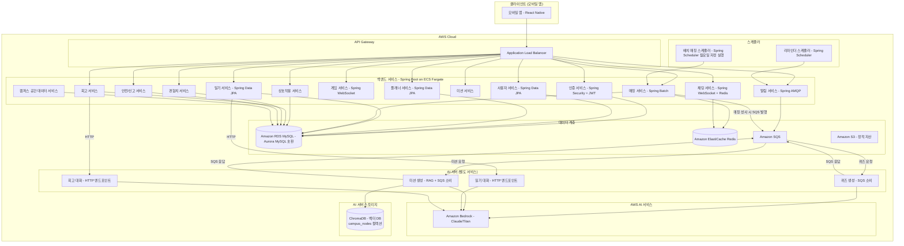
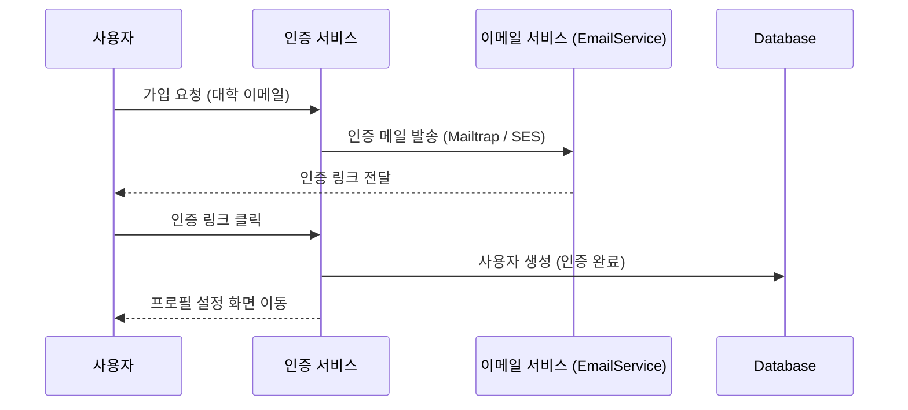
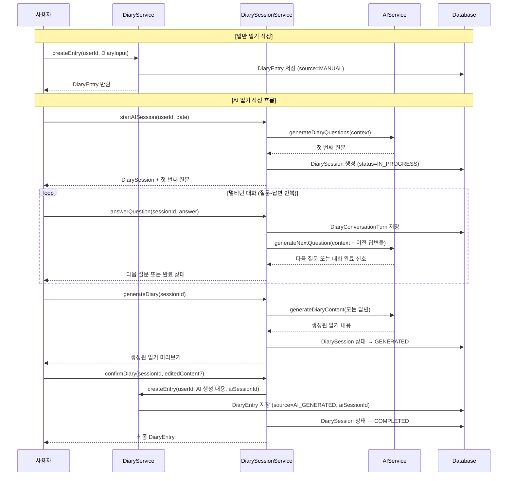
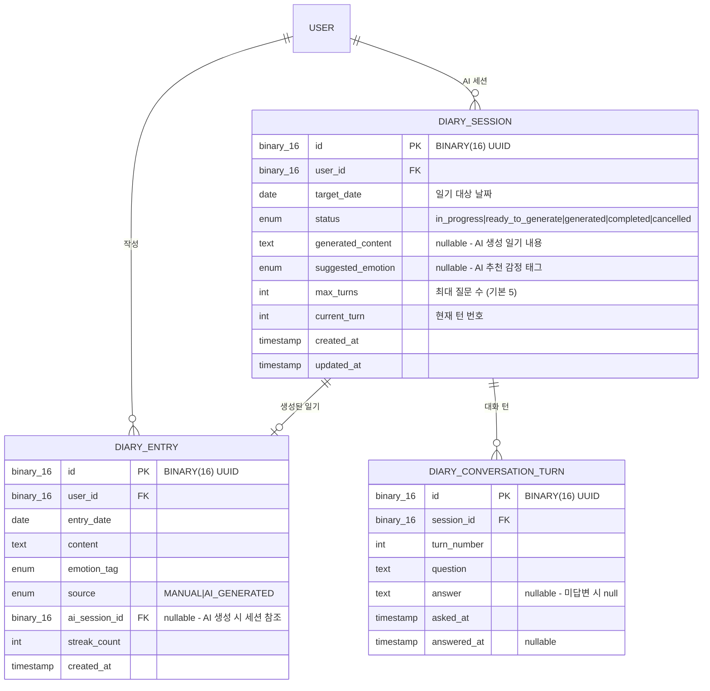
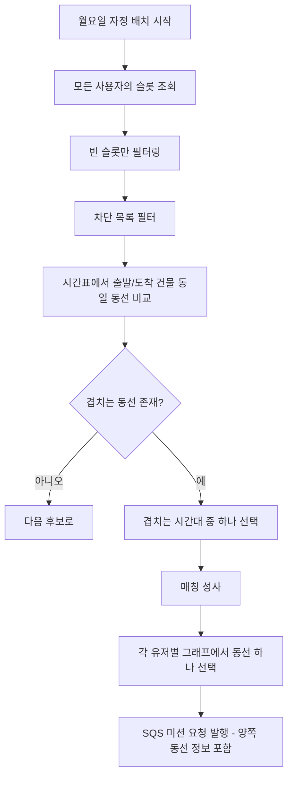
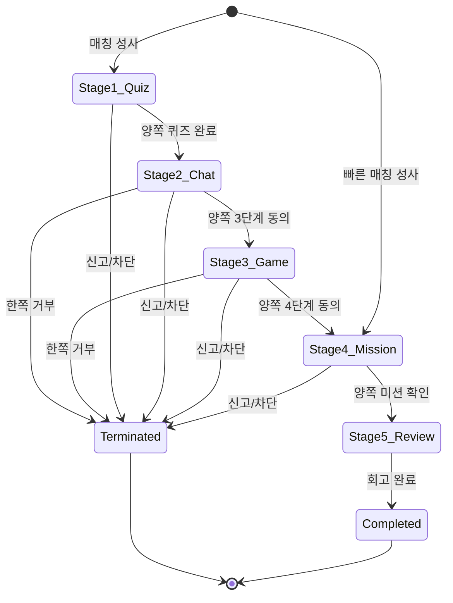
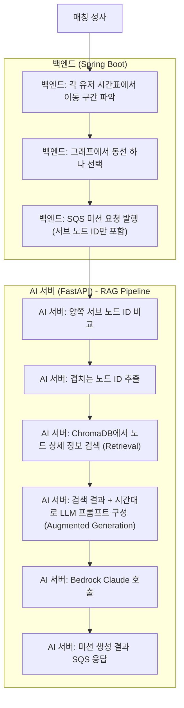

# 기술 설계 문서: 일기예보 (ilgi-yebo)

## 개요

일기예보는 대학생 대상 소셜 매칭 서비스로, 수업 시간표와 동선 교집합을 기반으로 자연스러운 만남을 제공한다. 사용자는 일기/플래너를 통해 자기 성장을 도모하고, 5단계 상호작용을 통해 점진적으로 관계를 형성한다.

핵심 도메인:
- **사용자 관리**: 대학 이메일 인증 기반 가입, 프로필/관심사 설정
- **일상 기록**: 플래너(일정)와 일기(자유 형식) 작성, 경험치 연동 [MVP 후순위]
- **슬롯 기반 매칭**: 평일(월~금) 자정 배치 처리. MVP에서는 동선 시간대 겹침 기반 단순 매칭 (AI 미사용, 프로필 속성 분석 미적용). 프로필 데이터는 추후 분석을 위해 수집만 수행
- **단계별 상호작용**: 퀴즈(비동기 힌트 질문 포함) → 채팅 → 협동 게임 → 미션 기반 만남 → 회고(AI 기반/직접 작성) (5단계)
- **빠른 매칭**: 1~3단계 건너뛰기, 빠른 매칭 풀 우선 매칭 [MVP 후순위]
- **경험치/성장**: 활동 기반 경험치, 레벨업, 슬롯 해금
- **안전**: 신고/차단, 자동 계정 정지

## 아키텍처

### High-Level Architecture



### 설계 결정 사항

1. **Spring Boot (Java) 기반 백엔드**: 엔터프라이즈급 안정성, 풍부한 생태계(Spring Data JPA, Spring Security, Spring Batch, Spring WebSocket 등), 대규모 서비스 운영에 검증된 프레임워크. Java record를 활용한 불변 DTO, sealed interface를 활용한 타입 안전 모델링
2. **마이크로서비스 아키텍처**: 매칭, 채팅, 게임 등 독립적 확장이 필요한 도메인이 많아 서비스 분리 채택
3. **배치 매칭 (월요일 자정 실행)**: Spring Scheduler를 활용한 배치 처리. 매주 월요일 자정에만 실행하여 한 주간의 매칭을 일괄 생성. 중간에 매칭이 일찍 끝나도 다음 월요일까지 재매칭하지 않음
4. **Redis 캐시 (Amazon ElastiCache)**: Spring Data Redis를 통한 채팅 세션, 매칭 풀 임시 데이터, 게임 상태 등 실시간성이 필요한 데이터에 활용
5. **메시지 큐 (Amazon SQS / Amazon MQ)**: Spring AMQP를 통한 알림 전송의 비동기 처리로 서비스 간 결합도 감소
6. **별도 AI 서버 + Amazon Bedrock**: AI 관련 로직(프롬프트 관리, Bedrock 호출, RAG 검색)은 별도 AI 서버에서 담당한다. Spring Boot 백엔드는 필요한 입력값만 전달하고, AI 서버가 프롬프트를 구성하여 Bedrock을 호출한다. 통신 방식은 기능별로 구분한다:
   - **퀴즈/미션 (비동기 SQS)**: 매칭 성사 시점에 사전 생성. Spring Boot가 SQS 요청큐에 입력값을 발행하면, AI 서버가 소비하여 Bedrock 호출 후 SQS 응답큐로 결과를 반환. 사용자 대기 없음
   - **일기/회고 (동기 HTTP)**: 사용자가 실시간으로 대화하는 흐름. Spring Boot가 AI 서버의 HTTP 엔드포인트를 직접 호출하여 즉시 응답을 받음
   - **미션 RAG**: AI 서버가 백엔드로부터 받은 서브 노드 ID로 ChromaDB에서 장소 상세 정보를 검색(Retrieval)하고, 검색 결과를 Bedrock 프롬프트에 주입(Augmented Generation)하여 미션 생성
   - MVP에서는 매칭 점수 계산과 동선 추론에 AI를 사용하지 않으며, 시간표 기반 단순 동선 겹침으로 대체한다. 출시 후 데이터가 충분히 쌓이면 AI 기반으로 확장 예정
7. **캠퍼스 공간 데이터 (그래프 + RAG)**: 건물(메인 노드)과 건물 사이 장소(서브 노드)를 그래프로 모델링하여 MySQL에 관리한다. 서브 노드는 간선으로 연결되어 여러 동선을 형성한다. 서브 노드의 상세 정보(name, description, typeActivity, operatingHours)는 Bedrock Titan Embeddings로 벡터화하여 AI 서버의 ChromaDB `campus_nodes` 컬렉션에 저장한다. 매칭 시 백엔드가 각 유저의 동선(출발 건물 → 서브 노드 ID 리스트 → 도착 건물)을 선택하여 AI 서버에 SQS로 전달하면, AI 서버가 양쪽 동선의 겹치는 서브 노드 ID를 찾고 ChromaDB에서 상세 정보를 검색(Retrieval)한 후 LLM 프롬프트에 주입(Augmented Generation)하여 미션을 생성한다
8. **Spring Security + JWT**: 대학 이메일 인증 기반 가입 및 JWT 토큰 기반 인증/인가 처리. `JwtAuthenticationFilter`가 모든 요청에서 Bearer 토큰을 파싱하여 SecurityContext에 userId를 설정한다. 실제 인증 강제는 `@MemberGuard` 커스텀 어노테이션(AOP 기반)이 메서드 단위로 처리하며, `@CurrentMember` 파라미터 어노테이션으로 컨트롤러에서 현재 로그인한 사용자의 UUID를 주입받는다. Spring Security의 `authorizeHttpRequests`는 `permitAll()`로 열어두고, 인증이 필요한 API에만 `@MemberGuard`를 선택적으로 적용하는 구조이다
9. **Spring Data JPA + MySQL (Amazon RDS Aurora MySQL 호환)**: JPA를 통한 ORM 매핑으로 도메인 모델과 데이터베이스 간 매핑 간소화. 팀 내 MySQL 운영 경험이 풍부하여 생산성 극대화. Aurora MySQL 호환 모드로 고가용성 및 자동 장애 복구 지원. RDS 관리형 서비스로 운영 부담 감소. **스키마 관리는 Flyway 마이그레이션을 사용하지 않고, JPA `ddl-auto: update` 설정을 통해 엔티티 기반으로 테이블을 자동 생성/수정한다.** 엔티티 클래스가 곧 스키마의 단일 진실 공급원(Single Source of Truth)이다
10. **AWS 배포 전략**: ECS Fargate 기반 컨테이너 배포로 서버 관리 부담 최소화, ALB를 통한 트래픽 분산, RDS/ElastiCache/SQS 등 관리형 서비스 활용으로 운영 효율성 극대화. S3를 통한 정적 자산 관리
11. **이메일 서비스 2단계 전략**: MVP 단계에서는 Mailtrap을 사용하여 인증 이메일을 발송하고, 프로덕션 단계에서는 AWS SES(Simple Email Service)로 전환한다. EmailService 인터페이스를 통해 구현체를 추상화하여 전환 시 코드 변경을 최소화한다
12. **이름/전공 입력 2단계 전략**: MVP 단계에서는 사용자가 이름과 전공을 직접 입력하고, SES 도입 후에는 대학 이메일 주소를 파싱하여 이름과 전공을 자동으로 입력한다. EmailParsingService 인터페이스를 통해 대학별 이메일 형식 파싱 규칙을 관리한다


## 컴포넌트 및 인터페이스

### Low-Level Design

#### 1. 인증 서비스 (AuthService)



**인터페이스:**
```java
public interface AuthService {
    /** 대학 이메일로 인증 코드 발송 */
    VerificationResponse sendVerification(String email);

    /** 인증 코드 확인 및 사용자 생성 */
    AuthTokenResponse verifyAndCreateUser(String verificationId, String code);

    /** 로그인 */
    AuthTokenResponse login(String email, String password);
}

public record VerificationResponse(String verificationId) {}

public record AuthTokenResponse(
    String userId,
    String token,
    String refreshToken
) {}
```

#### 1-1. 이메일 서비스 (EmailService)

```java
/**
 * 이메일 발송 추상화 인터페이스.
 * MVP: MailtrapEmailService, 프로덕션: SesEmailService
 */
public interface EmailService {
    /** 인증 이메일 발송 */
    void sendVerificationEmail(String to, String verificationCode);
}

/** MVP 단계: Mailtrap 기반 이메일 발송 */
public class MailtrapEmailService implements EmailService {
    @Override
    public void sendVerificationEmail(String to, String verificationCode) {
        // Mailtrap SMTP를 통한 이메일 발송
    }
}

/** 프로덕션 단계: AWS SES 기반 이메일 발송 */
public class SesEmailService implements EmailService {
    @Override
    public void sendVerificationEmail(String to, String verificationCode) {
        // AWS SES SDK를 통한 이메일 발송
    }
}
```

#### 1-2. 이메일 파싱 서비스 (EmailParsingService)

```java
/**
 * 대학 이메일 주소에서 이름과 전공을 파싱하는 서비스.
 * 대학별 이메일 형식이 다르므로 파싱 규칙을 대학별로 관리한다.
 * 예: "홍길동_컴퓨터공학과@university.ac.kr" → 이름: 홍길동, 전공: 컴퓨터공학과
 */
public interface EmailParsingService {
    /** 이메일 주소에서 이름과 전공 파싱 시도 */
    Optional<ParsedEmailInfo> parseEmail(String email);

    /** 특정 대학 도메인에 대한 파싱 규칙 존재 여부 확인 */
    boolean hasParsingRule(String universityDomain);
}

public record ParsedEmailInfo(
    String name,
    String major
) {}
```

#### 2. 사용자 서비스 (UserService)

```java
public interface UserService {
    /** 프로필 설정 (취미, 관심사, 성격 유형, 이상형) */
    UserProfile setupProfile(String userId, ProfileSetup profile);

    /** 프로필 조회 */
    UserProfile getProfile(String userId);

    /** 프로필 수정 */
    UserProfile updateProfile(String userId, ProfileSetup updates);
}

public record ProfileSetup(
    String nickname,
    String name,
    String major,
    List<String> hobbies,
    List<String> interests,
    String personalityType,
    IdealTypePreferences idealTypePreferences,
    LocalDate birthDate,
    Gender gender
) {}

public enum Gender { MALE, FEMALE, OTHER }

public record IdealTypePreferences(
    List<String> preferredHobbies,
    List<String> preferredPersonalityTypes,
    List<String> preferredInterests
) {}

public record UserProfile(
    String id,
    String email,
    String nickname,
    String name,
    String major,
    List<String> hobbies,
    List<String> interests,
    String personalityType,
    IdealTypePreferences idealTypePreferences,
    LocalDate birthDate,
    Gender gender,
    int totalExp,
    int currentLevel
) {}
```

#### 3. 플래너 서비스 (PlannerService)

```java
public interface PlannerService {
    /** 일정 생성 (수동 입력) */
    PlanEntry createPlanEntry(String userId, PlanEntryInput input);

    /** 일정 수정 */
    PlanEntry updatePlanEntry(String userId, String entryId, PlanEntryInput input);

    /** 일정 삭제 */
    void deletePlanEntry(String userId, String entryId);

    /** 특정 날짜 일정 목록 조회 (본인만) */
    List<PlanEntry> getPlanEntries(String userId, LocalDate date);

    /** 동선 정보 추출 (매칭 서비스에서 호출, SCHEDULE 기반) */
    RouteInfo extractRouteInfo(String userId, LocalDate date);
}

public record PlanEntryInput(
    LocalDate date,
    LocalTime startTime,
    LocalTime endTime,
    String location,
    String activity,
    PlanItemType type
) {}

public record PlanEntry(
    String id,
    String userId,
    LocalDate date,
    LocalTime startTime,
    LocalTime endTime,
    String location,
    String activity,
    PlanItemType type,
    PlanSource source,
    @Nullable String sourceScheduleId
) {}

public enum PlanItemType { CLASS, FREE, ACTIVITY }

public enum PlanSource { MANUAL, SCHEDULE_AUTO }

public record RouteInfo(
    String userId,
    LocalDate date,
    List<LocationTime> locations
) {}

public record LocationTime(LocalTime time, String place) {}
```

> **참고:** 시간표 등록 및 재등록은 `ScheduleService.upsertMySchedule()`에서 처리한다. 시간표 등록 시 학기 범위에 맞춰 PLAN_ENTRY(source=SCHEDULE_AUTO)를 자동 생성하는 로직도 ScheduleService에 포함된다.

#### 4. 일기 서비스 (DiaryService)

> **AI 일기 작성 흐름**: 사용자는 일반 일기(직접 작성)와 AI 일기(AI 대화 기반 생성) 두 가지 방식으로 일기를 작성할 수 있다. AI 일기 작성 시 시스템이 질문을 생성하고, 사용자가 답변하는 멀티턴 대화를 반복한 후, 최종적으로 AI가 답변을 기반으로 일기를 생성한다. 두 방식 모두 동일한 DiaryEntry로 저장되며, `aiSessionId`를 통해 AI 생성 일기를 추적할 수 있다.



```java
public interface DiaryService {
    /** 일기 작성 (일반 직접 작성 또는 AI 생성 확정 시 호출) */
    DiaryEntry createEntry(String userId, DiaryInput entry);

    /** 일기 목록 조회 (본인만) */
    Page<DiaryEntry> getEntries(String userId, Pageable pageable);

    /** 연속 작성 일수 조회 */
    StreakInfo getStreak(String userId);

    /** 감정 변화 추이 조회 */
    List<EmotionTrend> getEmotionTrend(String userId, String period);
}

public record DiaryInput(
    String content,
    @Nullable EmotionTag emotionTag,
    LocalDate date,
    DiarySource source,
    @Nullable String aiSessionId
) {}

public enum DiarySource { MANUAL, AI_GENERATED }

public enum EmotionTag { HAPPY, SAD, ANGRY, ANXIOUS, CALM, EXCITED, TIRED }

public record DiaryEntry(
    String id,
    String userId,
    LocalDate date,
    String content,
    @Nullable EmotionTag emotionTag,
    DiarySource source,
    @Nullable String aiSessionId,
    int streakCount,
    Instant createdAt
) {}

public record StreakInfo(int currentStreak, int longestStreak) {}

public record EmotionTrend(LocalDate date, EmotionTag emotion) {}
```

#### 4-1. AI 일기 세션 서비스 (DiarySessionService)

> AI 일기 작성의 멀티턴 대화를 관리하는 서비스. DiaryService와 분리하여 단일 책임 원칙을 준수하고, 추후 Conversation 도메인 확장 시 독립적으로 발전 가능하도록 설계한다.

**통신 아키텍처:**

AI 일기 멀티턴 대화는 **동기 HTTP 요청-응답** 방식으로 별도 AI 서버와 통신한다. SQS/AMQP 등 메시지 큐를 사용하지 않는다.

```
모바일 앱 ──HTTP──→ Spring Boot REST API ──HTTP──→ AI 서버 ──AWS SDK──→ Amazon Bedrock
    ↑                      │                          │                      │
    └──── JSON 응답 ───────┘←──── JSON 응답 ──────────┘←──── 모델 응답 ──────┘
```

- Spring Boot는 필요한 입력값(플래너, 대화 히스토리 등)만 AI 서버에 전달
- AI 서버가 프롬프트를 구성하고 Bedrock을 호출하여 결과를 반환
- AI 서버 응답 시간(~2-5초)이 HTTP 요청 내에서 처리 가능한 수준이므로 동기 방식 채택
- 사용자가 질문을 받고 답변을 입력하는 시간이 AI 응답 시간보다 훨씬 길어 병목 없음
- 에러 처리: Spring Retry로 AI 서버 타임아웃 시 최대 3회 재시도

```java
public interface DiarySessionService {
    /** AI 일기 세션 시작 - 첫 번째 질문 생성 */
    DiarySessionResponse startAISession(String userId, LocalDate date);

    /** 질문에 답변 - 다음 질문 또는 대화 완료 반환 */
    DiaryTurnResponse answerQuestion(String sessionId, String userId, String answer);

    /** 답변 기반 일기 생성 요청 */
    GeneratedDiaryPreview generateDiary(String sessionId, String userId);

    /** 생성된 일기 확정 (선택적 수정 포함) */
    DiaryEntry confirmDiary(String sessionId, String userId, @Nullable String editedContent, @Nullable EmotionTag emotionTag);

    /** 세션 조회 (진행 중인 세션 확인) */
    Optional<DiarySessionResponse> getActiveSession(String userId, LocalDate date);

    /** 세션 취소 */
    void cancelSession(String sessionId, String userId);
}

public record DiarySessionResponse(
    String sessionId,
    String userId,
    LocalDate date,
    DiarySessionStatus status,
    String currentQuestion,
    int currentTurnNumber,
    int maxTurns,
    List<DiaryConversationTurn> conversationHistory
) {}

public record DiaryTurnResponse(
    String sessionId,
    boolean isCompleted,
    @Nullable String nextQuestion,
    int currentTurnNumber,
    int maxTurns
) {}

public record DiaryConversationTurn(
    int turnNumber,
    String question,
    @Nullable String answer,
    Instant askedAt,
    @Nullable Instant answeredAt
) {}

public record GeneratedDiaryPreview(
    String sessionId,
    String generatedContent,
    @Nullable EmotionTag suggestedEmotion,
    Instant generatedAt
) {}

public enum DiarySessionStatus {
    IN_PROGRESS,   // 질문-답변 진행 중
    READY_TO_GENERATE, // 모든 질문 답변 완료, 생성 대기
    GENERATED,     // AI 일기 생성 완료, 확정 대기
    COMPLETED,     // 일기 확정 완료
    CANCELLED      // 사용자 취소
}
```

#### 4-2. AI 일기 질문 생성 (AI 서버 연동)

> 일기 관련 AI 호출은 별도 AI 서버의 HTTP 엔드포인트를 통해 수행한다. Spring Boot는 당일 플래너 데이터와 대화 히스토리를 입력값으로 전달하고, AI 서버가 프롬프트를 구성하여 Bedrock을 호출한다.

```java
/**
 * DiarySessionService가 AI 서버와 통신할 때 사용하는 입출력 구조.
 * AIServiceClient 인터페이스의 일기 관련 메서드를 통해 호출한다.
 *
 * AI 서버 엔드포인트:
 *   POST /api/diary/first-question  → DiaryQuestionInput → DiaryQuestionResponse
 *   POST /api/diary/next-question   → DiaryNextQuestionInput → DiaryNextQuestionResponse
 *   POST /api/diary/generate        → DiaryContentInput → DiaryContentResponse
 */

// Spring Boot가 AI 서버에 전달하는 입력값
public record DiaryQuestionInput(
    String userId,
    LocalDate date,
    @Nullable List<PlanEntry> todaySchedule,  // 당일 플래너 데이터
    @Nullable DiaryEntry previousDiary        // 전날 일기 (연속성 참고)
) {}

public record DiaryNextQuestionInput(
    String userId,
    LocalDate date,
    List<DiaryConversationTurn> conversationHistory,
    @Nullable List<PlanEntry> todaySchedule
) {}

public record DiaryContentInput(
    String userId,
    LocalDate date,
    List<DiaryConversationTurn> conversationHistory,
    @Nullable List<PlanEntry> todaySchedule
) {}

// AI 서버가 반환하는 응답
public record DiaryQuestionResponse(String question) {}

public record DiaryNextQuestionResponse(
    boolean isConversationComplete,
    @Nullable String nextQuestion,
    @Nullable String completionReason  // 예: "충분한 답변 수집", "사용자 피로도 고려"
) {}

public record DiaryContentResponse(
    String generatedContent,
    @Nullable EmotionTag suggestedEmotion
) {}
```

#### 4-3. AI 일기 데이터 모델



**주요 인덱스 (추가):**

| 테이블 | 인덱스 | 용도 |
|--------|--------|------|
| DIARY_SESSION | (user_id, target_date, status) | 사용자별 날짜별 활성 세션 조회 |
| DIARY_SESSION | (user_id, status) | 사용자별 진행 중 세션 조회 |
| DIARY_CONVERSATION_TURN | (session_id, turn_number) | 세션별 대화 순서 조회 |
| DIARY_ENTRY | (user_id, source) | 소스별 일기 필터링 |

**설계 결정 사항:**

1. **DiaryService와 DiarySessionService 분리**: 일반 일기 CRUD는 DiaryService가 담당하고, AI 멀티턴 대화 관리는 DiarySessionService가 담당한다. 이를 통해 단일 책임 원칙을 준수하고, 추후 AI 대화 로직이 복잡해져도 DiaryService에 영향을 주지 않는다.
2. **DiaryEntry에 source/aiSessionId 추가**: AI 생성 일기와 일반 일기가 동일 테이블에 공존하되, source 필드로 구분하고 aiSessionId로 원본 세션을 추적할 수 있다.
3. **DiarySession 독립 엔티티**: 멀티턴 대화 상태를 별도 테이블로 관리하여, 추후 Conversation 도메인으로 확장하거나 다른 AI 대화 기능(회고 등)과 공통 패턴을 추출할 수 있다.
4. **maxTurns 설정**: 질문 수를 제한하여 사용자 피로도를 관리한다. 기본값 5회이며, AI가 충분한 답변을 수집했다고 판단하면 조기 종료할 수 있다.
5. **생성 후 확정 2단계**: AI가 일기를 생성한 후 사용자가 수정/확정하는 단계를 분리하여, 사용자가 최종 결과물에 대한 통제권을 유지한다.

#### 5. 매칭 서비스 (MatchingService)

> **MVP 매칭 전략**: AI를 사용하지 않고, 시간표 기반 동선 시간대 겹침만으로 매칭한다. 프로필 속성(취미, 관심사, 이상형)과 매칭 범위(나이, 성별)는 데이터 수집만 하고 매칭 알고리즘에 반영하지 않는다. 출시 후 데이터가 충분히 쌓이면 AI 기반 매칭으로 확장한다.



```java
public interface MatchingService {
    /** 배치 매칭 실행 (스케줄러에서 호출) */
    BatchMatchingResult executeBatchMatching();

    /** 슬롯 관리 */
    List<Slot> getSlots(String userId);
    Slot unlockSlot(String userId);
    Slot updateSlotAttributes(String userId, String slotId, SlotAttributes attrs);

    /**
     * 동선 겹침 비교 (MVP: 시간표의 출발/도착 건물 동일 여부만 비교)
     * 겹치는 시간대가 있으면 각 유저별 그래프에서 동선을 선택하여 SQS 미션 요청 발행
     */
    RouteOverlap calculateRouteOverlap(String userA, String userB);
}

public record Slot(
    String id,
    String userId,
    SlotAttributes attributes,
    @Nullable String currentMatchId,
    @Nullable LocalDate matchStartDate,
    boolean isQuickMatch,
    SlotStatus status
) {}

public enum SlotStatus { EMPTY, ACTIVE, COMPLETED }

public record SlotAttributes(
    List<String> hobbies,
    List<String> interests,
    IdealTypePreferences idealType,
    @Nullable MatchPreferences matchPreferences
) {}

public record MatchPreferences(
    @Nullable Integer minAge,
    @Nullable Integer maxAge,
    @Nullable Gender genderPreference
) {}

public record BatchMatchingResult(
    int totalProcessed,
    int matchesCreated
) {}

public record RouteOverlap(
    boolean hasOverlap,
    List<OverlapLocation> overlappingLocations
) {}

public record OverlapLocation(String fromBuilding, String toBuilding, String timeRange) {}
```

> **timeSlot(이동 시간) 계산 규칙**: 시간표 상의 수업 종료 시간은 실제 종료 시간보다 15분 늦다. 예를 들어 시간표에 13:30~15:00으로 등록된 수업은 실제로 14:45에 끝난다. 따라서 이동 시간(timeSlot)은 `수업 종료 시간 - 15분`부터 `다음 수업 시작 시간`까지이다.
>
> 예시:
> - 시간표: 수업A 13:30~15:00, 수업B 15:00~16:30
> - 실제 종료: 14:45
> - 이동 시간(timeSlot): 14:45~15:00
> - 출발 건물: 수업A 건물, 도착 건물: 수업B 건물

#### 6. 상호작용 서비스 (InteractionService)



```java
public interface InteractionService {
    /** 현재 상호작용 상태 조회 */
    InteractionState getInteractionState(String matchId);

    /** 단계 진행 동의/거부 */
    InteractionState respondToStageAdvance(String matchId, String userId, boolean accept);

    /** 매칭 종료 (거부, 기한 만료 등) */
    void terminateMatch(String matchId, TerminationReason reason);

    /** 퀴즈 단계 힌트 질문 전송 (비동기) */
    HintQuestion sendHintQuestion(String matchId, String senderId, String question);

    /** 힌트 질문에 답변 */
    HintQuestion answerHintQuestion(String questionId, String responderId, String answer);

    /** 힌트 질문/답변 목록 조회 */
    List<HintQuestion> getHintQuestions(String matchId, String userId);
}

public record InteractionState(
    String matchId,
    String userAId,
    String userBId,
    int currentStage, // 1-5
    StageStatus stageStatus,
    boolean isQuickMatch,
    LocalDate matchCycleStart,
    LocalDate matchCycleEnd,
    StageData stageData
) {}

public enum StageStatus { IN_PROGRESS, WAITING_RESPONSE, COMPLETED, TERMINATED }

public sealed interface StageData permits
    StageData.Quiz, StageData.Chat, StageData.Game,
    StageData.Mission, StageData.Review {

    record Quiz(List<String> quizCompletedBy) implements StageData {}
    record Chat(@Nullable Instant chatStartTime, @Nullable Instant chatEndTime) implements StageData {}
    record Game(@Nullable String gameType, boolean gameCompleted) implements StageData {}
    record Mission(@Nullable String missionId, List<String> missionConfirmedBy, boolean extended) implements StageData {}
    record Review(List<String> reviewCompletedBy) implements StageData {}
}

public record HintQuestion(
    String id,
    String matchId,
    String senderId,
    String responderId,
    String question,
    @Nullable String answer,
    HintQuestionStatus status,
    Instant createdAt,
    @Nullable Instant answeredAt
) {}

public enum HintQuestionStatus { PENDING, ANSWERED }

public enum TerminationReason { USER_REJECTED, REPORTED, EXPIRED, BLOCKED }
```


#### 7. 채팅 서비스 (ChatService)

```java
public interface ChatService {
    /** 채팅 세션 시작 (30분 제한) */
    ChatSession startChatSession(String matchId);

    /** 메시지 전송 */
    ChatMessage sendMessage(String sessionId, String userId, String content);

    /** 아이스브레이킹 질문 제안 */
    String getIcebreakerQuestion(String matchId);

    /** 채팅 이력 조회 */
    List<ChatMessage> getMessages(String sessionId);
}

public record ChatSession(
    String id,
    String matchId,
    Instant startTime,
    Instant endTime, // startTime + 30분
    ChatSessionStatus status
) {}

public enum ChatSessionStatus { ACTIVE, ENDED }

public record ChatMessage(
    String id,
    String sessionId,
    String senderId,
    String content,
    Instant timestamp
) {}
```

#### 8. 게임 서비스 (GameService)

```java
public interface GameService {
    /** 사용 가능한 게임 목록 조회 */
    List<GameInfo> getAvailableGames();

    /** 게임 세션 생성 */
    GameSession createGameSession(String matchId, String gameType);

    /** 게임 액션 처리 */
    Map<String, Object> processGameAction(String sessionId, String userId, Map<String, Object> action);

    /** 게임 완료 처리 */
    GameResult completeGame(String sessionId);
}

public record GameInfo(
    String type,
    String name,
    String description,
    int estimatedDurationMinutes
) {}

public record GameSession(
    String id,
    String matchId,
    String gameType,
    Map<String, Object> state,
    GameSessionStatus status
) {}

public enum GameSessionStatus { WAITING, IN_PROGRESS, COMPLETED }

public record GameResult(
    String sessionId,
    int intimacyPoints
) {}
```

#### 9. 미션 서비스 (MissionService)

> **RAG 기반 미션 생성**: 미션 생성은 RAG(Retrieval-Augmented Generation) 파이프라인을 사용한다. 캠퍼스 서브 노드 데이터(장소명, 설명, typeActivity, 운영시간)를 ChromaDB에 임베딩하여 저장하고, 미션 생성 요청 시 백엔드가 전달한 서브 노드 ID로 벡터 DB에서 상세 정보를 검색(Retrieval)한 후, 검색 결과를 LLM 프롬프트에 주입(Augmented Generation)하여 자연스러운 미션을 생성한다.



**RAG 파이프라인 상세:**

1. **임베딩 & 인덱싱 (오프라인)**: 백엔드가 캠퍼스 장소(서브 노드) 데이터를 등록/수정할 때 AI 서버에 HTTP 인덱싱 요청 → AI 서버가 `name + description + typeActivity + operatingHours`를 텍스트로 합쳐서 Bedrock Titan Embeddings로 벡터화 → ChromaDB `campus_nodes` 컬렉션에 저장
2. **동선 선택 (백엔드)**: 유저 시간표에서 이동 구간(출발 건물 → 도착 건물)을 파악하고, 캠퍼스 그래프에서 가능한 경로 중 하나를 선택하여 서브 노드 ID 리스트를 확정
3. **SQS 메시지 발행 (백엔드)**: 양쪽 유저의 동선 정보(메인 노드 이름 + 서브 노드 ID 리스트)를 미션 요청 큐에 발행
4. **교집합 계산 (AI 서버)**: 양쪽 서브 노드 ID를 비교하여 겹치는 노드 추출
5. **벡터 DB 검색 - Retrieval (AI 서버)**: 겹치는 노드 ID로 ChromaDB `campus_nodes` 컬렉션에서 상세 정보(name, description, typeActivity, operatingHours) 검색
6. **프롬프트 증강 & 생성 - Augmented Generation (AI 서버)**: 검색된 장소 정보 + timeSlot + TYPE_ACTIVITIES 매핑을 Bedrock Claude 프롬프트에 주입하여 구체적 미션 생성

**AI 서버 TYPE_ACTIVITIES 매핑:**

```python
TYPE_ACTIVITIES = {
    "CAFE": "커피, 대화, 휴식",
    "CONVENIENCE_STORE": "간식, 음료, 대화",
    "RESTAURANT": "식사, 대화",
    "LECTURE_ROOM": "수업, 스터디",
    "STUDY_ROOM": "스터디, 과제, 대화",
    "MEETING_ROOM": "모임, 대화, 협업",
    "ELEVATOR": "이동",
    "BENCH": "대화, 휴식, 산책",
    "OTHER": "대화, 휴식",
}
```

**ChromaDB 컬렉션 구조:**

| 컬렉션 | 용도 | 메타데이터 |
|---------|------|-----------|
| `campus_nodes` | 캠퍼스 서브 노드 장소 정보 | node_id, typeActivity, operatingHours |

**미션 요청 SQS 메시지 스키마:**

> 백엔드는 각 유저의 동선에 있는 venue ID와 출발/도착 건물의 place ID를 모두 `subNodeIds`에 포함하여 전달한다. AI 서버는 이 ID들로 ChromaDB `campus_nodes` 컬렉션에서 상세 정보를 검색한다. venue와 buildingPlace는 같은 컬렉션에 통합 저장되므로 (메타데이터의 `source` 필드로 구분) AI 서버는 ID만으로 동일하게 처리할 수 있다.

**매칭 케이스별 subNodeIds 구성:**

| 케이스 | 설명 | subNodeIds에 포함되는 항목 |
|--------|------|------------------------|
| 같은 건물에 동시에 있는 경우 | from == to (이동 없음) | 해당 건물의 place ID들 |
| 같은 건물로 이동 중인 경우 | 도착지 동일, 출발지 다름 | 각 동선의 venue ID + 도착 건물의 place ID들 |
| 인접 건물 간 이동 중인 경우 | 경로 중간에 겹치는 venue 존재 | 각 동선의 venue ID + 출발/도착 건물의 place ID들 |

**AI 서버 교집합 판단 우선순위:**
1. 양쪽 `subNodeIds`에서 겹치는 ID가 있으면 → 해당 장소에서 미션 생성
2. 겹치는 ID가 없으면 → 도착 건물이 같은 경우 도착 건물의 place 중 적합한 장소 선택
3. 그래도 없으면 → FAILED 응답

```json
{
  "action": "GENERATE_MISSION",
  "matchId": "uuid-string",
  "userAId": "uuid-string",
  "userBId": "uuid-string",
  "timeSlot": "14:45-15:00",
  "userARoute": {
    "fromBuilding": { "id": "uuid-string", "name": "미래관" },
    "toBuilding": { "id": "uuid-string", "name": "북악관" },
    "subNodeIds": ["venue-uuid-1", "venue-uuid-2", "place-uuid-북악관카페", "place-uuid-북악관로비"]
  },
  "userBRoute": {
    "fromBuilding": { "id": "uuid-string", "name": "공학관" },
    "toBuilding": { "id": "uuid-string", "name": "북악관" },
    "subNodeIds": ["venue-uuid-3", "venue-uuid-2", "place-uuid-북악관카페", "place-uuid-북악관로비"]
  },
  "requestedAt": "2024-01-01T00:00:00Z"
}
```

**미션 응답 SQS 메시지 스키마:**

```json
{
  "action": "MISSION_GENERATED",
  "status": "SUCCESS | FAILED",
  "matchId": "uuid-string",
  "mission": {
    "location": "북악관 카페",
    "activity": "커피 마시며 서로의 전공 이야기 나누기",
    "description": "북악관 1층 카페에서 각자 좋아하는 음료를 주문하고, 서로의 전공에서 가장 재미있었던 수업에 대해 이야기해보세요.",
    "selectedNodeId": "uuid-string"
  },
  "completedAt": "2024-01-01T00:00:00Z",
  "errorMessage": "string (FAILED 시 에러 설명)"
}
```

**장소 인덱싱 요청 (백엔드 → AI 서버, HTTP):**

> venue와 buildingPlace 모두 같은 엔드포인트로 인덱싱한다. `source` 필드로 구분하며, ChromaDB `campus_nodes` 컬렉션에 통합 저장된다.

```
POST /api/campus-nodes/index
```

```json
{
  "nodeId": "uuid-string",
  "source": "VENUE | BUILDING_PLACE",
  "name": "북악관 왼쪽 입구",
  "typeActivity": ["CAFE", "CONVENIENCE_STORE", "RESTAURANT"],
  "description": "북악관(N2동) 서쪽 입구",
  "operatingHours": "24시간",
  "buildingName": "북악관 (BUILDING_PLACE인 경우)",
  "floor": 1
}
```

```java
public interface MissionService {
    /** 미션 생성 요청 (SQS 발행 → AI 서버에서 RAG 기반 생성) */
    void requestMissionGeneration(String matchId);

    /** 미션 수행 확인 */
    MissionStatus confirmMission(String missionId, String userId);

    /** 미션 기한 연장 */
    Mission extendMissionDeadline(String missionId);
}

public record Mission(
    String id,
    String matchId,
    String location,
    String activity,
    String description,
    Instant deadline,
    List<String> confirmedBy,
    boolean extended,
    MissionStatus status,
    @Nullable String selectedNodeId  // AI가 선택한 서브 노드 ID (추적용)
) {}

public enum MissionStatus { PENDING, CONFIRMED, EXPIRED }
```

#### 9-1. 미션 생성 AI 서버 처리 흐름

> 미션 생성은 AI 서버가 SQS 미션 요청큐에서 메시지를 소비하여 처리한다. 백엔드는 각 유저의 동선 정보(메인 노드 이름 + 서브 노드 ID 리스트)를 메시지에 포함하여 전달하고, AI 서버는 겹치는 노드 ID로 ChromaDB에서 상세 정보를 검색(Retrieval)하여 LLM 프롬프트에 주입(Augmented Generation)한다.

```java
/**
 * [AI 서버 측 구현]
 * AI 서버 내부 흐름 (RAG Pipeline):
 * 1. SQS에서 MissionGenerationRequest 수신
 * 2. 양쪽 동선의 서브 노드 ID 비교 → 겹치는 노드 ID 추출
 * 3. 겹치는 노드 ID로 ChromaDB campus_nodes 컬렉션에서 상세 정보 검색 (Retrieval)
 * 4. 검색된 장소의 typeActivity로 TYPE_ACTIVITIES 매핑
 * 5. operatingHours와 timeSlot 비교하여 이용 가능한 장소 필터링
 * 6. 검색 결과(description + 활동 정보)를 Bedrock Claude 프롬프트에 주입 (Augmented Generation)
 * 7. 생성된 미션을 SQS 응답큐에 발행
 *
 * 겹치는 노드가 없는 경우:
 * - FAILED 응답을 반환하여 백엔드가 다른 동선으로 재시도
 *
 * 데이터 동기화:
 * - 백엔드에서 장소 등록/수정 시 POST /api/campus-nodes/index 호출
 * - AI 서버가 텍스트를 임베딩하여 ChromaDB에 upsert
 */

// Spring Boot → AI 서버 (SQS 미션 요청 메시지에 포함되는 구조)
public record UserRoute(
    BuildingNode fromBuilding,
    BuildingNode toBuilding,
    List<String> subNodeIds  // 서브 노드 ID 리스트만 전달
) {}

public record BuildingNode(
    String id,
    String name
) {}
```

#### 10. 회고 서비스 (ReviewService)

```java
public interface ReviewService {
    /** 회고 작성 모드 선택 (AI 기반 / 직접 작성) */
    ReviewSession selectReviewMode(String interactionId, String userId, ReviewMode mode);

    /** AI 질문 조회 (AI 기반 모드) */
    List<AIReviewQuestion> getAIQuestions(String sessionId);

    /** AI 질문에 답변 */
    AIReviewQuestion answerAIQuestion(String sessionId, String questionId, String answer);

    /** AI가 답변 기반으로 회고 글 생성 */
    GeneratedReview generateReview(String sessionId);

    /** 생성된 회고 글 수정 */
    Review editGeneratedReview(String sessionId, String editedContent);

    /** 직접 작성 모드로 회고 제출 */
    Review submitDirectReview(String interactionId, String userId, DirectReviewInput review);

    /** 회고 조회 (본인만) */
    Optional<Review> getReview(String interactionId, String userId);
}

public enum ReviewMode { AI_ASSISTED, DIRECT }

public record ReviewSession(
    String id,
    String interactionId,
    String userId,
    ReviewMode mode,
    ReviewSessionStatus status,
    Instant createdAt
) {}

public enum ReviewSessionStatus { IN_PROGRESS, GENERATED, COMPLETED }

public record AIReviewQuestion(
    String id,
    String sessionId,
    String question,
    @Nullable String answer,
    int order
) {}

public record GeneratedReview(
    String sessionId,
    String content,
    Instant generatedAt
) {}

public record DirectReviewInput(
    int satisfaction, // 1-5
    String reflection,
    boolean wantToMeetAgain
) {}

public record Review(
    String id,
    String interactionId,
    String userId,
    ReviewMode mode,
    int satisfaction, // 1-5
    String reflection,
    boolean wantToMeetAgain,
    boolean aiGenerated,
    Instant createdAt
) {}
```

#### 11. 경험치 서비스 (ExperienceService)

```java
public interface ExperienceService {
    /** 경험치 부여 */
    ExpGrant grantExperience(String userId, ExpActivity activity);

    /** 경험치/레벨 조회 */
    ExperienceInfo getExperienceInfo(String userId);

    /** 경험치 획득 내역 조회 */
    Page<ExpHistoryEntry> getExpHistory(String userId, Pageable pageable);

    /** 레벨업 확인 및 보상 처리 */
    Optional<LevelUpResult> checkAndProcessLevelUp(String userId);
}

public enum ExpActivity {
    DIARY_WRITE, DIARY_STREAK_BONUS, PLANNER_WRITE,
    QUIZ_COMPLETE, CHAT_PARTICIPATE, GAME_COMPLETE,
    MISSION_COMPLETE, REVIEW_WRITE
}

public record ExperienceInfo(
    String userId,
    int totalExp,
    int currentLevel,
    int expToNextLevel,
    int currentLevelExp
) {}

public record ExpGrant(
    ExpActivity activity,
    int amount,
    int bonusAmount,
    int newTotal
) {}

public record LevelUpResult(
    int newLevel,
    List<Reward> rewards
) {}

public record Reward(
    RewardType type,
    String description
) {}

public enum RewardType { SLOT_UNLOCK, BADGE, TITLE }

public record ExpHistoryEntry(
    String id,
    ExpActivity activity,
    int amount,
    int bonusAmount,
    Instant createdAt
) {}
```

#### 12. 안전/신고 서비스 (SafetyService)

```java
public interface SafetyService {
    /** 신고 접수 */
    Report reportUser(String reporterId, String targetId, String matchId, String reason, String details);

    /** 사용자 차단 */
    void blockUser(String userId, String targetId);

    /** 차단 목록 조회 */
    List<String> getBlockedUsers(String userId);

    /** 신고 횟수 확인 및 자동 정지 처리 */
    SuspensionResult checkAndSuspend(String targetId);
}

public record Report(
    String id,
    String reporterId,
    String targetId,
    String matchId,
    String reason,
    String details,
    ReportStatus status,
    Instant createdAt
) {}

public enum ReportStatus { PENDING, REVIEWED, RESOLVED }

public record SuspensionResult(
    boolean suspended,
    int reportCount,
    @Nullable Instant suspensionEndDate
) {}
```

#### 13. 알림 서비스 (NotificationService)

```java
public interface NotificationService {
    /** 알림 전송 */
    void sendNotification(String userId, NotificationPayload notification);

    /** 알림 설정 조회/수정 */
    NotificationSettings getNotificationSettings(String userId);
    NotificationSettings updateNotificationSettings(String userId, NotificationSettings settings);

    /** 리마인더 스케줄링 */
    void scheduleReminder(String userId, ReminderType type, Instant triggerAt);
}

public enum NotificationType {
    MATCH_CREATED, STAGE_COMPLETED, MISSION_REMINDER,
    PLANNER_REMINDER, LEVEL_UP, HINT_QUESTION_RECEIVED, HINT_ANSWER_RECEIVED
}

public record NotificationPayload(
    NotificationType type,
    String title,
    String body,
    @Nullable Map<String, String> data
) {}

public record NotificationSettings(
    boolean matchNotification,
    boolean stageNotification,
    boolean missionReminder,
    boolean plannerReminder,
    boolean levelUpNotification,
    boolean hintQuestionNotification
) {}

public enum ReminderType { MISSION_DEADLINE, PLANNER_INACTIVE }
```

#### 14. AI 서비스 클라이언트 (AIServiceClient)

> **역할**: Spring Boot 백엔드에서 별도 AI 서버와 통신하는 클라이언트. 프롬프트 관리와 Bedrock 호출은 AI 서버가 담당하며, Spring Boot는 필요한 입력값만 전달한다.

> **통신 방식**:
> - 퀴즈/미션: SQS 큐 기반 비동기 (매칭 시점에 사전 생성, 사용자 대기 없음)
> - 일기/회고: HTTP 동기 호출 (사용자 실시간 대화, 즉시 응답 필요)

> **MVP 범위**: 퀴즈 생성, 미션 생성(RAG), AI 일기 대화, 회고 질문/글 생성을 AI 서버를 통해 수행한다. 동선 추론(`inferRoute`), 매칭 점수 계산(`calculateRouteMatchScore`)은 MVP에서 AI를 사용하지 않으며, 시간표 기반 단순 로직으로 대체한다.

```java
/**
 * AI 서버와의 통신을 담당하는 클라이언트 인터페이스.
 * 프롬프트 관리는 AI 서버 측에서 담당하며,
 * Spring Boot는 입력 데이터만 전달한다.
 */
public interface AIServiceClient {

    // ===== 비동기 (SQS 큐) - 매칭 시점 사전 생성 =====

    /** 퀴즈 생성 요청을 SQS에 발행 (매칭 성사 시 호출) */
    void requestQuizGeneration(QuizGenerationInput input);

    /** 미션 생성 요청을 SQS에 발행 (매칭 성사 시 호출, AI 서버가 RAG 수행) */
    void requestMissionGeneration(MissionGenerationInput input);

    // ===== 동기 (HTTP) - 사용자 실시간 대화 =====

    /** 일기 첫 번째 질문 생성 */
    DiaryQuestionResponse generateDiaryFirstQuestion(DiaryQuestionInput input);

    /** 일기 다음 질문 생성 (또는 대화 완료 판단) */
    DiaryNextQuestionResponse generateDiaryNextQuestion(DiaryNextQuestionInput input);

    /** 대화 내용 기반 일기 내용 생성 */
    DiaryContentResponse generateDiaryContent(DiaryContentInput input);

    /** 회고 질문 생성 */
    List<String> generateReviewQuestions(ReviewQuestionInput input);

    /** 회고 글 생성 */
    String generateReviewContent(ReviewContentInput input);
}

// ===== 퀴즈 (SQS 비동기) =====

public record QuizGenerationInput(
    String matchId,
    String targetUserId,
    UserProfile targetProfile  // 상대방 프로필
) {}

// ===== 미션 (SQS 비동기 + RAG) =====

public record MissionGenerationInput(
    String matchId,
    RouteOverlap routeOverlap,       // 동선 교집합 정보
    UserProfilePair userProfiles     // 양쪽 사용자 프로필
) {}

// ===== 일기 (HTTP 동기) =====

public record DiaryQuestionInput(
    String userId,
    LocalDate date,
    @Nullable List<PlanEntry> todaySchedule,
    @Nullable DiaryEntry previousDiary
) {}

public record DiaryNextQuestionInput(
    String userId,
    LocalDate date,
    List<DiaryConversationTurn> conversationHistory,
    @Nullable List<PlanEntry> todaySchedule
) {}

public record DiaryContentInput(
    String userId,
    LocalDate date,
    List<DiaryConversationTurn> conversationHistory,
    @Nullable List<PlanEntry> todaySchedule
) {}

public record DiaryQuestionResponse(String question) {}

public record DiaryNextQuestionResponse(
    boolean isConversationComplete,
    @Nullable String nextQuestion,
    @Nullable String completionReason
) {}

public record DiaryContentResponse(
    String generatedContent,
    @Nullable EmotionTag suggestedEmotion
) {}

// ===== 회고 (HTTP 동기) =====

public record ReviewQuestionInput(
    String matchId,
    String missionDescription,
    String missionLocation,
    UserProfilePair userProfiles
) {}

public record ReviewContentInput(
    List<QuestionAnswer> answers,
    String matchId,
    String missionDescription
) {}

public record UserProfilePair(UserProfile userA, UserProfile userB) {}
public record QuestionAnswer(String question, String answer) {}
```


#### 15. 캠퍼스 공간 데이터 서비스 (CampusDataService)

```java
public interface CampusDataService {
    /** 건물 관리 */
    CampusBuilding createBuilding(CampusBuildingInput building);
    CampusBuilding updateBuilding(String buildingId, CampusBuildingInput updates);
    List<CampusBuilding> getBuildings();
    Optional<CampusBuilding> getBuildingById(String buildingId);

    /** 경로 관리 */
    CampusPath createPath(CampusPathInput path);
    CampusPath updatePath(String pathId, CampusPathInput updates);
    Optional<CampusPath> getPathBetween(String fromBuildingId, String toBuildingId);
    List<CampusPath> getAllPaths();

    /** 거점(만남 장소) 관리 */
    CampusVenue createVenue(CampusVenueInput venue);
    CampusVenue updateVenue(String venueId, CampusVenueInput updates);
    List<CampusVenue> getVenues(@Nullable VenueFilter filter);
    Optional<CampusVenue> getVenueById(String venueId);

    /** 캠퍼스 컨텍스트 조회 (AI 서비스에서 사용) */
    CampusContext getCampusContext();
}

public record CampusBuilding(
    String id,
    String name,
    Coordinates coordinates,
    BuildingPurpose purpose,
    String description
) {}

public enum BuildingPurpose { LECTURE, RESTAURANT, CAFE, LIBRARY, GYM, ADMIN, DORMITORY, OTHER }

public record CampusBuildingInput(
    String name,
    Coordinates coordinates,
    BuildingPurpose purpose,
    String description
) {}

public record CampusPath(
    String id,
    String fromBuildingId,
    String toBuildingId,
    int walkingTimeMinutes,
    List<String> passingVenueIds,
    String description
) {}

public record CampusPathInput(
    String fromBuildingId,
    String toBuildingId,
    int walkingTimeMinutes,
    List<String> passingVenueIds,
    String description
) {}

public record CampusVenue(
    String id,
    String name,
    @Nullable String buildingId,
    Coordinates coordinates,
    VenueType type,
    int meetingSuitability, // 1-5
    OperatingHours operatingHours,
    List<String> characteristics
) {}

public enum VenueType { CAFE, CONVENIENCE_STORE, BENCH, PLAZA, PARK, FOOD_COURT, STUDY_ROOM, OTHER }

public record OperatingHours(
    @Nullable TimeRange monday,
    @Nullable TimeRange tuesday,
    @Nullable TimeRange wednesday,
    @Nullable TimeRange thursday,
    @Nullable TimeRange friday,
    @Nullable TimeRange saturday,
    @Nullable TimeRange sunday
) {}

public record TimeRange(LocalTime open, LocalTime close) {}

public record CampusVenueInput(
    String name,
    @Nullable String buildingId,
    Coordinates coordinates,
    VenueType type,
    int meetingSuitability,
    OperatingHours operatingHours,
    List<String> characteristics
) {}

public record VenueFilter(
    @Nullable VenueType type,
    @Nullable Integer minMeetingSuitability,
    @Nullable String nearBuildingId,
    @Nullable OpenAtFilter openAt
) {}

public record OpenAtFilter(DayOfWeek dayOfWeek, LocalTime time) {}
```

## 데이터 모델

### ER 다이어그램

```mermaid
erDiagram
    USER ||--o{ SLOT : "보유"
    USER ||--o{ DIARY_ENTRY : "작성"
    USER ||--o{ DIARY_SESSION : "AI 일기 세션"
    DIARY_SESSION ||--o{ DIARY_CONVERSATION_TURN : "대화 턴"
    DIARY_SESSION ||--o| DIARY_ENTRY : "생성된 일기"
    USER ||--o{ PLAN_ENTRY : "작성"
    USER ||--o{ SCHEDULE : "등록"
    SCHEDULE ||--o{ PLAN_ENTRY : "자동 생성"
    USER ||--o{ EXP_HISTORY : "획득"
    USER ||--o{ REPORT : "신고"
    USER ||--o{ BLOCK : "차단"
    USER ||--o{ NOTIFICATION_SETTING : "설정"
    
    CAMPUS_BUILDING ||--o{ CAMPUS_PATH : "출발/도착"
    CAMPUS_BUILDING ||--o{ CAMPUS_VENUE : "포함"
    CAMPUS_PATH ||--o{ CAMPUS_VENUE : "경유"
    
    SLOT ||--o| MATCH : "활성 매칭"
    MATCH ||--|| INTERACTION : "상호작용"
    MATCH ||--o| CHAT_SESSION : "채팅"
    MATCH ||--o| GAME_SESSION : "게임"
    MATCH ||--o| MISSION : "미션"
    MATCH ||--o{ HINT_QUESTION : "힌트 질문"
    INTERACTION ||--o{ REVIEW : "회고"
    INTERACTION ||--o{ REVIEW_SESSION : "회고 세션"

    USER {
        binary_16 id PK "BINARY(16) UUID"
        string email UK
        string password_hash
        string nickname
        string name
        string major
        string university
        json hobbies "JSON 배열"
        json interests "JSON 배열"
        string personality_type
        json ideal_type_preferences
        date birth_date
        enum gender "male|female|other"
        int total_exp
        int current_level
        boolean is_suspended
        timestamp created_at
        timestamp updated_at
    }

    SLOT {
        binary_16 id PK "BINARY(16) UUID"
        binary_16 user_id FK
        json hobbies "JSON 배열"
        json interests "JSON 배열"
        json ideal_type
        json match_preferences "JSON - {minAge, maxAge, genderPreference}"
        binary_16 current_match_id FK
        boolean is_quick_match
        enum status "empty|active|completed"
        timestamp created_at
    }

    MATCH {
        binary_16 id PK "BINARY(16) UUID"
        binary_16 user_a_id FK
        binary_16 user_b_id FK
        binary_16 slot_a_id FK
        binary_16 slot_b_id FK
        boolean is_quick_match
        date cycle_start_date
        date cycle_end_date
        boolean cycle_extended
        enum extension_status "none|pending|accepted|rejected"
        binary_16 extension_requested_by FK "nullable"
        enum status "active|completed|terminated"
        timestamp created_at
    }

    INTERACTION {
        binary_16 id PK "BINARY(16) UUID"
        binary_16 match_id FK
        int current_stage "1-5"
        enum stage_status "in_progress|waiting|completed|terminated"
        json quiz_completed_by "JSON 배열"
        timestamp chat_start_time
        timestamp chat_end_time
        string game_type
        boolean game_completed
        binary_16 mission_id FK
        json mission_confirmed_by "JSON 배열"
        boolean mission_extended
        json review_completed_by "JSON 배열"
        string termination_reason
        timestamp updated_at
    }

    DIARY_ENTRY {
        binary_16 id PK "BINARY(16) UUID"
        binary_16 user_id FK
        date entry_date
        text content
        enum emotion_tag
        enum source "MANUAL|AI_GENERATED"
        binary_16 ai_session_id FK "nullable - AI 생성 시 세션 참조"
        int streak_count
        timestamp created_at
    }

    DIARY_SESSION {
        binary_16 id PK "BINARY(16) UUID"
        binary_16 user_id FK
        date target_date "일기 대상 날짜"
        enum status "in_progress|ready_to_generate|generated|completed|cancelled"
        text generated_content "nullable"
        enum suggested_emotion "nullable"
        int max_turns
        int current_turn
        timestamp created_at
        timestamp updated_at
    }

    DIARY_CONVERSATION_TURN {
        binary_16 id PK "BINARY(16) UUID"
        binary_16 session_id FK
        int turn_number
        text question
        text answer "nullable"
        timestamp asked_at
        timestamp answered_at "nullable"
    }

    PLAN_ENTRY {
        binary_16 id PK "BINARY(16) UUID"
        binary_16 user_id FK
        date entry_date
        time start_time
        time end_time
        string location
        string activity
        enum type "class|free|activity"
        enum source "MANUAL|SCHEDULE_AUTO"
        binary_16 source_schedule_id FK "nullable - 자동 생성 시 원본 SCHEDULE 참조"
        timestamp created_at
        timestamp updated_at
    }

    SCHEDULE {
        binary_16 id PK "BINARY(16) UUID"
        binary_16 user_id FK
        string name "수업명"
        enum day_of_week "MONDAY~SUNDAY"
        time started_at
        time ended_at
        string place
        binary_16 campus_building_id FK "nullable"
        int floor "nullable"
        timestamp created_at
        timestamp updated_at
    }

    CHAT_SESSION {
        binary_16 id PK "BINARY(16) UUID"
        binary_16 match_id FK
        timestamp start_time
        timestamp end_time
        enum status "active|ended"
    }

    CHAT_MESSAGE {
        binary_16 id PK "BINARY(16) UUID"
        binary_16 session_id FK
        binary_16 sender_id FK
        text content
        timestamp created_at
    }

    GAME_SESSION {
        binary_16 id PK "BINARY(16) UUID"
        binary_16 match_id FK
        string game_type
        json state
        int intimacy_points
        enum status "waiting|in_progress|completed"
    }

    MISSION {
        binary_16 id PK "BINARY(16) UUID"
        binary_16 match_id FK
        string location
        string activity
        text description
        timestamp deadline
        json confirmed_by "JSON 배열"
        boolean extended
        enum status "pending|confirmed|expired"
    }

    REVIEW {
        binary_16 id PK "BINARY(16) UUID"
        binary_16 interaction_id FK
        binary_16 user_id FK
        enum mode "ai_assisted|direct"
        int satisfaction "1-5"
        text reflection
        boolean want_to_meet_again
        boolean ai_generated
        timestamp created_at
    }

    REVIEW_SESSION {
        binary_16 id PK "BINARY(16) UUID"
        binary_16 interaction_id FK
        binary_16 user_id FK
        enum mode "ai_assisted|direct"
        enum status "in_progress|generated|completed"
        timestamp created_at
    }

    AI_REVIEW_QUESTION {
        binary_16 id PK "BINARY(16) UUID"
        binary_16 session_id FK
        text question
        text answer
        int question_order
        timestamp answered_at
    }

    HINT_QUESTION {
        binary_16 id PK "BINARY(16) UUID"
        binary_16 match_id FK
        binary_16 sender_id FK
        binary_16 responder_id FK
        text question
        text answer
        enum status "pending|answered"
        timestamp created_at
        timestamp answered_at
    }

    EXP_HISTORY {
        binary_16 id PK "BINARY(16) UUID"
        binary_16 user_id FK
        enum activity
        int amount
        int bonus_amount
        timestamp created_at
    }

    REPORT {
        binary_16 id PK "BINARY(16) UUID"
        binary_16 reporter_id FK
        binary_16 target_id FK
        binary_16 match_id FK
        string reason
        text details
        enum status "pending|reviewed|resolved"
        timestamp created_at
    }

    BLOCK {
        binary_16 id PK "BINARY(16) UUID"
        binary_16 user_id FK
        binary_16 blocked_user_id FK
        timestamp created_at
    }

    NOTIFICATION_SETTING {
        binary_16 id PK "BINARY(16) UUID"
        binary_16 user_id FK
        boolean match_notification
        boolean stage_notification
        boolean mission_reminder
        boolean planner_reminder
        boolean level_up_notification
        boolean hint_question_notification
    }

    CAMPUS_BUILDING {
        binary_16 id PK "BINARY(16) UUID"
        string name
        decimal latitude
        decimal longitude
        enum purpose "lecture|restaurant|cafe|library|gym|admin|dormitory|other"
        text description
        timestamp created_at
        timestamp updated_at
    }

    CAMPUS_PATH {
        binary_16 id PK "BINARY(16) UUID"
        binary_16 from_building_id FK
        binary_16 to_building_id FK
        int walking_time_minutes
        json passing_venue_ids "JSON 배열"
        text description
        timestamp created_at
        timestamp updated_at
    }

    CAMPUS_VENUE {
        binary_16 id PK "BINARY(16) UUID"
        string name
        binary_16 building_id FK "nullable"
        decimal latitude
        decimal longitude
        enum type "cafe|convenience_store|bench|plaza|park|food_court|study_room|other"
        int meeting_suitability "1-5"
        json operating_hours
        json characteristics "JSON 배열"
        timestamp created_at
        timestamp updated_at
    }
```



### 주요 인덱스 전략

> MySQL에서는 PostgreSQL의 배열 타입 대신 JSON 타입을 사용하므로, JSON 컬럼에 대한 가상 생성 컬럼(Generated Column) + 인덱스 또는 JSON 함수 기반 조회를 활용한다. UUID는 BINARY(16)으로 저장하여 인덱스 성능을 최적화한다.

| 테이블 | 인덱스 | 용도 |
|--------|--------|------|
| SLOT | (user_id, status) | 사용자별 빈 슬롯 조회 |
| MATCH | (status, cycle_end_date) | 배치 매칭 시 만료 매칭 조회 |
| MATCH | (user_a_id, status), (user_b_id, status) | 사용자별 활성 매칭 조회 |
| BLOCK | (user_id, blocked_user_id) UNIQUE | 차단 관계 중복 방지 및 빠른 조회 |
| REPORT | (target_id, status) | 신고 횟수 집계 |
| DIARY_ENTRY | (user_id, entry_date) UNIQUE | 일일 1건 제약 및 조회 |
| DIARY_ENTRY | (user_id, source) | 소스별 일기 필터링 |
| DIARY_SESSION | (user_id, target_date, status) | 사용자별 날짜별 활성 세션 조회 |
| DIARY_SESSION | (user_id, status) | 사용자별 진행 중 세션 조회 |
| DIARY_CONVERSATION_TURN | (session_id, turn_number) | 세션별 대화 순서 조회 |
| PLAN_ENTRY | (user_id, entry_date, start_time) | 날짜별 일정 조회 및 충돌 검사 |
| PLAN_ENTRY | (user_id, source, created_at) | 직접 입력 플래너 존재 여부 확인 (알림용) |
| SCHEDULE | (user_id, day_of_week) | 사용자별 요일 시간표 조회 |
| EXP_HISTORY | (user_id, created_at) | 경험치 내역 시간순 조회 |
| HINT_QUESTION | (match_id, status) | 매칭별 미답변 질문 조회 |
| HINT_QUESTION | (responder_id, status) | 답변 대기 질문 조회 |
| REVIEW_SESSION | (interaction_id, user_id) UNIQUE | 사용자별 회고 세션 중복 방지 |
| AI_REVIEW_QUESTION | (session_id, question_order) | 세션별 질문 순서 조회 |
| CAMPUS_BUILDING | (purpose) | 용도별 건물 조회 |
| CAMPUS_PATH | (from_building_id, to_building_id) UNIQUE | 건물 간 경로 중복 방지 및 빠른 조회 |
| CAMPUS_VENUE | (type, meeting_suitability) | 유형 및 적합도 기반 거점 조회 |
| CAMPUS_VENUE | (building_id) | 건물별 거점 조회 |


## 정확성 속성 (Correctness Properties)

*속성(property)은 시스템의 모든 유효한 실행에서 참이어야 하는 특성 또는 동작이다. 속성은 사람이 읽을 수 있는 명세와 기계가 검증할 수 있는 정확성 보장 사이의 다리 역할을 한다.*

### Property 1: 대학 이메일 도메인 검증

*For any* 이메일 문자열에 대해, 시스템은 허용된 대학 도메인 목록에 포함된 도메인을 가진 이메일만 인증을 허용해야 한다.

**Validates: Requirements 1.1**

### Property 2: 프로필 필수 필드 불변식

*For any* 완성된 사용자 프로필에 대해, 취미, 관심사, 성격 유형, 이상형 조건 필드가 모두 비어있지 않아야 한다.

**Validates: Requirements 1.3**

### Property 3: 신규 사용자 초기 슬롯 부여

*For any* 프로필 설정을 완료한 신규 사용자에 대해, 해당 사용자의 슬롯 수는 정확히 1개여야 한다.

**Validates: Requirements 1.4**

### Property 4: 플래너 데이터 라운드트립

*For any* 유효한 플래너 데이터(수업 시간, 장소, 자유 시간 포함)에 대해, 저장 후 조회하면 원본과 동일한 데이터가 반환되어야 한다.

**Validates: Requirements 2.2, 2.3**

### Property 5: 플래너 미작성 시 알림 트리거

*For any* 사용자와 미작성 일수에 대해, 미작성 일수가 3일 이상이면 플래너 작성 권유 알림이 트리거되어야 한다.

**Validates: Requirements 2.4**

### Property 6: 플래너 미작성 시 시간표 기반 동선 대체

*For any* 플래너를 작성하지 않은 사용자에 대해, 동선 정보 추출 시 시간표 기반의 기본 동선 정보가 반환되어야 한다.

**Validates: Requirements 2.5**

### Property 7: 개인 기록 접근 제어

*For any* 두 사용자 A, B에 대해 (A ≠ B), 사용자 A의 일기 또는 회고 내용을 사용자 B가 조회할 수 없어야 한다.

**Validates: Requirements 3.4, 9.4**

### Property 8: 감정 추이 데이터 정확성

*For any* 감정 태그가 포함된 일기 시퀀스에 대해, 감정 변화 추이 조회 결과는 작성된 일기의 날짜와 감정 태그를 정확히 반영해야 한다.

**Validates: Requirements 3.5**

### Property 9: 활동별 경험치 부여

*For any* 경험치 대상 활동(일기 작성, 플래너 작성, 퀴즈 완료, 채팅 참여, 게임 완료, 미션 수행, 회고 작성)에 대해, 해당 활동 수행 시 양수의 경험치가 부여되고 사용자의 누적 경험치가 증가해야 한다.

**Validates: Requirements 3.2, 9.3, 10.1**

### Property 10: 연속 일기 작성 보너스

*For any* 연속 일기 작성 일수 N (N ≥ 2)에 대해, N일째 일기 작성 시 부여되는 총 경험치는 비연속 작성 시 부여되는 기본 경험치보다 커야 한다.

**Validates: Requirements 3.3**

### Property 11: 배치 매칭 - 빈 슬롯 매칭 규칙

*For any* 빈 슬롯 집합에 대해, 배치 매칭 실행 후 각 빈 슬롯에는 최대 1명의 상대가 배정되어야 하며, 활성 매칭이 있고 매칭 주기(5일)가 종료되지 않은 슬롯은 건너뛰어야 한다. 배치 매칭은 평일(월~금)에만 실행되어야 한다.

**Validates: Requirements 4.2, 4.3, 4.4, 4.5, 4.7**

### Property 12: 매칭 주기 불변식

*For any* 생성된 매칭에 대해, cycle_end_date는 cycle_start_date와 같은 주 금요일이어야 한다 (월요일 매칭 시 같은 주 금요일, 즉 5일간의 매칭_주기).

**Validates: Requirements 4.6**

### Property 13: 경험치 기반 슬롯 해금

*For any* 사용자의 누적 경험치에 대해, 레벨업 조건을 충족하면 새로운 슬롯이 해금되어야 하고, 조건 미충족 시 슬롯 수가 변하지 않아야 한다.

**Validates: Requirements 4.8, 10.3**

### Property 14: 매칭 점수 - 속성 및 동선 우선순위

*For any* 슬롯 속성과 두 후보 사용자에 대해, 슬롯 속성과의 일치도가 높거나 동선 교집합이 존재하는 후보가 그렇지 않은 후보보다 높은 매칭 점수를 받아야 한다.

**Validates: Requirements 4.9, 4.10**

### Property 15: 매칭 성사 시 양쪽 알림 전송

*For any* 성사된 매칭에 대해, 매칭된 양쪽 사용자 모두에게 매칭 알림이 전송되어야 한다.

**Validates: Requirements 4.11, 12.1**

### Property 16: 퀴즈 불변식

*For any* 생성된 퀴즈에 대해, 객관식 형태이며 최소 5문항을 포함해야 하고, 퀴즈 완료 결과에는 정답률과 상대방 요약 정보가 포함되어야 한다.

**Validates: Requirements 5.2, 5.3**

### Property 17: 단계 전환 규칙

*For any* 매칭의 상호작용 상태에 대해, 현재 단계의 완료 조건(양쪽 퀴즈 완료, 양쪽 동의, 양쪽 미션 확인 등)이 충족되면 다음 단계로 전환되어야 하고, 미충족 시 현재 단계를 유지해야 한다.

**Validates: Requirements 5.4, 6.3, 7.3, 8.3**

### Property 18: 채팅 세션 시간 제한

*For any* 생성된 채팅 세션에 대해, endTime은 startTime으로부터 정확히 30분 후여야 한다.

**Validates: Requirements 6.1**

### Property 19: 거부 시 매칭 종료

*For any* 단계 진행 확인에서 한쪽이 거부한 매칭에 대해, 해당 매칭의 상태는 terminated로 변경되어야 한다.

**Validates: Requirements 6.4**

### Property 20: 게임 완료 시 친밀도 부여

*For any* 완료된 게임 세션에 대해, 양쪽 사용자 모두에게 양수의 친밀도 점수가 부여되어야 한다.

**Validates: Requirements 7.2**

### Property 21: 미션 생성 불변식

*For any* 생성된 미션에 대해, location과 activity 필드가 비어있지 않아야 하며, 미션 장소는 매칭된 두 사용자의 동선 교집합 내에 있어야 한다.

**Validates: Requirements 8.1, 8.2, 13.5**

### Property 22: 미션 연장 1회 제한

*For any* 미션에 대해, 기한 연장은 최대 1회만 가능해야 하며, 이미 연장된 미션에 대한 추가 연장 요청은 거부되어야 한다.

**Validates: Requirements 8.4**

### Property 23: 회고 필수 필드 불변식

*For any* 완성된 회고에 대해 (AI 기반 또는 직접 작성 모두), 만남 만족도(1~5), 느낀 점, 다시 만나고 싶은지 여부 필드가 모두 포함되어야 한다.

**Validates: Requirements 9.6**

### Property 24: 경험치 조회 라운드트립

*For any* 경험치 부여 이벤트에 대해, 부여 후 경험치 내역을 조회하면 해당 이벤트가 내역에 포함되어야 하며, 누적 경험치와 레벨 정보가 정확히 반영되어야 한다.

**Validates: Requirements 10.2, 10.4**

### Property 25: 신고 시 매칭 즉시 중단

*For any* 신고 접수에 대해, 해당 매칭의 상태는 즉시 terminated로 변경되어야 한다.

**Validates: Requirements 11.2**

### Property 26: 차단된 사용자 매칭 방지

*For any* 차단 관계가 있는 두 사용자에 대해, 배치 매칭 결과에서 이 두 사용자가 매칭되어서는 안 된다.

**Validates: Requirements 11.3**

### Property 27: 신고 3회 이상 시 계정 정지

*For any* 사용자의 누적 신고 횟수 N에 대해, N ≥ 3이면 해당 사용자의 계정이 일시 정지되어야 하고, N < 3이면 정지되지 않아야 한다.

**Validates: Requirements 11.4**

### Property 28: 알림 설정 라운드트립

*For any* 알림 설정 변경에 대해, 변경 후 조회하면 변경된 설정값이 정확히 반환되어야 한다.

**Validates: Requirements 12.3**

### Property 29: 미션 기한 임박 리마인더

*For any* 미션에 대해, 기한 24시간 전에 리마인더 알림이 스케줄되어야 한다.

**Validates: Requirements 12.4**

### Property 30: 빠른 매칭 풀 우선 매칭

*For any* 빠른 매칭을 요청한 사용자 집합에 대해, 배치 매칭 시 빠른 매칭 풀 내에서 먼저 매칭을 시도하고, 실패 시에만 일반 풀로 이동해야 한다.

**Validates: Requirements 13.2, 13.4**

### Property 31: 빠른 매칭 시 4단계 즉시 해금

*For any* 빠른 매칭으로 성사된 매칭에 대해, 상호작용의 currentStage는 4여야 하며, 1~3단계는 건너뛰어야 한다.

**Validates: Requirements 13.3**

### Property 32: 빠른 매칭 시 건너뛴 단계 경험치 미부여

*For any* 빠른 매칭 사용자에 대해, 퀴즈 완료, 채팅 참여, 게임 완료에 해당하는 경험치가 부여되지 않아야 한다.

**Validates: Requirements 13.6**

### Property 33: 힌트 질문 비동기 처리

*For any* 전송된 힌트 질문에 대해, 질문 전송 시 상대방에게 알림이 전송되어야 하고, 답변 시 질문자에게 알림이 전송되어야 한다. 질문과 답변은 비동기적으로 처리되어야 한다 (실시간 채팅 세션 없이).

**Validates: Requirements 5.5, 5.6, 5.7, 5.8**

### Property 34: 힌트 질문은 퀴즈 단계에서만 가능

*For any* 힌트 질문 전송 요청에 대해, 해당 매칭의 현재 단계가 1(퀴즈)이 아니면 요청이 거부되어야 한다.

**Validates: Requirements 5.5**

### Property 35: AI 회고 글 생성 라운드트립

*For any* AI 기반 회고 세션에서 사용자가 모든 질문에 답변한 경우, 시스템은 답변 내용을 기반으로 회고 글을 생성해야 하며, 생성된 글은 사용자가 수정할 수 있어야 한다.

**Validates: Requirements 9.2, 9.3, 9.4**

### Property 36: 회고 작성 모드 선택 불변식

*For any* 회고 세션에 대해, 사용자는 AI 기반 모드 또는 직접 작성 모드 중 하나를 선택해야 하며, 두 모드 모두 동일한 필수 필드(만족도, 느낀 점, 재만남 의사)를 포함하는 회고를 생성해야 한다.

**Validates: Requirements 9.1, 9.5, 9.6**

### Property 37: AI 동선 추론 - 캠퍼스 공간 데이터 활용

*For any* 유효한 시간표/플래너와 캠퍼스 공간 데이터에 대해, AI 동선 추론 결과는 캠퍼스 내 실제 존재하는 건물과 경로만 포함해야 하며, 각 이동 구간의 경유 장소는 해당 경로의 passingVenueIds에 포함된 장소여야 한다.

**Validates: Requirements 2.6, 14.6**

### Property 38: AI 미션 생성 - 운영시간 준수

*For any* AI가 생성한 미션에 대해, 제안된 장소는 미션 수행 시간대에 운영 중이어야 하며, 만남 적합도(meetingSuitability)가 3 이상인 장소여야 한다.

**Validates: Requirements 8.1, 14.4, 14.6**

### Property 39: 캠퍼스 공간 데이터 CRUD 라운드트립

*For any* 캠퍼스 건물/경로/거점 데이터에 대해, 등록 후 조회하면 원본과 동일한 데이터가 반환되어야 하며, 수정 후 조회하면 수정된 데이터가 반환되어야 한다.

**Validates: Requirements 14.1, 14.2, 14.3, 14.4, 14.5**

### Property 40: AI 퀴즈 생성 - 프로필 기반 관련성

*For any* AI가 생성한 퀴즈에 대해, 각 문항은 대상 사용자의 프로필(취미, 관심사, 성격 유형) 정보와 관련된 내용이어야 하며, 정답이 options 배열 내에 존재해야 한다.

**Validates: Requirements 5.1**

### Property 41: 매칭 주기 연장 - 양쪽 동의 필수

*For any* 매칭 주기 연장 요청에 대해, 양쪽 사용자가 모두 동의한 경우에만 cycle_end_date가 5일 연장되어야 하며 (다음 주 금요일까지), 한쪽이라도 거부하면 기존 매칭 주기가 유지되어야 한다.

**Validates: Requirements 4.13, 4.14, 4.15**

### Property 42: 매칭 범위 설정 - 나이/성별 필터링

*For any* 매칭_범위_설정이 구성된 사용자에 대해, 배치 매칭 결과에서 매칭된 상대의 나이와 성별이 해당 사용자의 매칭_범위_설정 조건에 부합해야 한다.

**Validates: Requirements 4.16, 4.17**

### Property 43: 매칭 범위 미설정 시 제한 없음

*For any* 매칭_범위_설정이 구성되지 않은 사용자에 대해, 배치 매칭 시 나이와 성별에 의한 필터링이 적용되지 않아야 한다.

**Validates: Requirements 4.18**

### Property 44: 이메일 파싱 라운드트립

*For any* 파싱 규칙이 등록된 대학 도메인의 유효한 이메일 주소에 대해, 이메일_파싱_서비스가 파싱한 이름과 전공은 이메일 주소에 인코딩된 원본 이름과 전공과 동일해야 한다.

**Validates: Requirements 1.6, 1.8**

### Property 45: 이메일 서비스 추상화 불변식

*For any* EmailService 구현체(MailtrapEmailService, SesEmailService)에 대해, sendVerificationEmail 호출 시 동일한 인증 코드가 동일한 수신자에게 발송되어야 한다.

**Validates: Requirements 1.1, 1.5**


## 에러 처리

### 인증 관련
| 에러 상황 | 처리 방식 | HTTP 코드 |
|-----------|-----------|-----------|
| 허용되지 않은 이메일 도메인 | 지원 대학 목록 안내 | 400 |
| 인증 코드 만료 | 재발송 안내 | 410 |
| 인증 코드 불일치 | 재입력 요청 (5회 제한) | 401 |
| 정지된 계정 로그인 시도 | 정지 사유 및 해제 일시 안내 | 403 |

### 매칭 관련
| 에러 상황 | 처리 방식 | HTTP 코드 |
|-----------|-----------|-----------|
| 매칭 가능한 상대 없음 | 다음 배치에서 재시도 | 200 (빈 결과) |
| 이미 차단된 사용자와 매칭 시도 | 자동 필터링 (사용자에게 노출 안 함) | - |
| 배치 매칭 중 시스템 오류 | 실패 슬롯 기록, 다음 배치에서 재시도 | 500 (내부) |

### 상호작용 관련
| 에러 상황 | 처리 방식 | HTTP 코드 |
|-----------|-----------|-----------|
| 매칭 주기 만료 | 상호작용 자동 종료, 슬롯 비움 | - |
| 채팅 시간 초과 | 채팅 세션 자동 종료 | - |
| 미션 기한 만료 (연장 미사용) | 연장 옵션 제공 | 200 |
| 미션 기한 만료 (연장 사용 후) | 미션 실패 처리, 매칭 종료 | - |
| 게임 세션 중 연결 끊김 | 게임 상태 저장, 재접속 시 복원 | - |

### 데이터 관련
| 에러 상황 | 처리 방식 | HTTP 코드 |
|-----------|-----------|-----------|
| 같은 날짜에 일기/플래너 중복 작성 | 기존 데이터 업데이트 (upsert) | 200 |
| 빈 일기 내용 제출 | 입력 검증 실패 | 400 |
| 프로필 필수 필드 누락 | 누락 필드 안내 | 400 |

### 안전 관련
| 에러 상황 | 처리 방식 | HTTP 코드 |
|-----------|-----------|-----------|
| 자기 자신 신고 시도 | 요청 거부 | 400 |
| 이미 차단한 사용자 재차단 | 멱등 처리 (성공 반환) | 200 |
| 정지된 사용자의 서비스 이용 시도 | 정지 안내 메시지 | 403 |

### AI 서비스 관련 (Amazon Bedrock)
| 에러 상황 | 처리 방식 | HTTP 코드 |
|-----------|-----------|-----------|
| Bedrock API 타임아웃 | Spring Retry로 최대 3회 재시도 | 503 |
| Bedrock 스로틀링 (ThrottlingException) | 지수 백오프 재시도 | 429 |
| 모델 응답 형식 오류 | 응답 파싱 실패 로깅, 기본값 반환 또는 재시도 | 502 |
| IAM 권한 부족 | 에러 로깅, 관리자 알림 | 500 |

## 테스트 전략

### 이중 테스트 접근법

본 프로젝트는 단위 테스트와 속성 기반 테스트(Property-Based Testing)를 병행하여 포괄적인 검증을 수행한다.

### 단위 테스트

단위 테스트는 구체적인 예시, 에지 케이스, 에러 조건을 검증한다.

**프레임워크:** JUnit 5 + Mockito

**대상:**
- 이메일 인증 흐름 (특정 도메인 허용/거부 예시)
- 아이스브레이킹 질문 제공 확인
- 게임 종류 3가지 이상 확인
- 회고 양식 제공 확인 (AI 기반 모드 및 직접 작성 모드)
- AI 회고 질문 생성 확인 (예시 질문 포함 여부)
- 힌트 질문 전송/답변 알림 전송 확인
- 빠른 매칭 요청 옵션 제공 확인
- 빠른 매칭 시 프로필 요약 정보 제공 확인
- 매칭 가능 상대 없을 때 조건 완화 제안 (에지 케이스)
- 빈 콘텐츠, 잘못된 감정 태그 등 입력 검증
- Bedrock API 호출 실패 시 재시도 및 폴백 동작 검증

### 속성 기반 테스트 (Property-Based Testing)

**라이브러리:** jqwik (Java PBT 라이브러리)

jqwik는 JUnit 5 플랫폼 위에서 동작하는 Java 속성 기반 테스트 라이브러리로, `@Property` 어노테이션과 `@ForAll` 파라미터를 통해 자동 데이터 생성 및 축소(shrinking)를 지원한다.

**설정:**
- 각 속성 테스트는 최소 100회 반복 실행 (`@Property(tries = 100)`)
- 각 테스트에 설계 문서의 속성 번호를 태그로 포함

**태그 형식:** `Feature: ilgi-yebo, Property {number}: {property_text}`

**각 정확성 속성(Property 1~45)은 단일 속성 기반 테스트로 구현한다.**

**테스트 구성:**

| 속성 번호 | 테스트 대상 | 생성 데이터 |
|-----------|------------|------------|
| 1 | 이메일 도메인 검증 | 임의의 이메일 문자열 |
| 2 | 프로필 필수 필드 | 임의의 프로필 데이터 |
| 3 | 초기 슬롯 부여 | 임의의 신규 사용자 |
| 4 | 플래너 라운드트립 | 임의의 플래너 데이터 |
| 5 | 플래너 미작성 알림 | 임의의 사용자 + 미작성 일수 |
| 6 | 시간표 기반 동선 대체 | 임의의 시간표 데이터 |
| 7 | 개인 기록 접근 제어 | 임의의 사용자 쌍 + 일기/회고 |
| 8 | 감정 추이 정확성 | 임의의 감정 태그 시퀀스 |
| 9 | 활동별 경험치 | 임의의 활동 유형 |
| 10 | 연속 작성 보너스 | 임의의 연속 일수 |
| 11 | 배치 매칭 규칙 | 임의의 슬롯 상태 집합 |
| 12 | 매칭 주기 불변식 | 임의의 매칭 생성 |
| 13 | 슬롯 해금 | 임의의 경험치 값 |
| 14 | 매칭 점수 우선순위 | 임의의 슬롯 속성 + 후보 프로필 |
| 15 | 매칭 알림 전송 | 임의의 매칭 성사 |
| 16 | 퀴즈 불변식 | 임의의 프로필 기반 퀴즈 |
| 17 | 단계 전환 규칙 | 임의의 상호작용 상태 |
| 18 | 채팅 시간 제한 | 임의의 채팅 세션 |
| 19 | 거부 시 매칭 종료 | 임의의 거부 이벤트 |
| 20 | 게임 친밀도 부여 | 임의의 게임 세션 |
| 21 | 미션 생성 불변식 | 임의의 동선 교집합 |
| 22 | 미션 연장 1회 제한 | 임의의 미션 + 연장 시도 |
| 23 | 회고 필수 필드 | 임의의 회고 데이터 |
| 24 | 경험치 조회 라운드트립 | 임의의 경험치 이벤트 |
| 25 | 신고 시 매칭 중단 | 임의의 신고 이벤트 |
| 26 | 차단 사용자 매칭 방지 | 임의의 차단 관계 + 매칭 풀 |
| 27 | 신고 3회 계정 정지 | 임의의 신고 횟수 |
| 28 | 알림 설정 라운드트립 | 임의의 알림 설정 |
| 29 | 미션 리마인더 | 임의의 미션 기한 |
| 30 | 빠른 매칭 풀 우선 | 임의의 사용자 풀 |
| 31 | 빠른 매칭 4단계 해금 | 임의의 빠른 매칭 |
| 32 | 빠른 매칭 경험치 미부여 | 임의의 빠른 매칭 사용자 |
| 33 | 힌트 질문 비동기 처리 | 임의의 힌트 질문 + 답변 이벤트 |
| 34 | 힌트 질문 퀴즈 단계 제한 | 임의의 상호작용 상태 + 질문 요청 |
| 35 | AI 회고 글 생성 라운드트립 | 임의의 AI 질문 답변 세트 |
| 36 | 회고 작성 모드 선택 불변식 | 임의의 회고 세션 + 모드 선택 |
| 37 | AI 동선 추론 캠퍼스 데이터 활용 | 임의의 시간표 + 캠퍼스 데이터 |
| 38 | AI 미션 생성 운영시간 준수 | 임의의 동선 교집합 + 캠퍼스 거점 |
| 39 | 캠퍼스 공간 데이터 CRUD 라운드트립 | 임의의 건물/경로/거점 데이터 |
| 40 | AI 퀴즈 생성 프로필 관련성 | 임의의 프로필 + 생성된 퀴즈 |
| 41 | 매칭 주기 연장 양쪽 동의 | 임의의 매칭 + 연장 요청/응답 |
| 42 | 매칭 범위 설정 나이/성별 필터링 | 임의의 매칭 범위 설정 + 매칭 풀 |
| 43 | 매칭 범위 미설정 시 제한 없음 | 임의의 미설정 사용자 + 매칭 풀 |
| 44 | 이메일 파싱 라운드트립 | 임의의 대학 이메일 주소 + 파싱 규칙 |
| 45 | 이메일 서비스 추상화 불변식 | 임의의 이메일 + 인증 코드 |

### 통합 테스트

**프레임워크:** Spring Boot Test + Testcontainers (MySQL, Redis)

- 배치 매칭 전체 흐름 (빠른 매칭 풀 → 일반 풀 → 알림 전송, 매칭 범위 설정 필터링 포함)
- 매칭 주기 연장 흐름 (연장 요청 → 상대방 알림 → 동의/거부 → 주기 연장 또는 유지)
- 단계별 상호작용 전체 흐름 (1단계 → 5단계)
- 퀴즈 단계 힌트 질문 흐름 (질문 전송 → 알림 → 답변 → 알림 → 퀴즈 재시도)
- AI 기반 회고 작성 흐름 (모드 선택 → AI 질문 → 답변 → 글 생성 → 수정 → 완료)
- 신고 → 매칭 중단 → 차단 → 재매칭 방지 흐름
- 경험치 부여 → 레벨업 → 슬롯 해금 흐름
- AI 동선 추론 → 매칭 점수 계산 → 미션 생성 흐름 (캠퍼스 공간 데이터 연동, Bedrock 모킹)
- 캠퍼스 공간 데이터 CRUD → AI 서비스 컨텍스트 반영 흐름
