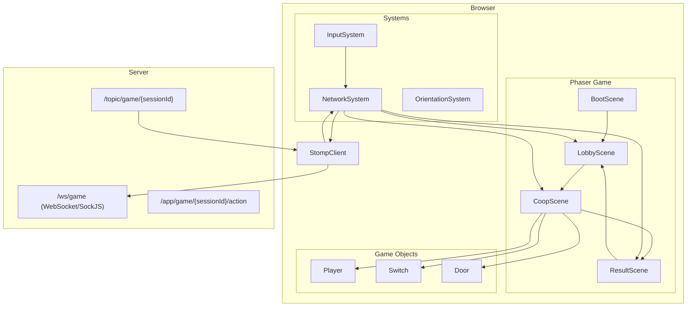
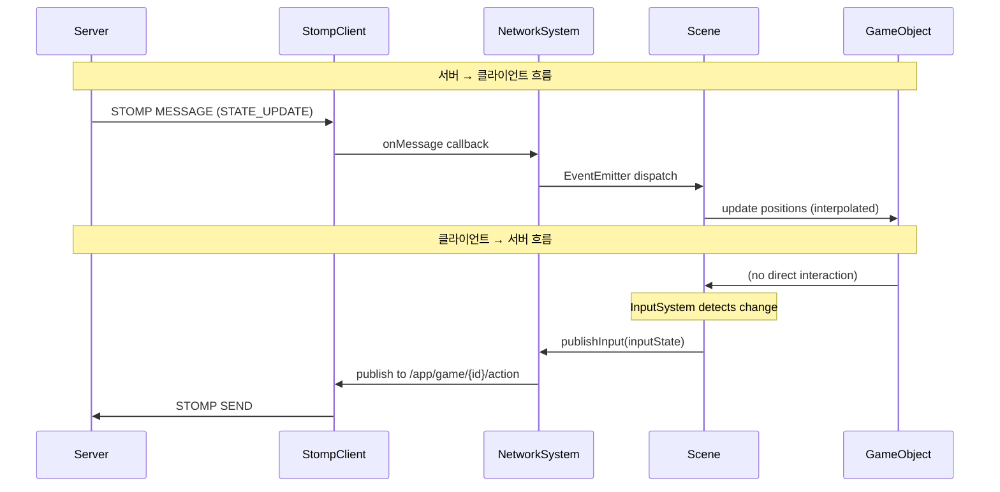
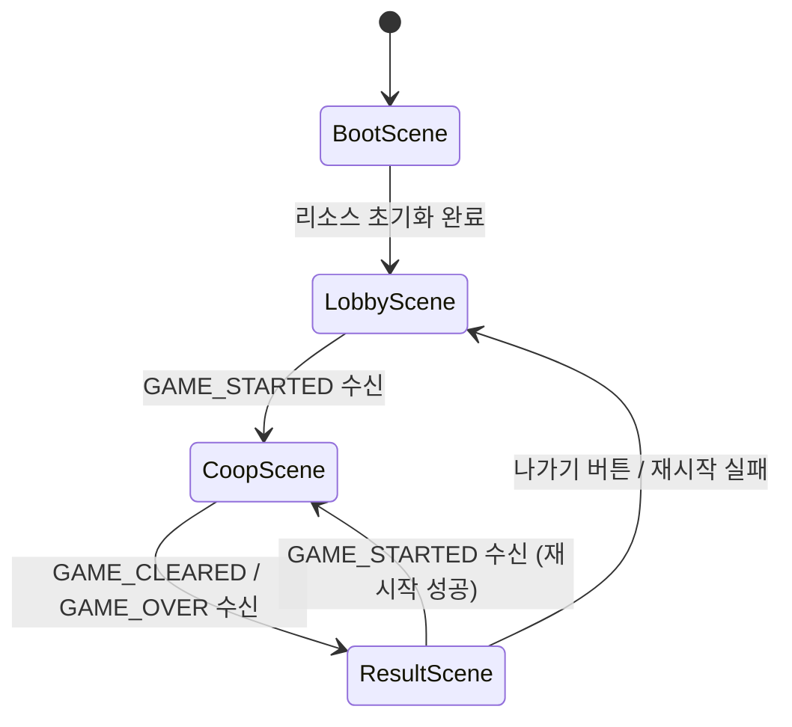
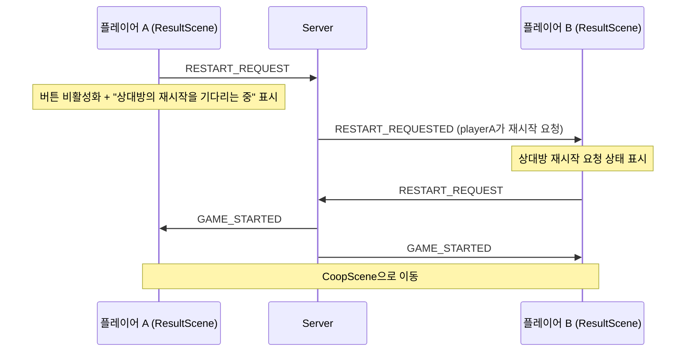

# 설계 문서: game-front-test

## Overview

"별빛 길 열기" (Starlight Path Opening)는 STOMP 기반 실시간 협동 게임 서버를 위한 Phaser.js 테스트 클라이언트입니다. 서버 권위적(server-authoritative) 아키텍처를 따르며, 클라이언트는 입력 전송과 상태 렌더링만 담당합니다.

### 핵심 설계 원칙

1. **서버 권위적 상태 관리**: 클라이언트는 게임 결과를 결정하지 않으며, 서버에서 수신한 STATE_UPDATE를 렌더링만 합니다.
2. **보간 기반 부드러운 렌더링**: 20Hz 서버 틱을 60fps 클라이언트 렌더링으로 보간하여 부드러운 움직임을 제공합니다.
3. **입력 차분 발행**: InputState가 변경될 때만 PLAYER_INPUT을 발행하여 네트워크 트래픽을 최소화합니다.
4. **씬 기반 상태 머신**: Phaser Scene 시스템을 활용하여 게임 흐름을 관리합니다.
5. **네트워크/게임 로직 분리**: NetworkSystem이 STOMP 통신을 캡슐화하고, 씬은 렌더링에 집중합니다.

### 기술 스택

| 기술 | 용도 |
|------|------|
| Vite | 빌드 도구 및 개발 서버 |
| TypeScript (strict) | 타입 안전성 |
| Phaser.js 3.x | 게임 엔진 (렌더링, 씬 관리, 입력) |
| @stomp/stompjs | STOMP 프로토콜 클라이언트 |
| sockjs-client | WebSocket 폴백 |

## Architecture

### 시스템 아키텍처 다이어그램



### 데이터 흐름 다이어그램



### 씬 전환 상태 다이어그램



### ResultScene 재시작 흐름



**재시작 흐름 규칙:**
1. ResultScene은 RESTART_REQUEST 버튼을 제공한다.
2. 재시작 요청을 보내면 버튼을 비활성화하고 "상대방의 재시작을 기다리는 중"을 표시한다.
3. RESTART_REQUESTED 수신 시 상대방이 재시작을 요청했음을 표시한다.
4. GAME_STARTED 수신 시 CoopScene으로 이동한다.

## Components and Interfaces

### 모듈 구조

```
src/
├── main.ts                          # Phaser Game 인스턴스 생성, URL 파라미터 파싱
├── game/
│   ├── PhaserGame.ts                # Phaser.Game 래퍼, config 적용
│   ├── config/
│   │   └── gameConfig.ts            # Phaser 설정 (1280x720, Scale.FIT, scenes)
│   ├── scenes/
│   │   ├── BootScene.ts             # 리소스 초기화, shape 그래픽 생성
│   │   ├── LobbyScene.ts            # 연결 상태, READY, 대기 UI
│   │   ├── CoopScene.ts             # 게임 렌더링, 보간, 입력 수용
│   │   └── ResultScene.ts           # 결과 표시, 재시작/나가기
│   ├── objects/
│   │   ├── Player.ts                # 플레이어 렌더링, 보간 로직
│   │   ├── Door.ts                  # 도어 렌더링, 별빛 게이트 효과
│   │   └── Switch.ts                # 스위치 렌더링, 발광 효과
│   ├── systems/
│   │   ├── NetworkSystem.ts         # STOMP 연결, 메시지 발행/구독, 재연결
│   │   ├── InputSystem.ts           # 키보드/터치 입력 → InputState 변환
│   │   └── OrientationSystem.ts     # 방향 감지, 회전 오버레이
│   └── types/
│       └── gameTypes.ts             # 모든 TypeScript 인터페이스/타입 정의
└── socket/
    └── stompClient.ts               # @stomp/stompjs 래퍼, SockJS 팩토리
```

### NetworkSystem (싱글톤)

NetworkSystem은 STOMP 연결 생명주기를 관리하는 핵심 시스템입니다.

```typescript
interface NetworkSystemConfig {
  wsEndpoint: string;       // "/ws/game"
  token: string;            // JWT
  gameSessionId: string;
}

type ConnectionStatus = 'connecting' | 'connected' | 'disconnected' | 'error';

interface NetworkSystemEvents {
  onStatusChange: (status: ConnectionStatus) => void;
  onRoomState: (msg: RoomStateMessage) => void;
  onGameStarted: (msg: GameStartedMessage) => void;
  onStateUpdate: (msg: StateUpdateMessage) => void;
  onGameCleared: (msg: GameClearedMessage) => void;
  onGameOver: (msg: GameOverMessage) => void;
  onPlayerDisconnected: (msg: PlayerDisconnectedMessage) => void;
  onPlayerReconnected: (msg: PlayerReconnectedMessage) => void;
  onRestartRequested: (msg: RestartRequestedMessage) => void;
  onGameError: (msg: GameErrorMessage) => void;
}
```

**책임:**
- SockJS 팩토리를 통한 WebSocket 연결 수립
- STOMP CONNECT 프레임에 `Authorization: Bearer {token}` 헤더 포함
- `/topic/game/{gameSessionId}` 구독 및 메시지 라우팅
- `/app/game/{gameSessionId}/action`으로 메시지 발행
- 지수 백오프 재연결 (초기 1초, 최대 30초, 최대 5회)
- 연결 상태 이벤트 발행
- 재연결 성공 시 자동 재구독

**설계 결정:** game-front-test에서는 싱글톤 패턴을 사용하여 모든 씬에서 동일한 연결 인스턴스를 공유합니다. Phaser의 Scene Registry나 글로벌 이벤트 버스를 통해 씬 간 통신합니다. 단, 실제 서비스 프론트 이식 시에는 match/gameSession 단위 lifecycle에 맞춰 인스턴스를 생성/해제할 수 있도록 `disconnect()`, `destroy()`, `reset()` 메서드를 제공합니다.

### InputSystem

```typescript
interface InputState {
  left: boolean;
  right: boolean;
  jump: boolean;
}
```

**책임:**
- 키보드 매핑: Arrow Left/A → left, Arrow Right/D → right, Space/W/Arrow Up → jump
- 모바일 터치 버튼 생성 및 이벤트 처리
- InputState 차분 감지 (이전 상태와 비교)
- 변경 시에만 NetworkSystem을 통해 PLAYER_INPUT 발행
- CoopScene에서만 활성화

**설계 결정:** InputSystem은 CoopScene의 생명주기에 바인딩됩니다. 씬 진입 시 활성화, 씬 이탈 시 비활성화됩니다. 터치 버튼은 모바일 감지 시에만 DOM 오버레이 또는 Phaser UI로 렌더링합니다.

### OrientationSystem

**책임:**
- `window.matchMedia('(orientation: portrait)')` 또는 `screen.orientation` API로 방향 감지
- 세로 모드 감지 시 전체 화면 HTML 오버레이 표시 (한국어 안내)
- 가로 모드 복귀 시 오버레이 제거
- 방향 변경 시 `game.scale.refresh()` 호출

**설계 결정:** OrientationSystem은 Phaser 외부의 DOM 레이어에서 오버레이를 관리합니다. Phaser 캔버스 위에 absolute positioned div를 사용하여 게임 렌더링과 독립적으로 동작합니다.

### StompClient (socket/stompClient.ts)

```typescript
interface StompClientConfig {
  brokerURL: string;
  connectHeaders: { Authorization: string };
  reconnectDelay: number;
  heartbeatIncoming: number;
  heartbeatOutgoing: number;
}
```

**책임:**
- @stomp/stompjs `Client` 인스턴스 생성 및 설정
- SockJS 팩토리 함수 제공 (`webSocketFactory`)
- 연결/해제/에러 콜백 설정
- NetworkSystem에 의해 제어됨 (직접 사용하지 않음)

**설계 결정:** stompClient.ts는 @stomp/stompjs의 얇은 래퍼로, 설정과 팩토리만 담당합니다. 비즈니스 로직은 NetworkSystem에 위치합니다.

**중요 - Authorization 헤더 위치:**
Authorization은 SockJS HTTP handshake header가 아니라 **STOMP CONNECT frame의 connectHeaders**에 넣습니다. 브라우저 WebSocket API는 커스텀 HTTP 헤더를 지원하지 않으므로, 반드시 STOMP 프로토콜 레벨에서 인증합니다.

```typescript
// 올바른 구현 방향
client.configure({
  webSocketFactory: () => new SockJS('/ws/game'),
  connectHeaders: {
    Authorization: `Bearer ${token}`,
  },
});
```

### Game Objects

#### Player

```typescript
class Player extends Phaser.GameObjects.Rectangle {
  userId: string;
  targetX: number;
  targetY: number;
  previousX: number;
  previousY: number;
  interpolationAlpha: number;
  color: number;  // userId 기반 해시 색상
}
```

- 서버 스냅샷 간 선형 보간으로 위치 업데이트
- userId 해시 기반 결정적 색상 할당 (전역 고유성은 보장하지 않음)
- 색상 충돌 시 라벨/outline/name tag로 구분
- velocityX/velocityY는 보간 방향 힌트로 활용 가능

#### Switch

```typescript
class Switch extends Phaser.GameObjects.Rectangle {
  switchId: string;
  pressed: boolean;
  glowEffect: Phaser.FX.Glow | null;
}
```

- pressed 상태에 따라 발광 효과 토글
- activatedBy 정보로 누가 눌렀는지 시각적 표시 가능

#### Door

```typescript
class Door extends Phaser.GameObjects.Rectangle {
  doorId: string;
  open: boolean;
  gateEffect: Phaser.GameObjects.Particles.ParticleEmitter | null;
}
```

- open 상태에 따라 시각적 구분 (색상/투명도 변경)
- 열림 시 별빛 파티클 효과

## Data Models

### 보간 버퍼 (Interpolation Buffer)

```typescript
interface Snapshot {
  timestamp: number;          // serverTimeMs (epoch ms) 또는 Date.now() fallback
  players: Record<string, PlayerStateDto>;
  switches: Record<string, SwitchStateDto | boolean>;
  doorOpen: boolean;
  remainingTimeMs: number;
  score: number;
}

class InterpolationBuffer {
  private buffer: Snapshot[];
  private readonly INTERPOLATION_DELAY_MS = 100;
  private readonly MAX_BUFFER_SIZE = 10;

  push(snapshot: Snapshot): void;
  getInterpolatedState(currentTime: number): InterpolatedState | null;
  private lerp(a: number, b: number, t: number): number;
}
```

**보간 전략:**
1. STATE_UPDATE 수신 시 Snapshot을 버퍼에 추가
2. Snapshot의 timestamp는 백엔드가 보내는 `serverTimeMs`를 사용한다. `serverTimeMs`가 없으면 `Date.now()`를 fallback으로 사용한다.
3. 렌더링 시점 = `현재 시간 - 100ms` (INTERPOLATION_DELAY_MS)
4. 렌더링 시점을 감싸는 두 스냅샷(before, after)을 찾음
5. `t = (renderTime - before.timestamp) / (after.timestamp - before.timestamp)`
6. 각 오브젝트의 x, y를 `lerp(before, after, t)`로 계산
7. 버퍼가 MAX_BUFFER_SIZE를 초과하면 가장 오래된 스냅샷 제거

**설계 결정:** 100ms 지연은 20Hz(50ms 간격) 서버 틱에서 최소 2개의 스냅샷을 확보하기 위한 값입니다. 네트워크 지터를 흡수하면서도 체감 지연을 최소화합니다.

**GameStateSnapshot 타입 (백엔드 payload 기준):**
```typescript
// 백엔드 STATE_UPDATE payload와 일치하는 타입
interface GameStatePayload {
  type: "STATE_UPDATE";
  gameSessionId: string;
  mapId?: string;              // MVP에서는 optional. 백엔드가 보내지 않아도 클라이언트는 기본 맵으로 정상 동작해야 한다.
  serverTimeMs: number;       // epoch milliseconds
  state: {
    players: Record<string, PlayerStateDto>;
    switches: Record<string, SwitchStateDto | boolean>;
    doorOpen: boolean;
    remainingTimeMs: number;
    score: number;
  };
}

interface PlayerStateDto {
  x: number;
  y: number;
  vx: number;
  vy: number;
}

interface SwitchStateDto {
  pressed: boolean;
  activatedBy?: string;
}
```

**MVP 설계 결정:**
- `players`는 `Record<string, PlayerStateDto>` 형태를 사용한다 (배열 아님).
- `switches`는 `Record<string, SwitchStateDto | boolean>` 형태를 사용한다.
- MVP에서는 `doors` 배열 대신 `doorOpen: boolean` 단일 값을 사용한다. 향후 문이 여러 개가 되면 `doors: Record<string, DoorStateDto>`로 확장한다.

### 연결 상태 모델

```typescript
interface ReconnectionState {
  attempt: number;           // 현재 재연결 시도 횟수
  maxAttempts: number;       // 5
  baseDelay: number;         // 1000ms
  maxDelay: number;          // 30000ms
  currentDelay: number;      // baseDelay * 2^attempt (capped at maxDelay)
}
```

### URL 파라미터 모델

```typescript
interface GameParams {
  token: string;             // JWT (필수)
  gameSessionId: string;     // 게임 세션 ID (필수)
  userId?: string;           // 표시용 (선택). 서버 인증에 사용되지 않으며, JWT의 실제 사용자와 다를 수 있다. 디버깅 시 token의 사용자와 동일한 값을 넣는 것을 권장한다.
}
```

### 씬 데이터 전달 모델

```typescript
// LobbyScene → CoopScene
interface CoopSceneData {
  gameSessionId: string;
  players: string[];
}

// CoopScene → ResultScene
interface ResultSceneData {
  type: 'cleared' | 'over';
  score: number;
  timeElapsed: number;
  intimacy?: number;         // GAME_CLEARED에서만
  reason?: string;           // GAME_OVER에서만
}
```

### 색상 팔레트

```typescript
const PALETTE = {
  navy: 0x1B2838,            // 배경 기본
  skyBlue: 0x87CEEB,         // 하늘 요소
  lavender: 0xB8A9C9,        // UI 보조
  starlightYellow: 0xFFF4B8, // 별빛, 강조
  pastelPink: 0xFFB7C5,      // 버튼 호버
  white: 0xFFFFFF,           // 텍스트
  darkGray: 0x2D2D2D,        // 텍스트 배경
} as const;
```

## Correctness Properties

*A property is a characteristic or behavior that should hold true across all valid executions of a system—essentially, a formal statement about what the system should do. Properties serve as the bridge between human-readable specifications and machine-verifiable correctness guarantees.*

### Property 1: Interpolation correctness (lerp between snapshots)

*For any* two server snapshots with timestamps t1 < t2 and any render time t where t1 ≤ t ≤ t2, the interpolated position of a game object SHALL equal `lerp(position_at_t1, position_at_t2, (t - t1) / (t2 - t1))` for both x and y coordinates.

**Validates: Requirements 12.1, 14.2**

### Property 2: InputState diff-based publishing

*For any* sequence of InputState values produced by keyboard or touch input, a PLAYER_INPUT message SHALL be published if and only if the current InputState differs from the previously published InputState. Identical consecutive states SHALL never produce a publish.

**Validates: Requirements 8.6, 8.7, 9.6**

### Property 3: Input mapping symmetry (press/release)

*For any* mapped input (keyboard key or touch button), pressing it SHALL set the corresponding InputState field to true, and releasing it SHALL set the corresponding field to false. The resulting InputState SHALL be independent of input source (keyboard vs touch).

**Validates: Requirements 8.4, 8.5, 9.4, 9.5**

### Property 4: Exponential backoff delay calculation

*For any* reconnection attempt number n (0 ≤ n < 5), the reconnection delay SHALL equal `min(1000 * 2^n, 30000)` milliseconds. After attempt 5, no further reconnection SHALL be attempted.

**Validates: Requirements 5.4, 5.6**

### Property 5: Deterministic userId color assignment

*For any* userId string, the color assignment function SHALL always produce the same color (결정성 보장). 같은 GameSession 내 플레이어는 가능한 한 시각적으로 구분 가능한 색상을 할당한다. 색상 충돌이 발생할 경우, 라벨/outline/name tag로 플레이어를 구분한다. 전역 고유성은 보장하지 않는다 (유한한 팔레트 제약).

**Validates: Requirements 12.2, 14.1**

### Property 6: PLAYER_INPUT message format correctness

*For any* valid InputState (any combination of left, right, jump booleans), the published STOMP message SHALL have the exact structure `{ "type": "PLAYER_INPUT", "input": { "left": boolean, "right": boolean, "jump": boolean } }` with no additional fields (specifically no userId).

**Validates: Requirements 6.3**

### Property 7: Unknown message type graceful handling

*For any* STOMP message received with a `type` field that is not one of the recognized types (ROOM_STATE, GAME_STARTED, STATE_UPDATE, GAME_CLEARED, GAME_OVER, PLAYER_DISCONNECTED, PLAYER_RECONNECTED, RESTART_REQUESTED, GAME_ERROR), the system SHALL log a console warning and SHALL NOT throw an exception or crash.

**Validates: Requirements 7.8**

### Property 8: READY message idempotence

*For any* number of READY button presses (n ≥ 1) within a single lobby session, the NetworkSystem SHALL publish exactly one READY message. Subsequent presses SHALL be silently ignored.

**Validates: Requirements 17.3**

## Error Handling

### 에러 분류 및 처리 전략

| 에러 유형 | 감지 방법 | 처리 | 사용자 메시지 |
|-----------|-----------|------|---------------|
| JWT 누락 | URL 파라미터 파싱 | 게임 시작 차단 | "인증 토큰이 없습니다. 올바른 링크로 접속해주세요." |
| gameSessionId 누락 | URL 파라미터 파싱 | 게임 시작 차단 | "게임 세션 정보가 없습니다. 올바른 링크로 접속해주세요." |
| JWT 만료 | STOMP 연결 거부 / 서버 에러 | 재인증 안내 | "인증이 만료되었습니다. 페이지를 새로고침해주세요." |
| STOMP 연결 실패 | onStompError 콜백 | 지수 백오프 재연결 | "서버에 연결 중입니다... ({n}/5)" |
| 재연결 한도 초과 | attempt > maxAttempts | 재연결 중단 | "서버에 연결할 수 없습니다. 페이지를 새로고침해주세요." |
| 게임 중 연결 끊김 | onWebSocketClose | 재연결 + 입력 중단 | "재연결 시도 중... 잠시만 기다려주세요." |
| GAME_ERROR 수신 | 메시지 핸들러 | 에러 표시 | 서버 제공 메시지 표시 |
| 알 수 없는 메시지 | type 필드 검증 | 콘솔 경고 후 무시 | (사용자에게 표시하지 않음) |
| 중복 READY | 상태 플래그 확인 | 전송 차단 | "이미 준비 완료 상태입니다." |

### 재연결 흐름

```mermaid
flowchart TD
    A[연결 끊김 감지] --> B{attempt < 5?}
    B -->|Yes| C[delay = min(1000 * 2^attempt, 30000)]
    C --> D[대기]
    D --> E[재연결 시도]
    E --> F{성공?}
    F -->|Yes| G[재구독 + 입력 재개]
    F -->|No| H[attempt++]
    H --> B
    B -->|No| I[에러 표시 + 재연결 중단]
```

### 게임 중 연결 끊김 처리

1. NetworkSystem이 연결 끊김을 감지
2. CoopScene에 `disconnected` 상태 이벤트 발행
3. CoopScene은 InputSystem을 비활성화 (입력 중단)
4. 재연결 시도 중 오버레이 표시
5. 재연결 성공 시:
   - `/topic/game/{gameSessionId}` 재구독
   - InputSystem 재활성화
   - 오버레이 제거
6. 재연결 실패 시:
   - 에러 메시지 표시
   - LobbyScene으로 복귀 옵션 제공

## Testing Strategy

### 테스트 접근 방식

이 프로젝트는 **이중 테스트 전략**을 사용합니다:

1. **Property-Based Tests (PBT)**: 순수 로직의 보편적 속성을 검증
2. **Unit Tests**: 특정 예제, 엣지 케이스, 에러 조건 검증
3. **Integration Tests**: E2E 동기화 및 외부 서비스 연동 검증

### Property-Based Testing 설정

**라이브러리:** [fast-check](https://github.com/dubzzz/fast-check) (TypeScript 네이티브 PBT 라이브러리)

**설정:**
- 최소 100회 반복 per property test
- 각 테스트에 설계 문서 property 참조 태그 포함
- 태그 형식: `Feature: game-front-test, Property {number}: {property_text}`

### 테스트 범위

| 테스트 유형 | 대상 | 도구 |
|-------------|------|------|
| Property Tests | InterpolationBuffer.lerp, InputSystem diff, backoff calc, color hash, message format | fast-check + vitest |
| Unit Tests | Scene transitions, URL parsing, message routing, UI state | vitest + @testing-library |
| Integration Tests | Multi-browser sync, STOMP connection lifecycle | Playwright |

### MVP 필수 테스트 (우선순위 1)

구현 일정이 빡세면 아래 4개를 먼저 작성한다:

1. **URL 파라미터 파싱** - token/gameSessionId 정상/누락/잘못된 형식
2. **PLAYER_INPUT payload 구조** - userId가 포함되지 않는지 검증
3. **InputState diff publishing** - 동일 상태 연속 발행 방지 검증
4. **Unknown message type graceful handling** - 예외 미발생 검증

### 여유 시 추가 테스트 (우선순위 2)

- 보간 수학 정확성 (Property 1)
- 지수 백오프 계산 (Property 4)
- READY 멱등성 (Property 8)
- 전체 PBT suite

### Property Test 구현 계획

각 Correctness Property는 하나의 property-based test로 구현됩니다:

1. **Property 1** (Interpolation): `fc.float()` 기반 타임스탬프와 위치 생성, lerp 결과 검증
2. **Property 2** (Diff publishing): `fc.array(fc.record({left: fc.boolean(), right: fc.boolean(), jump: fc.boolean()}))` 시퀀스 생성, 발행 횟수 검증
3. **Property 3** (Input mapping): `fc.constantFrom(...mappedKeys)` 키 생성, press/release 상태 검증
4. **Property 4** (Backoff): `fc.integer({min: 0, max: 4})` attempt 생성, delay 공식 검증
5. **Property 5** (Color): `fc.string()` userId 생성, 동일 userId에 대해 항상 동일 색상이 나오는지 결정성 검증. 서로 다른 userId의 전역 고유성은 검증하지 않는다. 같은 세션 내 색상 충돌 시 label/outline/name tag fallback은 unit test로 검증한다.
6. **Property 6** (Message format): `fc.record({left: fc.boolean(), right: fc.boolean(), jump: fc.boolean()})` InputState 생성, 메시지 구조 검증
7. **Property 7** (Unknown message): `fc.string().filter(s => !knownTypes.includes(s))` 타입 생성, 예외 미발생 검증
8. **Property 8** (READY idempotence): `fc.integer({min: 1, max: 100})` 횟수 생성, 발행 1회 검증

### Unit Test 범위

- URL 파라미터 파싱 (정상/누락/잘못된 형식)
- Scene 전환 트리거 (각 메시지 타입별)
- 연결 상태 한국어 매핑
- 터치 버튼 크기 및 존재 여부
- ResultScene 데이터 표시 (cleared vs over)
- 에러 메시지 표시 (각 에러 유형별)

### Integration Test 범위

- 두 브라우저 인스턴스 동기화 (Requirements 18)
- STOMP 연결/재연결 생명주기
- 전체 씬 흐름 (Boot → Lobby → Coop → Result → Lobby)

