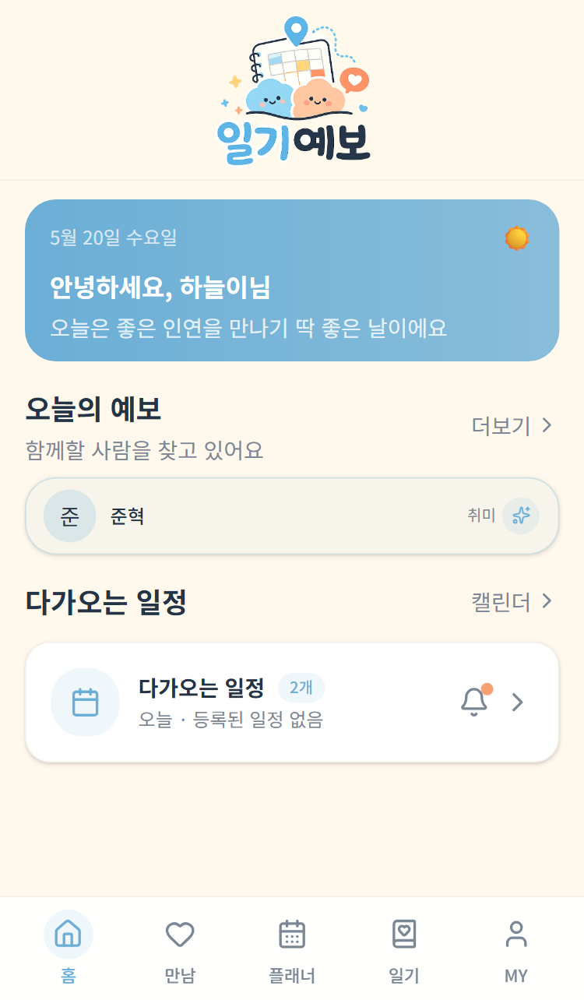
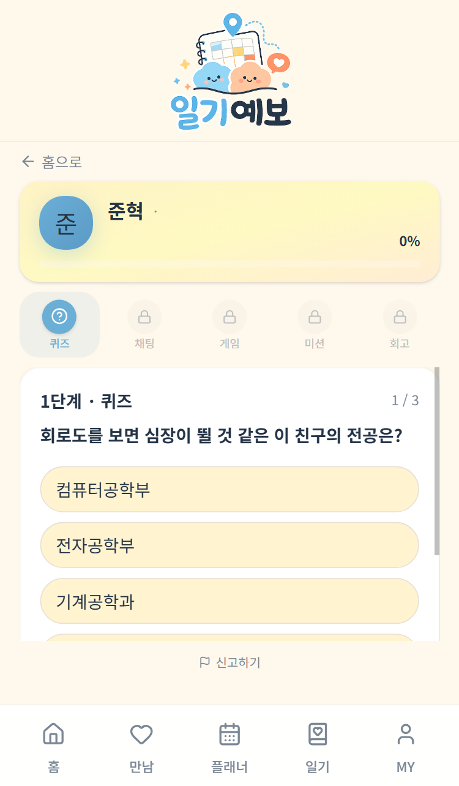

<!-- ════════════════════════════════════════ -->
<!-- ── 상단 앱 헤더 (로고) ──                 -->
<!-- ════════════════════════════════════════ -->

  
  
🔔

<!-- ════════════════════════════════════════ -->
<!-- ── 인사 카드 (히어로) ──                   -->
<!-- ════════════════════════════════════════ -->

  

  
캡스톤 디자인 · 57팀

  <h1>일기로 예견하는 보석같은 만남</h1>
  
수업 시간표와 캠퍼스 동선 교집합으로 자연스러운 만남의 기회를 만들어드려요

  

    🎓 대학생 전용
    📍 동선 기반
    🛡️ 5단계 안전
  

<!-- ════════════════════════════════════════ -->
<!-- ── 오늘의 예보 (예시 슬롯) ──              -->
<!-- ════════════════════════════════════════ -->

  

    
오늘의 예보

    
더보기 ›

  

  
이렇게 매칭이 진행돼요

  

    
✓

    
매칭 완료 · 5단계 진행 중

    
취미 ✨

  

  

    
🕐

    
월요일에 새로운 만남

    
관심사 🕐

  

  

    
⚡

    
퀵매칭 · 즉시 만남

    
이상형 ✨

  

<!-- ════════════════════════════════════════ -->
<!-- ── 핵심 기능 ──                           -->
<!-- ════════════════════════════════════════ -->

  

핵심 기능

  

    

      
🗺️

      
동선 기반 매칭

      
시간표와 캠퍼스 공간 데이터로 자연스레 마주칠 상대를 추천해요

    

    

      
🛡️

      
5단계 안전

      
서로 동의해야 다음 단계로 진행되는 점진적 시스템

    

    

      
🤖

      
AI 콘텐츠

      
Amazon Bedrock이 프로필 기반 퀴즈·미션·회고를 자동 생성

    

    

      
🌱

      
성장형 소셜

      
일기·플래너 작성과 상호작용으로 경험치를 쌓아요

    

  

<!-- ════════════════════════════════════════ -->
<!-- ── 5단계 상호작용 ──                       -->
<!-- ════════════════════════════════════════ -->

  

5단계 상호작용

  
한 단계씩 조심스럽게 가까워져요

  

    

      

        
❓

        
퀴즈

      

      

        
💬

        
채팅

      

      

        
🎮

        
게임

      

      

        
🗺️

        
미션

      

      

        
📖

        
회고

      

    

    

      매 단계마다 <strong>양쪽이 동의</strong>해야 다음으로 진행돼요 
      거부하면 매칭이 안전하게 종료되고, 신고·차단도 언제든 가능해요
    

  

<!-- ════════════════════════════════════════ -->
<!-- ── 이용 방법 ──                           -->
<!-- ════════════════════════════════════════ -->

  

이용 방법

  

    
1

    

      
대학 이메일로 가입

      
학교 이메일 인증으로 재학생 확인 · 취미·관심사 프로필 설정

    

  

  

    
2

    

      
시간표 등록

      
에브리타임 시간표 연동 · 매일 플래너로 더 정확한 동선 매칭

    

  

  

    
3

    

      
월요일 자정 매칭 성사

      
배치 매칭 시스템이 동선 겹치는 상대를 자동 매칭 (5일 주기)

    

  

  

    
4

    

      
5단계 상호작용 진행

      
퀴즈 → 채팅 → 게임 → 미션 → 회고 순으로 점진적 관계 형성

    

  

  

    
5

    

      
경험치로 레벨업

      
활동마다 경험치 축적 · 새로운 매칭 슬롯 해금

    

  

<!-- ════════════════════════════════════════ -->
<!-- ── 핵심 지표 ──                           -->
<!-- ════════════════════════════════════════ -->

  

핵심 지표

  
일기예보가 만들어갈 숫자들

  

    

      
500+

      
타깃 초기 사용자

    

    

      
5단계

      
점진적 안전 시스템

    

    

      
5일

      
매칭 주기 (월~금)

    

    

      
100%

      
재학생 인증 매칭

    

  

<!-- ════════════════════════════════════════ -->
<!-- ── 앱 화면 미리보기 ──                    -->
<!-- ════════════════════════════════════════ -->

  

앱 화면 미리보기

  
실제 앱 화면이에요

  

    

      
      
홈 화면

    

    

      
      
로그인 화면

    

  

<!-- ════════════════════════════════════════ -->
<!-- ── 차별점 비교 ──                         -->
<!-- ════════════════════════════════════════ -->

  

기존 앱과의 차별점

  
일기예보만의 특별함

  

    <!-- 헤더 -->
    

      
항목

      
일기예보

      
소개팅앱

      
에브리타임

    

    <!-- 행들 -->
    

      
재학생 인증

      
✅

      
❌

      
✅

    

    

      
동선 기반 매칭

      
✅

      
❌

      
❌

    

    

      
점진적 공개

      
✅

      
❌

      
❌

    

    

      
AI 콘텐츠 생성

      
✅

      
❌

      
❌

    

    

      
성장형 경험치

      
✅

      
❌

      
❌

    

    

      
신고 · 차단

      
✅

      
✅

      
✅

    

  

<!-- ════════════════════════════════════════ -->
<!-- ── 아키텍처 ──                            -->
<!-- ════════════════════════════════════════ -->

  

아키텍처

  
단일 Spring Boot · AWS 클라우드 네이티브

  

    

      
Client

      

        
React Native 모바일 앱

      

    

    
↓

    

      
Backend · Spring Boot

      

        
인증 · 사용자

        
매칭 엔진

        
상호작용

        
채팅 WebSocket

        
게임 WebSocket

        
경험치 · 알림

      

    

    
↓

    

      
Data Layer

      

        
MySQL Aurora

        
Redis

        
Amazon SQS

        
Amazon S3

      

    

    
↕ AWS SDK v2

    

      
AI

      

        
Amazon Bedrock (LLM)

      

    

  

<!-- ════════════════════════════════════════ -->
<!-- ── 기술 스택 ──                           -->
<!-- ════════════════════════════════════════ -->

  

기술 스택

  

    
Backend

    

      Spring Boot 3
      Spring Security
      Spring Data JPA
      WebSocket
      Spring Batch
    

  

  

    
AWS & Infra

    

      Amazon Bedrock
      Amazon SQS
      Amazon S3
      AWS SDK v2
    

  

  

    
Database

    

      MySQL 8.0
      Redis
      Flyway
    

  

  

    
Testing

    

      JUnit 5
      Mockito
      jqwik (PBT)
      Testcontainers
    

  

  

    
Client · Docs

    

      React Native
      Next.js
      Springdoc Swagger
      JWT
    

  

<!-- ════════════════════════════════════════ -->
<!-- ── 팀 소개 ──                             -->
<!-- ════════════════════════════════════════ -->

  

팀 소개

  

    

      
🌸

      
김아리

      
매칭 · 인증

      
이메일 인증 · JWT · 배치 매칭 스케줄러 · 슬롯 관리

    

    

      
⚡

      
선현승

      
실시간 상호작용

      
WebSocket 게임 · Redis 상태 동기화 · FSM 파이프라인

    

    

      
📔

      
정영미

      
일상 기록 · 퀴즈

      
플래너 · 일기 · 회고 · SQS 힌트 · 경험치 시스템

    

    

      
🤖

      
황찬우

      
AI · 공간 데이터

      
Bedrock LLM · 프롬프트 엔지니어링 · AI 미션 생성

    

  

<!-- ════════════════════════════════════════ -->
<!-- ── 링크 ──                                -->
<!-- ════════════════════════════════════════ -->

  

링크

  

    <a class="iy-link-btn primary" href="https://github.com/kookmin-sw/2026-capstone-57" target="_blank">
      🐙
      

        
소스 코드

        GitHub
      

    </a>
    <a class="iy-link-btn" href="https://kookmin-sw.github.io/2026-capstone-57/" target="_blank">
      🏠
      

        
팀 페이지

        홈페이지
      

    </a>
  

  국민대학교 2026 캡스톤 디자인 프로젝트 · 57팀

<!-- ════════════════════════════════════════ -->
<!-- ── 하단 네비게이션 ──                      -->
<!-- ════════════════════════════════════════ -->
<nav class="iy-nav">
  <a href="#home" class="active">🏠홈</a>
  <a href="#features">💚기능</a>
  <a href="#flow">📅흐름</a>
  <a href="#howto">📔방법</a>
  <a href="#team">👤팀</a>
</nav>

