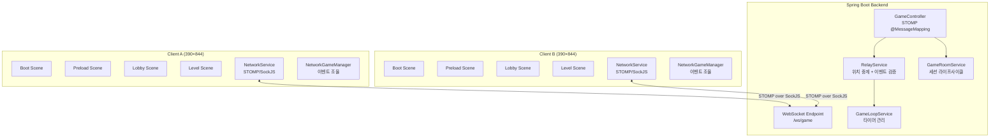
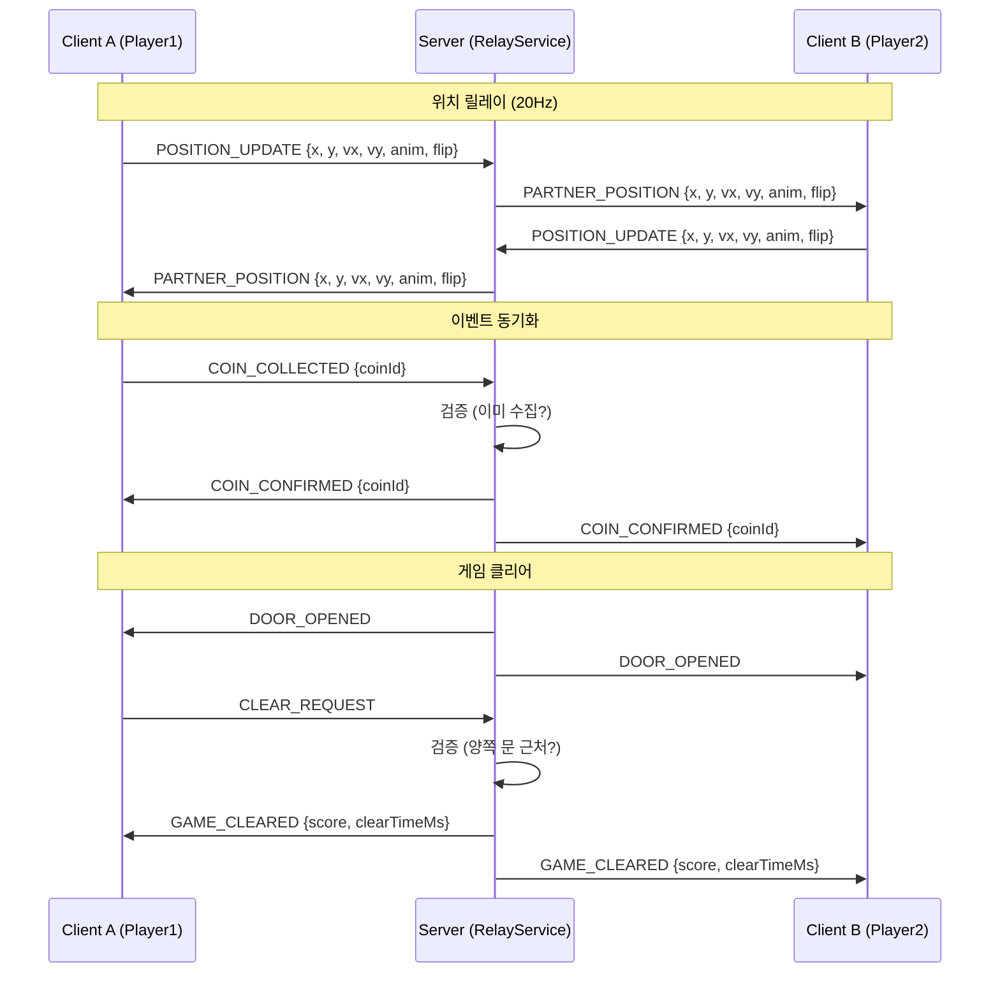
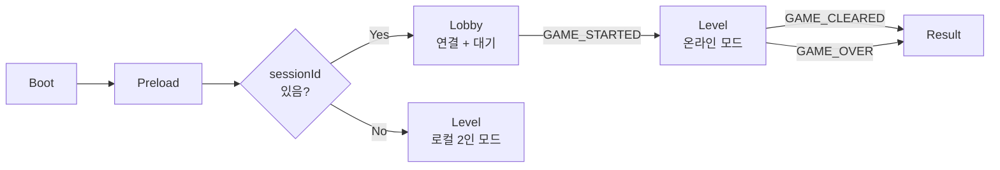

# Design Document: coop-game-networking

## Overview

2인 협동 퍼즐 플랫포머 게임 "별빛 길 열기"를 온라인 멀티플레이어로 전환하기 위한 네트워킹 아키텍처 설계 문서이다.

**핵심 설계 원칙:**
- **클라이언트 측 물리 유지**: 각 클라이언트가 자신의 캐릭터에 대해 Arcade Physics를 실행
- **서버는 릴레이 + 이벤트 판정**: 위치 데이터를 중계하고, 게임 이벤트(코인, 스위치, 문, 클리어)를 검증
- **좌표계 통일**: 서버 좌표 = 클라이언트 디스플레이 = 390×844 (CoordinateMapper 불필요)
- **각 클라이언트 1인 제어**: 각 디바이스가 하나의 캐릭터만 제어, 상대방 위치는 서버 릴레이로 수신
- **오프라인 폴백**: URL에 sessionId/token이 없으면 기존 로컬 2인 모드로 동작

기존 백엔드의 서버 권위(Server-Authoritative) 물리 엔진(PhysicsEngine, CollisionEngine)은 릴레이 모드에서 비활성화하고, 대신 RelayService가 위치 중계 및 이벤트 검증을 담당한다.

## Architecture

### 시스템 전체 구조



### 데이터 흐름 (릴레이 모드)



### Scene 흐름



## Components and Interfaces

### Component 1: NetworkService

**목적**: STOMP/SockJS 연결 관리, 메시지 송수신, 재연결 처리

**파일**: `src/services/NetworkService.ts`

```typescript
interface INetworkService {
  // 연결 관리
  connect(wsUrl: string, token: string, gameSessionId: string): Promise<void>;
  disconnect(): void;
  
  // 메시지 전송
  sendReady(): void;
  sendPositionUpdate(position: PositionUpdatePayload): void;
  sendGameEvent(event: GameEventPayload): void;
  
  // 이벤트 구독
  on<T extends ServerMessageType>(event: T, callback: (payload: ServerMessagePayloadMap[T]) => void): void;
  off(event: ServerMessageType, callback: Function): void;
  
  // 상태
  readonly connectionState: ConnectionState;
  readonly isConnected: boolean;
}
```

**책임**:
- SockJS fallback을 포함한 WebSocket 연결 수립 (`/ws/game`)
- STOMP CONNECT 시 JWT 인증 헤더 전송
- `/topic/game/{gameSessionId}` 구독 및 메시지 디스패치
- 연결 끊김 감지 및 자동 재연결 (exponential backoff: 1s, 2s, 4s, 8s, max 30s)
- 연결 상태 관리 (DISCONNECTED → CONNECTING → CONNECTED → RECONNECTING → ERROR)

---

### Component 2: NetworkGameManager

**목적**: Level 씬과 NetworkService 사이의 조율자. 온라인 모드의 모든 게임 로직 조율.

**파일**: `src/services/NetworkGameManager.ts`

```typescript
interface INetworkGameManager {
  initialize(scene: Phaser.Scene, config: NetworkGameConfig): void;
  destroy(): void;
  update(time: number, delta: number): void;
  
  // 상태
  readonly isOnlineMode: boolean;
  readonly myPlayerRole: 'player1' | 'player2';
  readonly partnerConnected: boolean;
}

interface NetworkGameConfig {
  gameSessionId: string;
  token: string;
  myUserId: string;
  partnerSprite: Phaser.Physics.Arcade.Sprite;
  localPlayerSprite: Phaser.Physics.Arcade.Sprite;
  coins: Phaser.Physics.Arcade.StaticGroup;
  switches: { switch1: Phaser.Physics.Arcade.Sprite; switch2: Phaser.Physics.Arcade.Sprite };
  door: Phaser.Physics.Arcade.Sprite;
  scoreText: Phaser.GameObjects.Text;
}
```

**책임**:
- 50ms 간격으로 로컬 플레이어 위치를 서버에 전송 (변경 시에만)
- 서버에서 수신한 상대방 위치를 lerp로 부드럽게 적용
- 코인 수집 시 서버에 COIN_COLLECTED 전송 + 낙관적 업데이트
- 스위치 상태 변경 시 서버에 전송 + 서버 응답으로 동기화
- 문 열림/클리어 이벤트 처리
- 상대방 연결 끊김/재연결 시 시각적 피드백

---

### Component 3: Lobby Scene

**목적**: WebSocket 연결 수립, READY 전송, 상대방 대기 UI 표시

**파일**: `src/scenes/Lobby.ts`

```typescript
// Lobby 씬은 Phaser.Scene을 확장
// placeholder UI: 텍스트 기반 연결 상태, 대기 인디케이터
// 사용자가 나중에 커스텀 에셋 추가 예정
```

**책임**:
- URL에서 sessionId, token 추출
- REST API로 세션 정보 조회 (`GET /api/v1/game-sessions/{id}`)
- NetworkService를 통해 WebSocket 연결 수립
- READY 메시지 전송
- ROOM_STATE 수신하여 양쪽 준비 상태 표시
- GAME_STARTED 수신 시 Level 씬으로 전환 (플레이어 역할 정보 전달)

---

### Component 4: RelayService (서버)

**목적**: 클라이언트 간 위치 중계 및 게임 이벤트 검증

**파일**: `backend/.../game/service/RelayService.java`

```java
public interface RelayService {
    void relayPosition(UUID sessionId, UUID senderId, PositionUpdateData position);
    void handleCoinCollected(UUID sessionId, UUID userId, String coinId);
    void handleSwitchEvent(UUID sessionId, UUID userId, String switchId, boolean pressed);
    void handleClearRequest(UUID sessionId, UUID userId);
}
```

**책임**:
- POSITION_UPDATE 수신 시 상대방에게 그대로 전달 (수정 없이)
- COIN_COLLECTED 수신 시 수집 여부 검증 후 COIN_CONFIRMED 브로드캐스트
- SWITCH_PRESSED/RELEASED 수신 시 상태 업데이트 후 브로드캐스트
- 모든 코인 수집 완료 시 DOOR_OPENED 브로드캐스트
- CLEAR_REQUEST 수신 시 양쪽 플레이어 위치 검증 후 GAME_CLEARED 브로드캐스트
- PLAYING 상태가 아닌 경우 POSITION_UPDATE 무시

## Data Models

### STOMP 메시지 프로토콜

#### 클라이언트 → 서버 (destination: `/app/game/{sessionId}/action`)

```typescript
// 기존 GameActionMessage 확장
interface GameActionMessage {
  type: 'READY' | 'POSITION_UPDATE' | 'COIN_COLLECTED' | 'SWITCH_PRESSED' | 'SWITCH_RELEASED' | 'CLEAR_REQUEST';
  payload?: PositionUpdatePayload | GameEventPayload;
}

interface PositionUpdatePayload {
  x: number;           // 0~390
  y: number;           // 0~844
  velocityX: number;
  velocityY: number;
  animation: PlayerAnimation;
  flipX: boolean;      // 좌우 반전 여부
}

interface GameEventPayload {
  targetId: string;    // coinId 또는 switchId
}

type PlayerAnimation = 'idle' | 'walk' | 'jump';
```

#### 서버 → 클라이언트 (topic: `/topic/game/{sessionId}`)

```typescript
// 서버 메시지 타입 정의
type ServerMessageType =
  | 'ROOM_STATE'
  | 'GAME_STARTED'
  | 'PARTNER_POSITION'
  | 'COIN_CONFIRMED'
  | 'COIN_REJECTED'
  | 'SWITCH_STATE'
  | 'DOOR_OPENED'
  | 'GAME_CLEARED'
  | 'GAME_OVER'
  | 'PLAYER_DISCONNECTED'
  | 'PLAYER_RECONNECTED';

// 메시지 페이로드 매핑
interface ServerMessagePayloadMap {
  ROOM_STATE: RoomStatePayload;
  GAME_STARTED: GameStartedPayload;
  PARTNER_POSITION: PartnerPositionPayload;
  COIN_CONFIRMED: CoinEventPayload;
  COIN_REJECTED: CoinEventPayload;
  SWITCH_STATE: SwitchStatePayload;
  DOOR_OPENED: {};
  GAME_CLEARED: GameClearedPayload;
  GAME_OVER: GameOverPayload;
  PLAYER_DISCONNECTED: PlayerEventPayload;
  PLAYER_RECONNECTED: PlayerEventPayload;
}
```

#### 상세 페이로드 정의

```typescript
interface RoomStatePayload {
  type: 'ROOM_STATE';
  players: Record<string, boolean>;  // userId → ready 여부
  playerAssignment?: {
    player1UserId: string;
    player2UserId: string;
  };
}

interface GameStartedPayload {
  type: 'GAME_STARTED';
  gameSessionId: string;
  playerAssignment: {
    player1UserId: string;  // blue_cloud 조작
    player2UserId: string;  // pink_cloud 조작
  };
  totalCoins: number;
  timeLimitMs: number;
}

interface PartnerPositionPayload {
  type: 'PARTNER_POSITION';
  x: number;
  y: number;
  velocityX: number;
  velocityY: number;
  animation: PlayerAnimation;
  flipX: boolean;
  timestamp: number;
}

interface CoinEventPayload {
  type: 'COIN_CONFIRMED' | 'COIN_REJECTED';
  coinId: string;
  collectedBy: string;     // userId
  totalCollected: number;  // 현재까지 수집된 총 코인 수
}

interface SwitchStatePayload {
  type: 'SWITCH_STATE';
  switchId: string;
  pressed: boolean;
  pressedBy: string;       // userId
}

interface GameClearedPayload {
  type: 'GAME_CLEARED';
  score: number;
  clearTimeMs: number;
  intimacyPoints: number;
}

interface GameOverPayload {
  type: 'GAME_OVER';
  reason: 'TIMEOUT' | 'DISCONNECTED';
  score: number;
  elapsedTimeMs: number;
}

interface PlayerEventPayload {
  type: 'PLAYER_DISCONNECTED' | 'PLAYER_RECONNECTED';
  playerId: string;
}
```

### 서버 측 릴레이 상태 모델 (Java)

```java
// RelayGameState - 릴레이 모드 전용 경량 상태
public class RelayGameState {
    private Set<String> collectedCoins;          // 수집된 코인 ID 집합
    private Map<String, Boolean> switchStates;   // 스위치 상태
    private boolean doorOpen;                     // 문 열림 여부
    private int totalCoins;                       // 전체 코인 수
    private long startTimeMs;                     // 게임 시작 시간
    private long timeLimitMs;                     // 제한 시간
    private Map<UUID, PositionUpdateData> lastPositions; // 마지막 위치
}

// PositionUpdateData
public record PositionUpdateData(
    double x, double y,
    double velocityX, double velocityY,
    String animation, boolean flipX,
    long timestamp
) {}
```

### ConnectionState (클라이언트)

```typescript
type ConnectionState =
  | 'DISCONNECTED'
  | 'CONNECTING'
  | 'CONNECTED'
  | 'RECONNECTING'
  | 'ERROR';
```

## Correctness Properties

*A property is a characteristic or behavior that should hold true across all valid executions of a system—essentially, a formal statement about what the system should do. Properties serve as the bridge between human-readable specifications and machine-verifiable correctness guarantees.*

### Property 1: Exponential backoff delay correctness

*For any* number of consecutive connection failures n (n ≥ 0), the computed retry delay SHALL equal `min(2^n × 1000, 30000)` milliseconds.

**Validates: Requirements 1.3, 8.1**

### Property 2: Connection state machine valid transitions

*For any* sequence of connection events (connect success, connect failure, disconnect, reconnect success, reconnect failure), the connection state machine SHALL only transition through valid paths: DISCONNECTED→CONNECTING→CONNECTED, CONNECTED→RECONNECTING→CONNECTED, CONNECTING→ERROR, RECONNECTING→ERROR, CONNECTED→RECONNECTING→ERROR→DISCONNECTED.

**Validates: Requirements 1.6**

### Property 3: Position message completeness

*For any* valid local player state (x in [0,390], y in [0,844], velocityX, velocityY, animation in {idle, walk, jump}, flipX in {true, false}), the serialized PositionUpdatePayload SHALL contain all six fields with values matching the input state.

**Validates: Requirements 3.2**

### Property 4: Delta-only position transmission

*For any* two consecutive player states, a position message SHALL be sent if and only if at least one field (x, y, velocityX, velocityY, animation, flipX) differs between the two states.

**Validates: Requirements 3.3**

### Property 5: Linear interpolation bounds

*For any* two positions (x1, y1) and (x2, y2) and interpolation factor t in [0, 1], the interpolated position SHALL satisfy: min(x1, x2) ≤ lerp_x ≤ max(x1, x2) AND min(y1, y2) ≤ lerp_y ≤ max(y1, y2).

**Validates: Requirements 4.2**

### Property 6: Server authoritative state consistency

*For any* sequence of valid game events (COIN_COLLECTED, SWITCH_PRESSED, SWITCH_RELEASED, CLEAR_REQUEST), the server's authoritative state SHALL maintain these invariants: (a) a coin can only be collected once, (b) the door opens if and only if all coins are collected, (c) GAME_CLEARED is broadcast if and only if the door is open AND both players' last known positions are within the door proximity threshold.

**Validates: Requirements 5.2, 7.1, 7.4, 11.3, 11.4**

### Property 7: Position relay identity

*For any* valid PositionUpdateData received from a client, the data relayed to the partner client SHALL be byte-for-byte identical to the original payload (no modification, no field omission).

**Validates: Requirements 11.1**

### Property 8: Session lifecycle state machine validity

*For any* sequence of session events, the session state SHALL only transition through valid paths: WAITING→PLAYING→FINISHED, WAITING→PLAYING→PAUSED→PLAYING→FINISHED, WAITING→PLAYING→PAUSED→FINISHED. Additionally, POSITION_UPDATE messages received in any state other than PLAYING SHALL be discarded without side effects.

**Validates: Requirements 11.6, 11.7**

## Error Handling

### Error Scenario 1: WebSocket 연결 실패

| 항목 | 내용 |
|------|------|
| **조건** | 초기 연결 시 서버 도달 불가 또는 네트워크 오류 |
| **대응** | Lobby 씬에서 "연결 중..." 텍스트 표시, 자동 재시도 |
| **복구** | Exponential backoff (1s, 2s, 4s, 8s, max 30s), 30초 초과 시 "연결 실패" + 재시도 버튼 |

### Error Scenario 2: JWT 인증 실패

| 항목 | 내용 |
|------|------|
| **조건** | JWT 토큰 만료 또는 유효하지 않음 |
| **대응** | ConnectionState를 ERROR로 전환, Lobby에서 인증 오류 메시지 표시 |
| **복구** | 사용자에게 "인증 만료" 알림, 앱으로 돌아가기 버튼 제공 |

### Error Scenario 3: 게임 중 연결 끊김 (자신)

| 항목 | 내용 |
|------|------|
| **조건** | Level 씬 진행 중 WebSocket 연결 끊김 |
| **대응** | "재연결 중..." 오버레이 표시, 게임 상태 freeze (물리 일시정지) |
| **복구** | 자동 재연결 시도, 성공 시 READY 전송하여 재개, 30초 초과 시 "연결 실패" + 로비 복귀 버튼 |

### Error Scenario 4: 상대방 연결 끊김

| 항목 | 내용 |
|------|------|
| **조건** | 서버에서 PLAYER_DISCONNECTED 수신 |
| **대응** | 상대 캐릭터에 alpha 0.5 적용, "상대방 연결 끊김" 텍스트 표시 |
| **복구** | PLAYER_RECONNECTED 수신 시 alpha 1.0 복원, 알림 제거 |

### Error Scenario 5: 코인 수집 충돌 (낙관적 업데이트 롤백)

| 항목 | 내용 |
|------|------|
| **조건** | 로컬에서 코인 숨김 처리 후 서버에서 COIN_REJECTED 수신 |
| **대응** | 코인 스프라이트 복원 (visible = true), 점수 증가 취소 |
| **복구** | 자동 복구 (서버 상태가 권위적) |

### Error Scenario 6: 세션 정보 조회 실패

| 항목 | 내용 |
|------|------|
| **조건** | REST API `GET /api/v1/game-sessions/{id}` 호출 실패 (404, 500 등) |
| **대응** | Lobby에서 에러 메시지 표시 |
| **복구** | 재시도 버튼 제공, 3회 실패 시 앱 복귀 안내 |

## Testing Strategy

### Property-Based Testing

**라이브러리**: fast-check (TypeScript)

각 Correctness Property에 대해 최소 100회 반복 실행하는 property-based test를 작성한다.

| Property | 테스트 대상 | 생성기 |
|----------|------------|--------|
| Property 1 | `computeRetryDelay(n)` 함수 | `fc.nat({max: 20})` |
| Property 2 | `ConnectionStateMachine` 클래스 | `fc.array(fc.oneof(fc.constant('success'), fc.constant('failure'), fc.constant('disconnect')))` |
| Property 3 | `buildPositionMessage(state)` 함수 | `fc.record({x: fc.float({min:0, max:390}), y: fc.float({min:0, max:844}), ...})` |
| Property 4 | `shouldSendPosition(prev, curr)` 함수 | 두 개의 랜덤 PlayerState 생성 |
| Property 5 | `lerp(p1, p2, t)` 함수 | `fc.float({min:0, max:1})` + 두 랜덤 좌표 |
| Property 6 | `RelayGameState` 클래스 | 랜덤 이벤트 시퀀스 생성 |
| Property 7 | `RelayService.relayPosition()` | 랜덤 PositionUpdateData 생성 |
| Property 8 | `SessionStateMachine` | 랜덤 이벤트 시퀀스 생성 |

**태그 형식**: `Feature: coop-game-networking, Property {N}: {title}`

### Unit Testing (Example-Based)

- **NetworkService**: mock STOMP client로 연결/구독/메시지 전송 검증
- **NetworkGameManager**: 코인 수집 낙관적 업데이트 + 롤백, 스위치 동기화, 상대방 렌더링
- **Lobby Scene**: 세션 정보 조회, READY 전송, GAME_STARTED 수신 시 씬 전환
- **Level.ts 온라인 모드**: 상대방 입력 비활성화, NetworkGameManager 초기화
- **Level.ts 오프라인 모드**: sessionId 없을 때 기존 로컬 2인 동작 유지

### Integration Testing

- Mock WebSocket 서버를 사용한 전체 메시지 흐름 (연결 → READY → GAME_STARTED → 위치 교환 → 클리어)
- 연결 끊김/재연결 시나리오
- 서버 RelayService: 코인 이중 수집 방지, 문 열림 조건, 클리어 검증

### 서버 측 Testing (Java, jqwik)

- **RelayService**: Property 6, 7, 8에 대한 jqwik property-based test
- **GameController**: POSITION_UPDATE, COIN_COLLECTED 등 새 메시지 타입 처리 검증

## File Structure

### 클라이언트 (신규/수정 파일)

```
phaser_game/src/
├── main.ts                          (수정: Lobby 씬 등록)
├── scenes/
│   ├── Preload.ts                   (수정: sessionId 유무에 따라 Lobby/Level 분기)
│   ├── Lobby.ts                     (신규: 연결 + 대기 씬)
│   ├── Level.ts                     (수정: START-USER-CODE 블록에 NetworkGameManager 통합)
│   └── Result.ts                    (신규: 결과 표시 씬)
├── services/
│   ├── NetworkService.ts            (신규: STOMP/SockJS 연결 관리)
│   └── NetworkGameManager.ts        (신규: 온라인 게임 로직 조율)
├── types/
│   └── network.ts                   (신규: 메시지 타입 정의)
└── ...
```

### 서버 (신규/수정 파일)

```
backend/src/main/java/com/ilgiyebo/domain/game/
├── controller/
│   └── GameController.java          (수정: POSITION_UPDATE, COIN_COLLECTED 등 처리 추가)
├── service/
│   ├── RelayService.java            (신규: 인터페이스)
│   └── RelayServiceImpl.java        (신규: 릴레이 + 이벤트 검증 구현)
├── engine/
│   ├── RelayGameState.java          (신규: 릴레이 모드 경량 상태)
│   └── GameRoomStatus.java          (기존: 변경 없음)
├── dto/
│   ├── request/
│   │   ├── GameActionMessage.java   (수정: payload 필드 추가)
│   │   └── PositionUpdateData.java  (신규)
│   └── response/
│       ├── PartnerPositionEvent.java (신규)
│       ├── CoinConfirmedEvent.java   (신규)
│       ├── CoinRejectedEvent.java    (신규)
│       ├── SwitchStateEvent.java     (신규)
│       └── DoorOpenedEvent.java      (신규)
└── ...
```

### 환경 설정

```
phaser_game/
├── .env.development                 (신규: VITE_WS_URL, VITE_API_BASE_URL)
├── .env.production                  (신규: 프로덕션 URL)
├── types/
│   └── process.env.ts               (수정: VITE_ 환경변수 타입 추가)
└── vite/
    └── config.dev.mjs               (수정: /api, /ws 프록시 설정 추가)
```

### Dependencies (신규 추가)

| 패키지 | 버전 | 용도 |
|--------|------|------|
| `@stomp/stompjs` | ^7.x | STOMP 프로토콜 클라이언트 |
| `sockjs-client` | ^1.6.x | WebSocket SockJS fallback |
| `@types/sockjs-client` | ^1.5.x | TypeScript 타입 (devDep) |

### Vite 프록시 설정 (개발 환경)

```javascript
// vite/config.dev.mjs 에 추가
server: {
  port: 8080,
  proxy: {
    '/api': {
      target: 'http://localhost:8081',
      changeOrigin: true
    },
    '/ws': {
      target: 'http://localhost:8081',
      ws: true,
      changeOrigin: true
    }
  }
}
```
