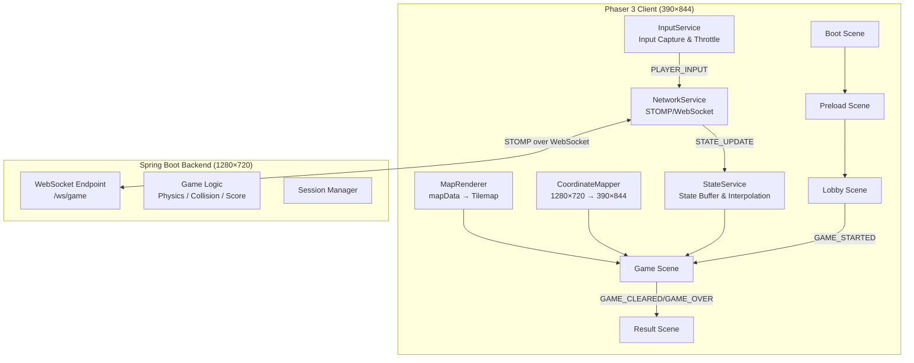
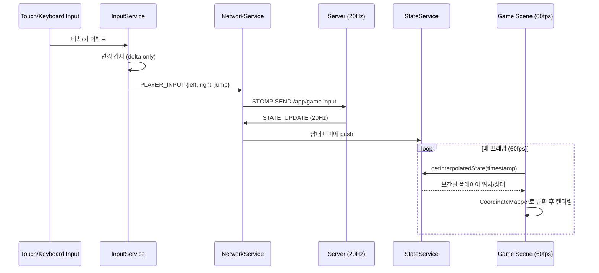
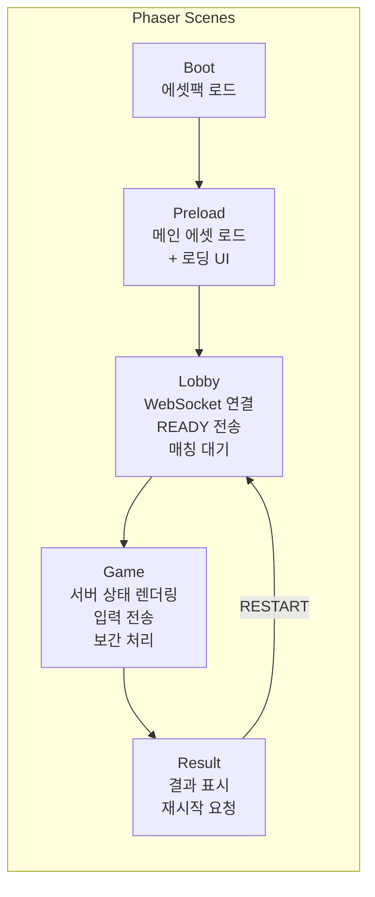

# Design Document: coop-switch-backend-integration

## Overview

본 설계 문서는 2인 협동 퍼즐 플랫포머 게임 "별빛 길 열기 (COOP_SWITCH)"의 Phaser 3 프론트엔드 클라이언트를 이미 완성된 Spring Boot 백엔드와 통합하기 위한 아키텍처를 정의한다.

서버 권위(Server-Authoritative) 모델을 따르며, 클라이언트는 입력만 전송하고 서버가 물리/충돌/점수를 계산한다. 클라이언트는 서버로부터 20Hz로 수신되는 상태 업데이트를 보간(interpolation)하여 부드러운 렌더링을 제공한다. Phaser Editor 2D로 관리되는 씬 구조와 수작업 네트워킹 코드가 공존하는 구조를 설계한다.

## Architecture

### 시스템 전체 구조



### 데이터 흐름 (메인 게임 루프)



## Components and Interfaces

### Component 1: NetworkService

**목적**: STOMP/WebSocket 연결 관리, 메시지 송수신, 재연결 처리

**Interface**:
```typescript
interface INetworkService {
  connect(token: string, gameSessionId: string, userId: string): Promise<void>;
  disconnect(): void;
  sendReady(): void;
  sendInput(input: PlayerInput): void;
  sendRestartRequest(): void;
  
  on(event: ServerMessageType, callback: (payload: any) => void): void;
  off(event: ServerMessageType, callback: (payload: any) => void): void;
  
  readonly isConnected: boolean;
  readonly connectionState: ConnectionState;
}
```

**책임**:
- SockJS fallback을 포함한 WebSocket 연결 수립
- STOMP CONNECT 시 JWT 인증 헤더 전송
- 서버 메시지 구독 및 이벤트 디스패치
- 연결 끊김 감지 및 자동 재연결 (exponential backoff)
- 연결 상태 관리 (CONNECTING, CONNECTED, DISCONNECTED, RECONNECTING)

---

### Component 2: InputService

**목적**: 플레이어 입력 캡처, 변경 시에만 서버로 전송 (delta-based)

**Interface**:
```typescript
interface IInputService {
  initialize(scene: Phaser.Scene): void;
  destroy(): void;
  getCurrentInput(): PlayerInput;
  
  onInputChange(callback: (input: PlayerInput) => void): void;
}
```

**책임**:
- 키보드 (Arrow keys / WASD) 및 모바일 터치 버튼 입력 캡처
- 이전 프레임 입력과 비교하여 변경 시에만 콜백 호출
- 매 프레임 전송이 아닌 상태 변경(on-change) 방식으로 네트워크 트래픽 최소화
- jump는 keydown 시 한 번만 true 전송, keyup 시 false 전송

---

### Component 3: StateService

**목적**: 서버 상태 버퍼링 및 프레임 간 보간(interpolation) 제공

**Interface**:
```typescript
interface IStateService {
  pushState(state: GameStateUpdate): void;
  getInterpolatedState(renderTimestamp: number): InterpolatedGameState;
  reset(): void;
  
  readonly latestState: GameStateUpdate | null;
  readonly bufferSize: number;
}
```

**책임**:
- 서버 STATE_UPDATE를 타임스탬프와 함께 링 버퍼에 저장
- 렌더링 시점에서 두 상태 사이를 선형 보간 (lerp)
- 보간 지연(interpolation delay) 관리: 렌더링은 서버 시간보다 ~100ms 뒤에서 수행
- 버퍼 언더런/오버런 처리

---

### Component 4: CoordinateMapper

**목적**: 서버 좌표계(1280×720)와 클라이언트 디스플레이(390×844) 간 변환

**Interface**:
```typescript
interface ICoordinateMapper {
  serverToClient(x: number, y: number): { x: number; y: number };
  clientToServer(x: number, y: number): { x: number; y: number };
  
  readonly scaleX: number;
  readonly scaleY: number;
  readonly offsetX: number;
  readonly offsetY: number;
}
```

**책임**:
- 서버 해상도(1280×720, 가로)를 클라이언트 해상도(390×844, 세로)로 매핑
- 종횡비 차이를 고려한 letterbox/pillarbox 오프셋 계산
- 타일맵 좌표 변환 지원

---

### Component 5: MapRenderer

**목적**: 서버에서 수신한 mapData를 기반으로 동적 타일맵 생성

**Interface**:
```typescript
interface IMapRenderer {
  renderMap(scene: Phaser.Scene, mapData: ServerMapData): void;
  clear(): void;
  
  readonly tilemap: Phaser.Tilemaps.Tilemap | null;
}
```

**책임**:
- GAME_STARTED 메시지의 mapData를 파싱하여 Phaser Tilemap 생성
- 하드코딩된 tilemap 대신 서버 데이터 기반 동적 렌더링
- 코인/장애물 등 오브젝트 레이어 렌더링 (시각적 표시만, 물리 없음)
- CoordinateMapper를 사용하여 올바른 스케일로 표시

---

### Scene 구조 및 책임



| Scene | Phaser Editor 관리 | 수작업 코드 |
|-------|-------------------|------------|
| Boot | ✗ (코드 전용) | 에셋팩 로드, Preload 전환 |
| Preload | ✓ (.scene 파일) | 에셋 로딩 진행률, Lobby 전환 |
| Lobby | ✓ (.scene 파일) | NetworkService 연결, READY 전송, 대기 UI |
| Game | ✓ (배경/UI만) | 상태 렌더링, 입력 처리, 보간, 맵 렌더링 |
| Result | ✓ (.scene 파일) | 점수 표시, 재시작 버튼 |

**Phaser Editor와 수작업 코드 공존 규칙**:
- `.scene` 파일은 Phaser Editor가 관리 → `editorCreate()` 메서드로 컴파일됨
- `/* START-USER-CODE */` ~ `/* END-USER-CODE */` 블록 안에 네트워킹/게임 로직 작성
- `/* START-USER-IMPORTS */` 블록에 서비스 import 추가
- Editor가 생성하는 코드와 충돌하지 않도록 서비스는 별도 파일로 분리

## Data Models

### PlayerInput (클라이언트 → 서버)

```typescript
interface PlayerInput {
  left: boolean;
  right: boolean;
  jump: boolean;
}
```

### ServerMessageType (서버 → 클라이언트 메시지 타입)

```typescript
type ServerMessageType =
  | "ROOM_STATE"
  | "GAME_STARTED"
  | "STATE_UPDATE"
  | "GAME_CLEARED"
  | "GAME_OVER"
  | "PLAYER_DISCONNECTED"
  | "PLAYER_RECONNECTED"
  | "RESTART_REQUESTED"
  | "GAME_ERROR";
```

### GameStartedPayload

```typescript
interface GameStartedPayload {
  gameSessionId: string;
  mapData: ServerMapData;
  players: PlayerInitialState[];
  config: GameConfig;
}

interface ServerMapData {
  width: number;          // 타일 단위
  height: number;         // 타일 단위
  tileWidth: number;      // 픽셀 (서버 좌표계 기준)
  tileHeight: number;
  layers: MapLayer[];
  tilesetKey: string;
}

interface MapLayer {
  name: string;           // "Ground", "Platforms", "Coins" 등
  data: number[];         // 1D 타일 인덱스 배열
  type: "tilelayer" | "objectgroup";
}

interface PlayerInitialState {
  playerId: string;
  characterType: "blue_cloud" | "pink_cloud";
  x: number;             // 서버 좌표계 (1280×720)
  y: number;
}

interface GameConfig {
  tickRate: number;       // 20
  worldWidth: number;     // 1280
  worldHeight: number;    // 720
}
```

### GameStateUpdate (20Hz 상태 업데이트)

```typescript
interface GameStateUpdate {
  tick: number;
  timestamp: number;      // 서버 타임스탬프 (ms)
  players: PlayerState[];
  coins: CoinState[];
  score: ScoreState;
}

interface PlayerState {
  playerId: string;
  x: number;              // 서버 좌표계
  y: number;
  velocityX: number;
  velocityY: number;
  animation: PlayerAnimation;
  isGrounded: boolean;
}

type PlayerAnimation = "idle" | "walk" | "jump";

interface CoinState {
  id: string;
  x: number;
  y: number;
  collected: boolean;
}

interface ScoreState {
  total: number;
  collected: number;
}
```

### InterpolatedGameState (보간된 렌더링 상태)

```typescript
interface InterpolatedGameState {
  players: InterpolatedPlayerState[];
  coins: CoinState[];
  score: ScoreState;
}

interface InterpolatedPlayerState {
  playerId: string;
  x: number;              // 보간된 서버 좌표
  y: number;
  animation: PlayerAnimation;
  isGrounded: boolean;
}
```

### ConnectionState

```typescript
type ConnectionState = 
  | "DISCONNECTED" 
  | "CONNECTING" 
  | "CONNECTED" 
  | "RECONNECTING" 
  | "ERROR";
```

## Error Handling

### Error Scenario 1: WebSocket 연결 실패

**조건**: 초기 연결 시 서버 도달 불가 또는 JWT 만료
**대응**: Lobby 씬에서 에러 메시지 표시, 재연결 버튼 제공
**복구**: Exponential backoff (1s, 2s, 4s, 8s, max 30s)로 자동 재시도, 5회 실패 시 수동 재연결 모드

### Error Scenario 2: 게임 중 연결 끊김

**조건**: Game 씬 진행 중 WebSocket 연결 끊김
**대응**: 화면에 "재연결 중..." 오버레이 표시, 마지막 수신 상태로 렌더링 유지 (freeze)
**복구**: 자동 재연결 시도, 성공 시 서버가 PLAYER_RECONNECTED 전송하여 상태 동기화

### Error Scenario 3: 상대 플레이어 연결 끊김

**조건**: 서버에서 PLAYER_DISCONNECTED 수신
**대응**: 상대 캐릭터에 반투명 효과 적용, "상대방 연결 끊김" 알림 표시
**복구**: PLAYER_RECONNECTED 수신 시 정상 렌더링 복원

### Error Scenario 4: 상태 버퍼 언더런

**조건**: 네트워크 지터로 인해 보간할 상태가 부족
**대응**: 마지막 알려진 상태를 유지 (extrapolation 없이 freeze)
**복구**: 새 상태 수신 시 자동으로 보간 재개, 급격한 위치 변화는 snap 처리

### Error Scenario 5: GAME_ERROR 수신

**조건**: 서버에서 게임 에러 메시지 수신
**대응**: 에러 내용을 사용자에게 표시, Game 씬 일시정지
**복구**: 에러 유형에 따라 Lobby로 복귀 또는 재시작 옵션 제공

## Testing Strategy

### Unit Testing Approach

- **NetworkService**: STOMP 클라이언트 mock을 사용하여 연결/재연결/메시지 송수신 테스트
- **InputService**: 입력 변경 감지 로직, delta-only 전송 로직 테스트
- **StateService**: 보간 알고리즘 정확성, 버퍼 관리 테스트
- **CoordinateMapper**: 좌표 변환 정확성 테스트 (경계값 포함)

### Property-Based Testing Approach

**Property Test Library**: fast-check

- CoordinateMapper: `serverToClient(clientToServer(p)) ≈ p` (왕복 변환 일관성)
- StateService: 보간 결과는 항상 두 입력 상태 사이에 위치
- InputService: 동일 입력 연속 시 콜백 호출 없음

### Integration Testing Approach

- Mock WebSocket 서버를 사용한 전체 메시지 흐름 테스트
- 씬 전환 시나리오 (Lobby → Game → Result) 테스트
- 연결 끊김/재연결 시나리오 E2E 테스트

## Performance Considerations

### 보간 전략 (Interpolation)

- **방식**: 고정 지연 보간 (Fixed-delay interpolation)
- **보간 지연**: 100ms (서버 tick 2개분 = 50ms × 2)
- **렌더링 시점**: 현재 시간 - 100ms 시점의 상태를 두 스냅샷 사이에서 lerp
- **장점**: 네트워크 지터에 강건, 부드러운 움직임 보장
- **단점**: 100ms 입력 지연 추가 (퍼즐 게임에서는 허용 가능)

### 좌표 매핑 전략

- 서버(1280×720 가로) → 클라이언트(390×844 세로) 변환
- 게임 영역을 클라이언트 화면에 fit하되, 종횡비 유지를 위해 letterbox 적용
- 스케일 팩터: `min(390/1280, 844/720)` 기준으로 uniform scale
- 오프셋: 남는 영역은 중앙 정렬

### 네트워크 최적화

- 입력은 변경 시에만 전송 (idle 상태에서 트래픽 0)
- 상태 버퍼 크기: 최대 10개 (500ms 분량)
- 불필요한 GC 방지를 위해 오브젝트 풀링 사용

## Security Considerations

- JWT 토큰은 URL 파라미터로 전달 (WebSocket 특성상 헤더 사용 불가)
- 토큰 만료 시 재인증 플로우 필요
- 클라이언트는 입력만 전송하므로 치트 방지는 서버 측에서 처리
- STOMP CONNECT 헤더에 JWT 포함하여 세션 인증

## Dependencies

| 패키지 | 버전 | 용도 |
|--------|------|------|
| phaser | ^3.80.1 | 게임 엔진 (기존) |
| @stomp/stompjs | ^7.x | STOMP 프로토콜 클라이언트 |
| sockjs-client | ^1.6.x | WebSocket SockJS fallback |
| @phaserjs/editor-scripts-base | ^1.0.0 | Phaser Editor 지원 (기존) |

### Vite 프록시 설정

개발 환경에서 백엔드 서버로의 프록시 설정이 필요하다:

- `/api` → 백엔드 REST API (로그인, 세션 생성 등)
- `/ws/game` → WebSocket 엔드포인트 (ws:// 프로토콜 업그레이드 포함)

### 프로젝트 디렉토리 구조 (신규 파일)

```
src/
├── main.ts
├── scenes/
│   ├── Boot.ts              (기존 main.ts에서 분리 가능)
│   ├── Preload.ts           (기존)
│   ├── Lobby.ts             (신규)
│   ├── Game.ts              (Level.ts 대체)
│   └── Result.ts            (신규)
├── services/
│   ├── NetworkService.ts    (신규)
│   ├── InputService.ts      (신규)
│   ├── StateService.ts      (신규)
│   ├── CoordinateMapper.ts  (신규)
│   └── MapRenderer.ts       (신규)
└── types/
    ├── network.ts           (신규 - 메시지 타입 정의)
    └── game-state.ts        (신규 - 게임 상태 타입 정의)
```
